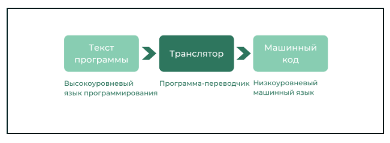
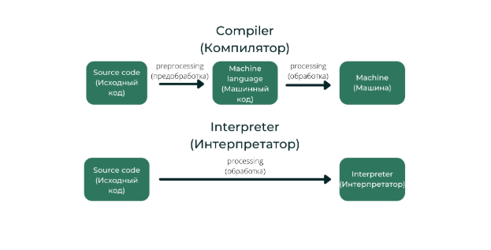

# Общие понятия про Python

- **Python** - высокоуровневый кроссплатформенный ЯП с неявной сильной динамической типизацией.

- **Скомпилированный** - это код, преобразованный из исходного (читаемого человеком) вида в другой формат (чаще низкоуровневый) с помощью компилятора. Цель компиляции - получить код, который может быть выполнен компьютером (или виртуальной машиной). Процесс компиляции:
Исходный код от программистов -> компилятор анализирует на предмет синтаксиса и логики -> затем переводит его в более низкоуровневое представление (объектный код, байт-код или сразу в машинный код).

- **Неявная типизация** - тип переменной определяется автоматически в момент присваивания значения, а не при объявлении. Не нужно писать `int x = 5` или `string x = "text"`, тип определяется по правой части оператора присваивания, одна и та же переменная может менять тип в процессе выполнения программы.
```python
x = 5  # x имеет тип int
x = "text"  # str
x = [1, 2]  # list
```

- **Сильная (строграя) типизация** - запрет на неявные преобразования типов, которые могут привести к потере данных или неоднозначности. 
```python
"5" + 3  # TypeError: can only concatenate str (not "int") to str
5 + "3"  # TypeError
```
Python не будет автоматически превращать строку `"5"` в число `5` для сложения с числом `3`. Для выполнения операции нужно явное преобразование `int("5") + 3`.
Исключение для численных типов, правило "при операции между разными числовыми типами результат приводится к более сложному типу" (int+float -> float, int+complex -> complex, float + complex -> complex).

- **Динамическая типизация** - проверка типов происходит во время выполнения программы (runtime), а не на этапе компиляции. Ошибки типов выявляются только при запуске кода, гибкость в написании обобщённого кода (полиморфизм), потенциальное снижение производительности (проверка типов на лету), необходимость тщательного тестирования, возможность реализовать функцию с проверкой типов внутри:
```python
def process_data(data):
    if isinstance(data, str):
        return data.upper()
    elif isinstance(data, int):
        return data * 2
```
В статически типизированных языках типы проверяются до запуска программы, ошибки типов лоятся на этапе компиляции, код обычно выполняется быстрее.

## Плюсы и минусы Python

### Плюсы
1. Дружелюбный синтаксис. Недостаток по скорости работы компенсируется скоростью написания кода и возможностью лёгкой отладки благодаря простому и человекочитабельнмоу принципу.

2. Многогранность применения. Кроссплатформенность обеспечивает работы на популярных платформах (Windows, Linux, Mac). Python применяется от программирования микроконтроллеров, алгоритмов машинного обучения, анализа данных, разработки игр, работы с компьютерной графикой, автоматизацией рутинных задач (связаных с администрированием различных систем), создание сайтов. Подходит для первого языка программирования.

3. Обилие библиотек. Широкому распространению языка способствовало обилие дополнительных библиотек – богатая коллекция уже готовых решений неких задач другими программистами с подробной документацией. + Наличие подробной стандартной библиотеки

### Минусы
1. Скорость работы. Интерпретируемые языки затрачивают время на преобразование в машинный код во время выполнения самой программы, в отличие от компилируемых, которые делают это до начала выполнения.

2. Неоптимальный расход ресурсов памяти. Python гибко работает с типами данных (динамическая типизация), из-за этого работа с памятью неоптимальна, и программы на Python потребляют больше ресурсов, чем могли бы (часто этот недостаток компенсируется кешированием).


### Популярность
1. Рейтинг института инженеров электротехники и электроники (IEEE) - 1 место по широте использования (2023);
2. Индекс TIOBE - 1 место по количеству поисковых запросов. С 2003 года был выбран языком года более 5 раз.
3. Индекс PYPL (Popularity of Programming Language) - 1 место по популярности запросов обучающих материалов по языку (в Google).


# Язык программирования
ЯП - это инструмент управления компьютером: строго определённый набор правил, благодаря которому осуществляется взаимодействие человека с машиной. 

Все программы, все операции, которые выполняют компьютеры, результат следования инструкциям, которые для компьютеров пишут люди. 

### Существует много языков для общения с компьютером, поскольку в разных ситуациях важна:
1. Скорость работы программы. Инструкции даются компьютеру на максимально понятном для него языке, чтобы не тратить время на перевод.
2. Скорость написания программы. Можно пожертвовать скоростью выполнения программы в пользу скорости написания программы.

По критериям скорости работы/написания программы ЯП делятся на две категории: высокоуровневые и низкоуровневые.

**Высокоуровневые** - ориентированы на удобство написания людьми. Независимы (программисту не нужно знать особенности оборудования, исполняемого код). Скорость выполнения программы компенсируется скоростью её написания. `Минусы` - дополнительный расход памяти (ВЯП для своей работы и хранения требуют значительно больше памяти, чем НЯП-программы). `Примеры` - Python, C++, Java, Kotlin, C#, JS, PHP.

**Низкоуровневые** - созданы для удовлетворения нужд конкретной компьютерной архитектуры и учитывают требования «железа», поэтому скорость их работы выше. `Минусы` - сложность написания программ, поэтому применяются редко и для узкоспециализированных задач. `Примеры` - Assembler, CIL

### Синтаксис ЯП
Синтаксис ЯП - это набор правил, на основе которых строится программа. Проводя аналогию с русским языком, синтаксис - это правила орфографии и пунктуации. В ЯП есть сторого определённый набор ключевых слов, описывающих команды для компьютера. В этих словах важен каждый символ: любое несоответствие или неоднозначность в коде вызывает ошибку. Важность структуры кода может сравнить с логичностью повествования (если будет нарушена структура кода, инструкция не сможет быть выполнена компьютером).

**Синтаксис (программирование)** - набор правил, определяющих корректную структуру программ на конкретном языке (задаёт допустимые комбинации символов, структуру блоков кода, правила объявления переменных/функций/классов, формат управляющих конструкций if/for/while, требования к оформлению выражений).

**Синтаксис (вообще)** - правила построения связанных высказываний (словосочетаний, предложений, текстов). Определяет порядок слов, согласованность частей речи, связи между членами предложения, структуру сложных предложений.

**Орфография** - наприла написания слов.

**Пунктуация** - система знаков препинания и правила их употребления.

## Типы кодов в программировании

### Исходный код (source code)
Исходный код - текст программы, написанный на ВЯП (Python, Java, C++, JS, ...). Использует высокоуровневые конструкции (функции, циклы, объекты), не зависит от конкретной аппаратуры, понятен человеку.

*Пример*
```python
def greet(name):
    return f"Hello, {name}!"
```

### Машинный код (machine code)
Машинный код (машинный язык) - последовательность инструкций в двоичном виде (нули и единицы), которые выполняет процессор. Это набор команд, выполняемых центральным процессором компьютера. С одной стороны, это самое низкоуровневое представление компьютерной программы, с другой - это упрощённый и аппаратно-зависимый (зависимый от конкретной аппаратной части) ЯП. Машинный код понятен только процессору. Если человек пишет машинный код напрямую, это часто приводит к ошибкам, поскольку разработчику необходимо управлять отдельными битами и вычислять числовые адреса и константы вручную. C появлением ВЯП необходимость в написании машинного кода человеком отпала. 

**упрощённый** - набор команд строго ограничен (процессор понимает лишь базовые операции: сложение, перемещение данных, сравнение, условные переходы), каждая команда выполняет очень простое действие (сложить два числа), нет абстракций (не существует понятий "функция", "класс", "массив" - только работа с памятью по конкретным адресам и регистрам процессора).

**аппаратно-зависимый** - машинный код напрямую привязан к архитектуре процессора: разные процессоры имеют разные наборы команд (код одного не запуститься на другом), команды оперируют с физическими ресурсами конкретного процессора (регистр, система адресации памяти)


*Пример*
Загрузить число 5 в регистр
`10111000 00000101 00000000 00000000 00000000`


### Промежуточный код / байт-код (intermediate code / bytecode)
Промежуточный код - текст программы, скомпилированный не в машинный язык, а в специальный формат для виртуальной машины. Это компромисс между исходным и машинным кодом. Аппаратно-независимый (один и тот же байт-код работает на разных процессорах), требует виртуальной машины для выполнения.

**Встречается**:
- Java - компилируется в байт-код JVM (Java Virtual Machine)
- Python - компилируется в байт-код Python (PVM), выполняемый интерпретатором
- .NET (C#, VB.NET) - компилируется в CIL (Common Intermediate Language)

*Пример*
Java
```java
public static void main(java.lang.String[]);
  Code:
     0: getstatic     #2      // Field java/lang/System.out:Ljava/io/PrintStream;
     3: ldc           #3      // String Hello, World!
     5: invokevirtual #4      // Method java/io/PrintStream.println:(Ljava/lang/String;)V
     8: return
```

Python
Исходный код
```python
import dis
```

Результат
```
  2           0 LOAD_FAST                0 (a)
              2 LOAD_FAST                1 (b)
              4 BINARY_MULTIPLY
              6 STORE_FAST               2 (result)

  3           8 LOAD_FAST                2 (result)
             10 RETURN_VALUE
```


### Ассемблерный код (assembly code)
Ассемблерный код - человекочитаемое представление машинного кода. Каждая строка соответствует одной машинной инструкции, но вместо двоичных кодов используются мнемоники (MOV, ADD, JMP). Аппаратно-зависимый (но с ним легче работать, чем с чистым машинным кодом). Преобразуется в машинный код с помощью ассемблера.

*Пример*
```asm
MOV AX, 5
ADD AX, BX
```

### Объектный код (object code / object file)
Объектный код - результат компиляции исходного кода (часто после преобразования в ассемблер), но ещё не готовая программа. Содержит машинный код, но он может быть не до конца связан с другими частями программы. Хранится в объектных файлах (`.o`, `.obj`). Чтобы получить исполняемый файл, объектные файлы нужно «связать» (выполнить линковку/компоновку) с помощью линковщика (linker).

*Пример*
```c
int add(int a, int b) {
    return a + b;
}
```


### Исполняемый код (executable code)
Исполняемый код - готовый файл (например, `.exe` в Windows), который можно запустить на выполнение. Образован в результате успешной линковки всех объектных файлов и библиотек. Содержит полностью готовый к исполнению машинный код и всю необходимую информацию для загрузки его в память операционной системой.

*Пример*
```asm
55                  push   %rbp
48 89 e5          mov    %rsp,%rbp
b8 00 00 00 00  mov    $0x0,%eax
5d                pop    %rbp
c3                retq
```

## Схема преобразования кода программы
1. **Исполняемая программа**
    1) Исходный код (на C++)
    2) Компилятор преобразует в ассемблерный код
    3) Ассемблер преобразует ассемблерный код в объектный код
    4) Линковщик объединяет объектный код с библиотеками (например, стандартной библиотекой C++) и создаёт исполняемый файл (program.exe)


2. **Виртуальная машина (Java, Python)**
    1) Исходный код (на Java)
    2) Компилятор преобразует в промежуточный код (байт-код)
    3) Виртуальная машина (JVM) во время выполнения преобразует байт-код в машинный код для конкретного процессора.

## Транслятор
Транслятор - программа, выполняющая преобразование программы на ВЯП в программу, состояющую из машинных команд. Язык написания входной программы называется исходным языком, а входная программа - исходным кодом. Выходной язык называется целевым языком или объектным кодом. Трансляторы - это переводчики программ с ВЯП-языков на машинны язык, с которым может работать процессор.

### Схема работы



### Разновидности транслятора:
1. Компилятор - выполняет компиляцию (преобразование) программы на высокоуровневом языке в машинный код. Полученный код записывается в исполняемый файл (`.exe`), который может быть запущен как и любая другая программа на компьютере. Компиляция выполняется единожды, а полученный файл может выполняться в системе сколько угодно раз. Если нужно внести изменения в исходный код, то это потребует повторной компиляции, а сам процесс довольно медленный.

`Преимущества`: скорость выполнения программы, т.к. исходный код преобразуется в машинный, который после компиляции доступен для исполнения без выполнения дополнительных операций (НЯП-программы работают быстрее и эффективнее)

`Недостатки`: платформозависимость, ограничение кода. Результирующий машинный код непосредственно зависит от программной и аппаратной платформы компьютера, на котором производится компиляция программы (программа, скомпилированная на Windows, не запустится на Linux или masOS без дополнительных манипуляций).

2. Интерпретатор - выполняет текст кода без предварительного преобразования в машинный код. Программа всегда остаётся на исходном языке и не может быть запущена на выполнение без использования интерпретатора. Каждая строка исходного кода переводится в машинный код за один проход итератора. Программа в машинном коде существует только в момент интерпретации и не сохраняется в отдельном файле.

`Преимущества`: кроссплатформенность (платформонезависимость), т.е. способность программы работать более чем на одной аппаратной платформе или в более чем одной ОС. Интерпретируемые языки не зависят от платформы, при написании программ можно применять продвинутые технологии динамического программирования (метапрограммирования - парадигмы построения кода информационный системы с динамическим изменением поведения или структуры в зависимости от данных, действий пользователя или взаимодействия с другими системами).

`Недостатки`: низкая скорость, доступность исходного кода. При каждом запуске требуется интерпретация кода, которая занимает время.

### Работа компилятора и интерпретатора




## Стандартная библиотека
Стандартная библиотека Python содержит обилие полезных модулей и является частью стандартного комплекта поставки Python.

### Основные составляющие standary library
1. Встроенные функции (Built-in Functions): `len()`, `range()`, `min()`, `max()`, ...
2. Встроенные типы (Built-it Types): `int`, `float`, `str`, `list`, `dict`, ...
3. Модули (набор полезных блоков кода по одной теме). 

**Модуль (библиотека)** - любой файл, содержащий программный код. Примеры: `math`, `random`, `datetime`, `json`, ...

**Пакет** - директория, содержащая несколько модулей (`.py`-файлов, специальный файл `__init__.py` для указания директории в качестве пакета, возможно подпакеты - вложенные директории-пакеты). Примеры: `os`, `collections`, `urllib`, `datetime()`, `itertools()`, `pprint()`, ...

- collections - расширяет основной набор типов данных специализированными типами данных, которые очень удобно применять в разных задач вроде подсчёта элементов последовательности.

- itertools - предоставляют набор быстрых инструментов для эффективной циклической обработки, которые могут быть полезны как сами по себе, так и в сочетании. Эти инструменты позволяют лаконично и эффективно создавать специализированные инструменты на чистым Python.


### __init__.py
Файл `__init__.py` служит маркером, сообщающим интерпретатору Python: "это не просто папка, это Python-пакет, доступный для импорта". Является обязательным до версии Python < 3.3, начиная с 3.3+ (благодаря PEP 420) появились namespace packages (пакеты пространст имён), и директория без `__init__.py` может быть импортирована. Если в `__init__.py` есть код, он будет выполнен при первом импорте пакета, это позволяет инициализировать пакет, упростить импорты, определить публичный API через переменную `__all__`, выполнить код инициализации.

Без `__init__.py` импорт возможен в 3.3+, но только отдельных модулей внутри директории. Импорт самой директории может не сработать. `__init__.py` делает директорию полноценным пакетом - с возможностью импорта пакета целиком, инициализацией и управлением API. Даже пустой `__init__.py` полезен - он явно задаёт намерения разработчика и обеспечивает совместимость со старыми версиями Python. Для новых проектов всегда рекомендуется использовать `__init__.py`, предоставляющим полный контроль над структурой пакета.