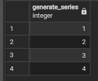

# PSQL

- `\sf %function_name%` - просмотр исходного кода функции (source function)
- `\g` - отправляет на сервер текущий буфер запроса (последний выполненный запрос) (g - go, идти, отправлять)


# PG

- generate_series(1, 4) - генерация последовательности чисел от 1 до 4



- pg_sleep(1) - задержка ответа

Вызов через 4 секунды

```SQL
select (select 'hello'), pg_sleep(4);
```

- random() - возвращает случайное число

