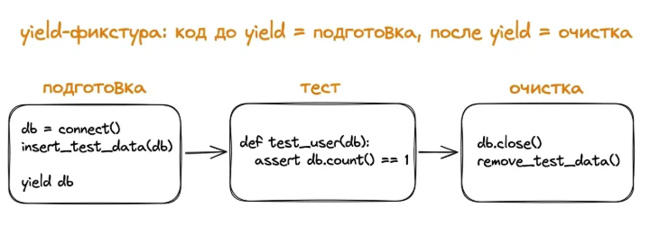

# Тестирование

Тестирование ПО – процесс исследования и оценки программного продукта с целью проверки его соответствия заявленным требованиям и выявления потенциальных дефектов до того, как с ними столкнутся конечные пользователи. Это набор проверок, подтверждающих, что код делает то, что от него ждут, – и продолжает делать после каждого изменения.

### Назначение

1. **Раннее обнаружение ошибок и снижение стоимости их исправления.** Чем раньше обнаружена ошибка, тем ниже относительная стоимость исправления. Во время разработки - 1x, код-ревью - 2х, QA - 5x-10x, после выпуска - 30x-100x.
2. **Уверенность при внесении изменений и рефакторинге**. Тесты позволяют сформировать "сеть безопасности" – организацию покрытия программного кода тестами, которые будут проверять новый код и предупреждать об ошибках (в том числе, ошибках совместимости с готовыми модулями). Разработчик может не бояться менять существующий код и проводить рефакторинг, добавлять новые функции и исправлять ошибки, потому что знает о предупреждениях со стороны тестов.
3. **Тесты как документация.** Хорошо написанные тесты служат формой живой, исполняемой документации. Они наглядно демонстрируют использование кода и ожидаемое поведение. Тесты, в отличие от стандартной документации, не устаревают, так как должны проходить для каждой версии кода.
4. **Улучшение дизайна кода.** Процесс написания тестов часто заставляет задуматься о структуре и дизайне кода. Если функцию или модуль сложно тестировать, это может быть признаком того, что он слишком сложен, имеет много зависимостей или нарушает принцип единой ответственности. Тестируемость - важный аспект хорошего дизайна.
5. **Предотвращение регрессий.** Регрессии - это ошибки, которые появляются в уже работавшем коде после внесения изменений. Автоматические тесты эффективно отлавливают такие проблемы, гарантируя, что старая функциональность не была случайно нарушена.

### Типы тестов

1. **Модульные тесты (Unit Tests).** Проверяют самые маленькие, изолированные части программы – отдельные функции, методы или классы. Цель – убедиться, что каждый "кирпичик" кода работает правильно сам по себе.

```Python
def add(a, b):
    return a + b


# Simple manual test
result = add(2, 3)
expected = 5

print(f'Test passed: {result == expected}')
```

2. **Интеграционные тесты (Integration Tests).** Интеграционные тесты проверяют взаимодействие между несколькими модулями или компонентами системы. Например, как модуль обработки заказов взаимодействует с модулем уведомлений или базой данных. Они помогают убедиться, что "кирпичики" правильно складываются вместе. Пример: проверка того, что после успешного создания пользователя в БД (один модуль), система аутентификации (другой модуль) может его распознать.
3. **Функциональные / Сквозные тесты (Functional / E2E).** Эти тесты проверяют всю систему или значительную её часть с точки зрения пользователя. Они имитируют реальные пользовательские сценарии, проходя через все слои приложения - от пользовательского интерфейса (если он есть) до базы данных. Пример: полный сценарий регистрации нового пользователя на сайте: заполнение формы, отправка данных, получение письма с подтвреждением, первый вход в систему.

### Пирамида тестирования

ПТ - визуализированная модель рекомендуемого соотношения различных типов тестов в проекте


Идея:

- Модульные тесты составляют основу. Их должно быть больше всего, так как они надёжные и точно указывают на место ошибки.
- Интеграционные тесты находятся на следующем уровне. Их меньше, чем модульных, они проверяют взаимодействие компонентов.
- Функциональные (E2E) тесты находятся на вершине. Их должно быть наименьшее количество, так как они медленные, хрупкие (часто ломаются из-за изменений в UI) и дорогие в поддержке.

Соблюдение этой структуры помогает создать эффективную и надёжную стратегию тестирования.

### Принципы хорошего теста (FIRST)

1. **Fast (быстрые)**. Тесты должны выполняться быстро. Медленные тесты замедляют разработку и их реже запускают.
2. **Independent/Isolated (независимые/изолированные)**. Тесты не должны зависеть друг от друга. Порядок их выполнения не должен влиять на результат. Каждый тест должен настраивать своё окружение и очищать его при необходимости.
3. **Repeatable (повторяемые).** Тесты должны давать одинаковый результат при каждом запуске в одной и той же среде. Никаких случайных сбоев или зависимостей от внешних изменяемых факторов.
4. **Self-Validating (самопроверяемые).** Тест должен сам определять, прошёл он или нет, без необходимости ручной проверки результатов. Обычно это достигается с помощью `assert` утверждений.
5. **Timely/Thorough (своевременные/тщательные)**. Тесты нужно писать своевременно (в идеале, до или вместе с кодом, который они тестируют - TDD). Они должны быть достаточно тщательными, чтобы покрывать важные аспекты тестируемого кода, включая граничные случаи.

## Фреймворки для тестирования

Фреймворки для тестирования предоставляют инструменты и структуру для написания, организации и запуска тестов, а также для получения отчётов о результатах.

- pytest: гибкий сторонний фреймворк с лаконичным синтаксисом
- unittest: встроенный в P модуль, следующий классическому xUnit-стилю

### pytest

Самый распространённый Ф для Т в P. Простой стартовый интерфейс: обычные P-функции с assert, запускаем pytest в терминале - он сам находит тесты и выводит, что прошло и что упало.

`pip install pytest`

Производственный код расположен в файле `example.py`, тесты в файлах с префиксом `test_` (рядом). По этому префиксу pytest и находит тесты автоматически.

**main.py**

```Python
def add(a, b):
    return a + b
```

**test_example.py**

```Python
from main import add

def test_add_positive():
  assert add(1, 2) == 3

def test_add_negative():
  assert add(-1, -3) == -4

def test_add_mixed():
  assert add(5, -2) == 3
```

**Запуск**

```Python
pytest
```

Точка `.` рядом с именем файла означает "один тест прошёл". Три точки = три прошли. Для подробного вывода с именами каждого теста есть флаг `-v`

```Python
pytest -v
```

**Упавший тест**

```Python
=========================================================================== FAILURES ===========================================================================
______________________________________________________________________ test_add_negative _______________________________________________________________________

    def test_add_negative():
>       assert add(5, -2) == 10
E       assert 3 == 10
E        +  where 3 = add(5, -2)

test_example.py:7: AssertionError
=================================================================== short test summary info ====================================================================
FAILED test_example.py::test_add_negative - assert 3 == 10
================================================================= 1 failed, 2 passed in 0.10s ==================================================================
```

pytest показывает:

- где упало: `(test_example.py:7)`
- какое выражение не сработало: `assert add(5, -2) == 10`
- что получилось вместо ожидаемого: `(3 == 10, и что 3 = add(5, -2))`

Такой развёрнутый вывод обычно сразу подсказывает причину. Это и есть главный аргумент в пользу pytest (подробный вывод причины) вместо специальных методов: pytest сам разбирает выражение и показывает интересные части.

### Структура теста: Arrange / Act / Assert

По мере роста тестов появляется паттерн, который сильно упрощает их чтение: AAA (Arrange / Act / Assert).

- **Arrange** (договариваться). Готовим данные, создаём объекты, настраиваем состояние.
- **Act**. Выполняем действие, которое тестируем.
- **Assert**. Проверяем результат.

Когда тест больше 3-4 строк – нужно разделение на 3 блока (комментариями или пустыми строками), это делает код читаемым и является стандартом для production-кода.

### Имена тестов: что_когда_ожидается

В реальных проектах имя теста читается как короткое утверждение о коде. Удобный шаблон: `test_<что>_<при_каких_условиях>_<ожидаемое_поведение>`:

- `test_add_returns_sum_for_positive_numbers` – понятнее `test_add_1`
- `test_withdraw_fails_when_balance_is_zero` – сразу видно, что и почему
- `test_user_email_is_lowercased_after_save` – конкретное поведение

Когда такой тест падает в CI, по имени сразу понятно, что именно сломалось, без чтения тела. Это экономит часы дебага в больших проектах.

### Фикстуры

Фикстура – это функция-помощник, возвращающая состояние и автоматически передающаяся в тест по имени. Часто тестам нужно одно и то же подготовленное состояние: пользователь с заполненными полями, открытый объект, тестовая база. Фикстура – это функция-помощник, возвращающая состояние и автоматически передающаяся в тест по имени. Фикстуры - общая подготовка для нескольких тестов. Декоратор `@pytest.fixture` говорит pytest "эта функция - фикстура, вызывый её для тестов, которые её запрашивают"

```Python
import pytest

@pytest.fixture
def alice():
  return {"id": 1, "name": "Alice", "email": "alice@example.com"}

def test_user_has_email(alice):
  assert "@" in alice["email"]

def test_user_id_is_int(alice):
  assert isinstance(alice["id"], int)
```

`pytest` сам видит, что `test_user_has_email` запрашивает фикстуру `alice`, вызывает её и передаёт результат в тест. Если фикстура не нужна - её можно просто не указывать в аргументах. Главное удобство: единожды описываем подготовку, затем используем в десятках тестов через один аргумент.

#### yield: подготовка и очистка

Если нужно не только подготовить что-то, но и прибрать после теста (закрыть соединение, удалить временный файл) – используем `yield` вместо `return`.

```Python
import os
import pytest


@pytest.fixture
def temp_file():
    # The code before yield
    path = 'file.txt'
  
    with open(path, 'w', encoding='UTF-8') as file:
        file.write("hello")
  
    yield path  # The test gets the path
  
    os.remove(path)  # Will be completed after tests
  
  
def test_read_file(temp_file):
    with open('file.txt', 'r', encoding='UTF-8') as file:
        assert file.read() == 'hello'
```

Код до `yield` выполняется перед тестом (setup), код после - после теста (teardown). Работает даже если тест упал.



```Python
# Setup
db = connect()
insert_test_data(db)

# Test
def test_user(db):
  assert db.count() == 1

# Cleaning
db.close()
remove_test_data()
```

#### Scope: как часто пересоздавать

По умолчанию фикстура вызывается для каждого теста. Если подготовка дорогая (открыть подключение к БД, загрузить большой файл), можно сказать pytest: "делай один раз на всю сессию" через `scope="session"`:

```Python
@pytest.fixture(scope="session")
def db_connection():
  print("\n Connect to the DB (one time)")
  conn = {"status": "connected"}
  yield conn
  print("\n Closing the connection")
```

На практике 95% времени используется function (по умолчанию, один экземпляр на тест) и session (один на весь прогон). Есть ещё class и module - для особых случаев.


#### conftest.py: общие фикстуры

Если фикстура нужна в нескольких файлах, её необходимо разместить в `conftest.py` рядом с тестами. Импортировать её не нужно - pytest находит её автоматически. Это стандартный способ делиться фикстурами между тестами одного проекта.

conftest.py

```Python
import pytest

@pytest.fixture(scope="session")
def app_config():
  return {"api_url": "https://test.example.com", "timeout": 5}
```

test_api.py

```Python
def test_api_url(app_config):
  assert "example.com" in app_config["api_url"]
```


### Параметризация: один тест, много входов

Когда нужно проверить функцию на 5-10 наборов входных данных, не нужно писать 10 одинаковых тестов. Нужно использовать `@pytest.mark.parametrize`

main.py

```Python
def get_discount(age, is_member):
    if age >= 65:
        return 0.15
    if is_member:
        return 0.10
    if age < 18:
        return 0.05
    return 0.0
```

test_example.py

```Python
import pytest

from main import get_discount

@pytest.mark.parametrize(
  "age, is_member, expected", 
  [
        (70, False, 0.15),
        (30, True,  0.10),
        (16, False, 0.05),
        (25, False, 0.0),
        (65, True,  0.15),
  ]
)
def test_get_discount(age, is_member, expected):
  assert get_discount(age, is_member) == expected
```

Первый аргумент parametrize - строка с именами параметров через запятую, а не кортеж (это специфическое соглашение pytest). Дальше идёт список кортежей - каждый кортеж это один прогон теста. pytest запускает тест 5 раз, каждый со своим набором значений. В выводе они идут отдельными тестами. 

```Python
test_discount.py::test_get_discount[70-False-0.15] PASSED
test_discount.py::test_get_discount[30-True-0.1]   PASSED
...
```

Если один из случаев упал, в имени теста видны его параметры - сразу понятно, какая комбинация сломалась.
