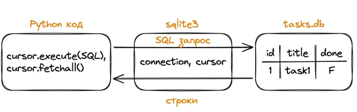

# Базы данных

БД - организованная коллекция данных, которая хранится и управляется специальной системой (СУБД). БД - система, мгновенно находящая нужную информацию среди миллионов записей. Почти любое приложение, которое хранит что-то надолго - пользователей, заказы, сообщения, - держит это в БД, а не в памяти программы. БД - как умный склад, где каждая полка имеет свой адрес, а складской робот (СУБД) может быстро найти и доставить любую нужную информацию.

Проблемы хранения информации внутри программы: **медленный поиск** (проверка каждого пользователя), **ограничение памяти** (все данных должны помещаться в RAM), **потеря данных** - если программа упадёт, всё пропадёт, **конкуренция** - несколько пользователей могут одновременно изменять данные.

```Python
users = [
    {"id": 1, "name": "Ann", "email": "xx@xx.xx"},
    {"id": 2, "name": "Max", "email": "yy@yy.yy"},
    # ... million other users...
]

def find_user_by_email(email):
    for user in users:
        if user["email"] == email:
            return user
    return None

print(
    find_user_by_email('yy@yy.yy')
)
```

БД решают проблемы медленного поиска, ограничения памяти, потери данных и конкуренции – именно поэтому они стали стандартом для серьёзных приложений.

## Виды БД

1. Реляционные. Организуют данные в таблицы с чёткой структурой. Самый популярный тип.

```Python
CREATE TABLE users (
  id INTEGER PRIMARY KEY,
  name VARCHAR(100),
  email VARCHAR(150)
)
```

2. Key-value. Хранят простые пары "ключ-значение". Очень быстрые для простых операций.

```Python
# Redis - популярная key-value БД
user_session = {
  "session:user123": "logged_in",
  "cart:user123": "[1, 5, 9]",  # ID товаров в корзине
  "last_seen:user123": "2024-01-15 10:30"
}
```

3. Документоориентированные БД. Хранят данные как документы (JSON-формат). Гибкая структура.

```Python
# Пример документа пользователя
{
  "name": "Ann",
  "email": "ann@xx.xx",
  "preferences": {
    "theme": "dark",
    "language": "ru"
  }
}
```

### Популярные СУБД

- PostgreSQL
- MySQL
- SQLite
- MongoDB (лидер документоориентированных БД)
- Redis - быстрая key-value БД
- Oracle Database - корпоративная реляционная БД
- Microsoft SQL Server - реляционная БД от Microsoft
- Elasticsearch - документоориентированная поисковая БД

РСУБД являются стандартном индустрии благодаря своей надёжности и универсальности.

## SQLite

SQLite (СУБД) - легковесная реляционная БД, встроенная в Python из коробки: ничего устанавливать не нужно, БД хранится в одном файле, и тот же подход работает с любой другой СУБД.

**Разница**

- БД - сами данные: структурированное хранилище (таблицы, строки, связи). Файл `.sqlite` с таблицами.
- СУБД - программа/движок, который умеет работать с данными: создавать, читать, обновлять, удалять, строить индексы, управлять транзакциями

В случае SQLite движок и файл БД тесно связаны: вся логика СУБД упакована в небольшую библиотеку (на С), а данные храняться в одном файле.

**Особенности SQLite**

- **Встраиваемая (embedded):** нет отдельного сервера, движок работает прямо внутри приложения (Python, Django).
- **Файл как БД:** вся база - один файл на диске. Удобно копировать, переносить, бэкапить.
- **Поддерживает SQL**: выполнение запросов (SELECT, JOIN, транзакции), но возможности скромнее по сравнение с Postgres.

### Работа с SQLite из Python

Для работы с SQLite в стандартной библиотеке есть модуль `sqlite3`. Базовый паттерн: создаём соединение, получаем cursor (через него выполняем запросы), закрываем соединение.

```Python
import sqlite3

connection = sqlite3.connect("tasks.db")
cursor = connection.cursor()

if cursor:
    print("Connection to the database has been established")

cursor.close()
print("Completed")
```



Для соединения с БД удобнее использовать контекстный менеджер `with` – он автоматически сохраняет изменения и закрывает соединение.

```Python
import sqlite3

with sqlite3.connect('tasks.db') as connection:
    cursor = connection.cursor()
    print('Connection to the DB has been established')
```

### Создание таблицы

```Python
import sqlite3

with sqlite3.connect('tasks.db') as connection:
    cursor = connection.cursor()
    cursor.execute('''
        CREATE TABLE IF NOT EXISTS task (
            id INTEGER PRIMARY KEY AUTOINCREMENT,
            title TEXT NOT NULL,
            completed BOOLEAN DEFAULT FALSE
        )
    ''')
  
print('The task table has been created')
```

## Разбор обращения к БД

```Python
import sqlite3

with sqlite3.connect('tasks.db') as connection:
    cursor = connection.cursor()  # Intermediary object
  
    query = '''
        SELECT * FROM task;
        '''
    
    cursor.execute(query)

  	# Получаем колонки таблицы
    columns = [col[0] for col in cursor.description]  # ['id', 'title', 'completed']

  	# Получаем данные для колонок
    rows = cursor.fetchall()  # [(1, 'Modif sqlite', 1)]

  	# Объединяем полученные результаты в словарь
    result = [dict(zip(columns, row)) for row in rows]  # [{'id': 1, 'title': 'Modif sqlite', 'completed': 1}]
```

- **cursor.description** - это атрибут курсора, который возвращает метаданные о колонках результата запроса – список кортежей. Каждый кортеж описывает одну колонку. Для `SELECT * FROM task` он выглядит так:

```Python
[
  ('id', None, None, None, 5, 1, 1),
  ('title', None, None, None, 2, 0, 0),
  ('completed', None, None, None, 1, 0, 0)
]
```

Первый элемент в каждом кортеже – имя колонки. Остальные – дополнительные сведения (тип, длина, nullable и т.д.), которые в sqlite3 часто не заполняются.

- **cursor**- объект-посредник, через которого отправляются запросы к БД и принимаются результаты. cursor - рабочая рука, которая совершает конкретные действия.
- **columns** -cписок имён колонок `['id', 'title', 'completed']`. Он нужен как шапка таблицы: чтобы превратить каждую строку результата (кортеж значений) в словарь вида `{"id": 1, "title": "...", "completed": 1}`
- **col[0]** - проходимся по кортежу из `cursor.description` и берём из него первый элемент – имя колонки. В итоге получается список имён: `['id', 'title', 'completed']`. Это нужно, чтобы потом сопоставить имена колонок со значениями строк.
- **fetchall()** - забирает все оставшиеся строки результата запроса и возвращает их как список кортежей: `[(1, 'Modif sqlite', 1)]`. Каждый кортеж - одна строка таблицы. Порядок значений в кортеже соответствует порядку колонок в SELECT. Нюансы: если строк много, fetchall может съесть много памяти. В таких случаях используют `fetchmany(size)` или итерацию по курсору + после fetchall курсор опустошается: повторный вызов вернёт пустой список. **В проде для больших выборок почти никогда не делают fetchall на весь результат**.
- Про fetchall дальше. Когда мы делаем `cursor.execute('SELECT * FROM task')`, БД готовит результат, но не отдаёт его сразу целиком. Курсор - это как указатель на позицию в этом результате. fetchall говорит: "возьми всё, что ещё не прочитано из этого результата, начиная с текущей позиции, и верни списком". fetchall не знает про названия колонок, он возвращает только значения в виде списка кортежей.

```Python
cursor.execute('SELECT * FROM task')

first_row = cursor.fetchone()  # Взяли первую строку
rest = cursor.fetchall()  # взяли все остальное
```

- **result** - здесь происходит превращение "табличного" представления (список кортежей) в словарное (список словарей).
  - zip(columns, row) соединяет имена колонок и значения строки
  - ```
    zip(['id', 'title', 'completed'], (1, 'Modif sqlite', 1)) -> 

    [('id', 1), ('title', 'Modif sqlite'), ('completed', 1)]
    ```
  - dict(...) превращает эти пары в словарь: `{'id': 1, 'title': 'Modif sqlite', 'completed': 1}`
  - Генератор списка делает это для каждой строки

Итог – удобный формат для дальнейшей работы с данными в программе: можно писать `row['title']` вместо `row[1]`, и код становится понятнее и устойчивее к изменениям порядка колонок.

```Python
[{'id': 1, 'title': 'Modif sqlite', 'completed': 1}]
```

Как всё работает вместе:

1. Делаем SELECTчерез cursor.execute(query)
2. Из cursor.description вытаскиваем имена колонок
3. Через fetchall() получаем все строки как список кортежей
4. С помощью zip и dict превращаем каждую строку в словарь, собирая итоговый список result
5. Печатаем промежуточные результаты для проверки

### Crud

Create / Read / Update / Delete - 4 базовые операции, которые покрывают почти всю работу с данными.

#### CREATE: добавление данных

```Python
import sqlite3

with sqlite3.connect('tasks.db') as connection:
    cursor = connection.cursor()
  
    cursor.execute(
        "INSERT INTO task (title) VALUES (?)",
        ("Learn SQLite", )
    )
  
    cursor.execute(
        "INSERT INTO task (title) VALUES (?)",
        ("Make purchases",)
    )
  
print('Tasks added')
```

**Важно** значения не вставляются напрямую в строку SQL через f-strings или конкатенацию. Вместо этого используется параметр `?`, а значение передаётся вторым аргументом в `execute`. Это защищает от SQL-инъекций.

```Python
# ОПАСНО
user_input = "'; DROP TABLE tasks; --"
cursor.execute(f"INSERT INTO tasks (title) VALUES ('{user_input}')")  # выполнится: INSERT ... VALUES (''); DROP TABLE tasks; --')

# БЕЗОПАСНО: значение передаётся отдельно
cursor.execute("INSERT INTO tasks (title) VALUES (?)", (user_input, ))  # выполнится: INSERT ... VALUES ('\'; DROP TABLE tasks; --')
```

**Правило** никогда не склеивать пользовательский ввод в SQL-строку, всегда использовать параметры через `?`.

В PostgreSQL: в psycopg2 вместо `?` используют `%s`, но принцип тот же:

```
cursor.execute(
	"INSERT INTO task (title) VALUES (%s)",
    (user_input, )
)
```


### READ: чтение данных

```Python
import sqlite3

user_input = "; DROP TABLE task; --"

with sqlite3.connect('tasks.db') as connection:
    cursor = connection.cursor()
  
    cursor.execute("SELECT id, title, completed FROM task")
  
    rows = cursor.fetchall()
  
for row in rows:
    print(row)
```

`cursor.fetchall()` возвращает все строки результата как список кортежей. Доступ к полям по индексу: row[0] это id, row[1] - title и т.д. Если нужно достать одну строку, используется `fetchone()`

```Python
import sqlite3

with sqlite3.connect('tasks.db') as connection:
  cursor = connection.cursor()
  cursor.execute("SELECT title FROM tasks WHERE id = ?", (1,))
  row = cursor.fetchone()

print(row)  # ('Изучить SQLITE')
```

### UPDATE: обновление данных

```Python
import sqlite3

task_number = 2

with sqlite3.connect('tasks.db') as connection:
    cursor = connection.cursor()
  
    cursor.execute("UPDATE task SET completed = ? WHERE id = ?", (False, task_number))


print(f'Task №{task_number} is marked as completed')
```

`WHERE id = ?` обязательно: без условия `UPDATE` обновит все строки в таблице


### DELETE: удаление данных

```Python
import sqlite3

with sqlite3.connect('tasks.db') as connection:
  cursor = connection.cursor()
  cursor.execute("DELETE FROM task WHERE id = ?", (2, ))

print("Task №2 has been removed")
```

Без WHERE DELETE удалит всю таблицу строк.
