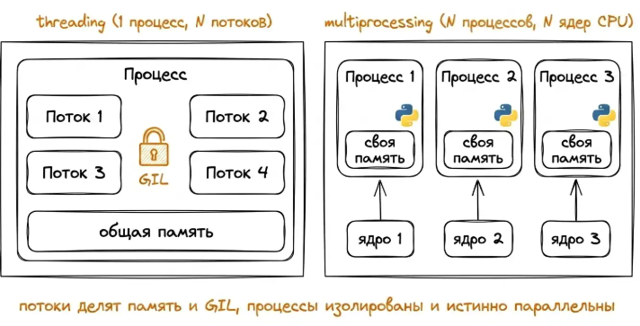
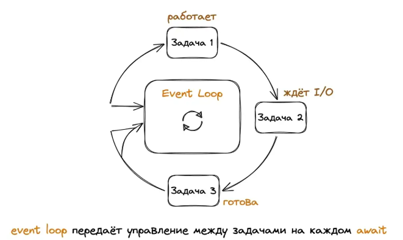

# Конкурентность, параллелизм, асинхронность

Программе необходимо скачать 100 страниц с разных сайтов. Отправлять запросы по очереди – означает ждать ответ от сервера в течении 1-2 секунд, что увеличивает общее время (сумма всех ожиданий). Большую часть этого времени процессор простаивает, пока один запрос ждёт ответа – могут быть отправлены другие. Это и есть конкурентное выполнение.

Python has three tools for this: threading, multiprocessing, asyncio.

- Concurrency (конкурентность): tasks can be switched between each other, creating the illusion of simultaneous work. One barista at the counter takes an order, puts the milk on to heat, moves on to the next customer, and returns to the milk. One performer, several tasks "in the air" at the same time.
- Parallelism: tasks are executed physically simultaneously on different processor cores. Several baristas, each making their own coffee. Requires multi-core processing.
- Asynchronicity: a way of organizing code in which a task can be "delayed" while waiting (for example, for a server response) without blocking the entire thread. This is a way to achieve concurrency on a single thread without switching OS.

Concurrency is the goal, parallelism and asynchrony are to ways to achieve it.


## I/O-bound vs CPU-bound: key dichotomy

The choice of tool depends only on what your task is:

- I/O-bound: the processor is idle waiting for an external resource. Network request, read from disk, database response. Here, asynchronous processing wins: while one request is waiting, we send the next ones.
- CPU-bound: the processor is working hard on calculations. Image compression, encryption, scientific computing. This requires real parallelism across multiple cores.

The most common beginner mistake is using multiprocessing for page downloads or asyncio for matrix multiplication. This will result in slowdowns, not speedups.

I/O-bound и CPU-bound - это категории задач по тому, что становится узким местом при их выполнении: ввод-вывод или вычисления на процессоре.

### IO (ограничено вводом-выводом)

Задача большую часть времени ждёт ответа от внешнего ресурса, а процессор почти не нагружен.

**Примеры**

- HTTP-запросы к API и ожидание ответа (сеть)
- Чтение файла с диска
- Запрос к БД и ожидание результата (сеть + диск)
- Ожидание ввода пользователя

Допустим, запрос к серверу идёт 1 секунду, а обработка ответа - 10 мс. Из этих 1010 мс процессор реально занят только 10 мс, остальное время поток висит в ожидании.

**Использование в Python**

- asyncio - запуск других запросов в момент, когда один запрос "ждёт"
- threading - В CPython для I/O-задач потоки полезны, потому что во время ожидания GIL освобождаются.
- concurrent.futures.ThreadPoolExecutor - удобная обёртка над потоками.

**I/O-bound-задача** - скачивание 100 страниц сайта. Основное время тратится на ожидание сети, а не на вычисления.

### CPU-bound (ограничено процессором)

Задача активно нагружает CPU вычислениями, почти не обращаясь к внешним ресурсам.

**Примеры**

- Сжатие, кодирование, шифрование данных
- Обработка изображений (фильтры, ресайз)
- Расчёт математических моделей, симуляции
- Парсинг и тяжёлые преобразования больших объемов текста

Почти 100% времени процессор занят выполнением инструкций.

**Использование в Python**

- Процессы (multiprocessing) - чтобы обойти GIL и задействовать несколько ядер.
- concurrent.futures.ProcessPoolExecutor - простой способ запустить задачи на нескольких ядрах
- Вызовы на C/C++/Rust (NumPy) - чтобы тяжёлые вычисления шли вне интерпретатора Python.

**CPU-bound-задача** - перемножение больших матриц или перебор вариантов в задаче оптимизации.

**The difference is clear**

```Python
import time
import requests

# I/O-bound: waiting for network
def fetch_url(url):
    r = requests.get(url)
    return r.text


# CPU-bound: a lot of calculations
def heavy_compute(n):
    total = 0
    for i in range(n):
        total += i * i
    return total

start = time.time()
fetch_url("https://jsonplaceholder.typicode.com/users/1/")  # We wait for an answer most of the time.
print("I/O time:", time.time() - start)

start = time.time()
heavy_compute(10_000_000)  # The CPU is running almost all the time.
print("CPU time:", time.time() - start)
```

## GIL

В стандартной реализации Python (CPython) есть Global Interpreter Lock (GIL) – глобальный замок, разрешающий выполнять Python-код только одному потоку за раз внутри процесса. Даже если у вас 8 ядер, потоки выполняются по очереди.

- Для CPU-bound задач threading бесполезен - потоки делят одно ядро через GIL. Нужны процессы (multiprocessing), у каждого свой GIL и своё ядро.
- Для I/O-bound задач GIL отпускается при ожидании сети/диска. Поэтому threading отлично подходит для I/O, как и asyncio (но без накладных расходов на потоки).

**Tools for a specific situation**

1. Множество сетевых запросов, тысячи соединений – asyncio
2. I/O в legacy-коде без async-библиотек – threading
3. Тяжёлые вычисления на нескольких ядрах – multiprocessing
4. Простое распараллеливание без погружения в детали – concurrent.futures (ThreadPoolExecutor, ProcessPoolExecutor)

Поток - легковесный исполнитель внутри одного процесса (для I/O), процесс - это отдельная программа с собственной памятью (для CPU-bound).

# Threads and processes

For I/O-bound tasks, threads are needed (`threading`), for CPU-bound tasks, processes are needed (`multiprocessing`). Their API is almost identical, once you've learnied one, you've learned both.



### threading: threads within one process

We create a thread using `threading.Thread`, passing it the target function and arguments.

```Python
import threading
import time


def worker(name, sleep_time):
    print(f'Thread {name}: I fall asleep for {sleep_time} c.')
    time.sleep(sleep_time)
    print(f'Thread {name}: completed')
  
t1 = threading.Thread(target=worker, args=("A", 2))
t2 = threading.Thread(target=worker, args=("B", 1))

t1.start()  # starting
t2.start()

t1.join()  # waiting for the completion 
t2.join()

print(f'All threads are complete')
```

- `target` - the function that the thread executes
- `args` - tuple of arguments
- `start()` - starts the thread
- `join()` - blocks the main thread untill this completes
- t1.join() - the main thread stops and waits until thread A finishes. Thread B continues to run independently.

Thread B started second, but finished first - it's slepp is shorter, and t1.join() waits for completion. This is concurrent execution: threads run simultaneously, and the order of completion is determined by their work, not by the order they were started.

Threads A and B run in parallel. join() doesn't stop them, it just makes the main thread wait.

## Protect shared data: Lock

Theads share memory. If two threads change the same variable, the result is unpredictable (race condition). Protection - Lock:

```Python
import threading

counter = 0
lock = threading.Lock()

def increment():
    global counter
    for _ in range(100_00):
        with lock:
            counter += 1

threads = [threading.Thread(target=increment) for _ in range(5)]

for t in threads:
    t.start()
  
  
for t in threads:
    t.join()
  
print(counter)
```

Without a lock, the result will be a random number less than 500_000: the threads "grind" each others incements. Context manager with lock: this is the standart way of working, it guarantees release even in case of exception. Besides Lock, threading also includes Event, Semaphore, Condition, and RLock. In practice, Local and Queue (see below) are sufficient in 90% of cases. The rest are needed for non-trivial coordination.

## Sharing data between threads: queue.Queue

Directly modifying shared variables is dangerous: you have to lock everything. It's cleaner and safer to pass data through a thread-safe queue from the queue module.

```Python
import threading
import queue
import time


q = queue.Queue()

def producer():
    for i in range(5):
        q.put(f'item-{i}')
        time.sleep(0.1)
    q.put(None)
  

def consumer():
    while True:
        item = q.get()
        if item is None:
            break
        print(f"Get {item}")
  
  
t_prod = threading.Thread(target=producer)
t_cons = threading.Thread(target=consumer)

t_prod.start()
t_cons.start()

t_prod.join()
t_cons.join()

consumer()
```

- q - потокобезопасная очередь. Она нужна, чтобы потоки могли обмениваться данными: один поток кладёт, другой забирает, и не возникает гонок (race conditions). q - общий буфер между producer (производит данные) и consumer (который их потребляет).
- q.get() - метод, забирающий элемент из очереди. Если в очереди есть элемент - возвращает его сразу. Если очередь пуста - поток блокируется и ждёт, пока элемент не появится. По умолчанию `get()` ждёт бесконечно. Можно передать таймаут `q.get(timeout=1)`. Тогда через 1 секунду выбросится исключение `queue.Empty`, если ничего не пришло.
- q.put() - кладём элемент в очередь.
- start() запускает поток, то есть начинает выполнять функцию, которую мы передали в target (в данном случае producer и consumer). После вызова старта управление сразу возвращается в основной поток, а функция в потоке выполняется параллельно. Вызывать старт можно только один раз для одного объекта потока
- join() - говорит текущему потоку "жди, пока этот поток не завершится". Это нужно, чтобы программа не завершилась раньше, чем отработают все рабочие потоки и чтобы корректно "дождаться" завершения задач (например, чтобы убедиться, что все элементы обработаны).

`q.put(None)` в конце producer - это соглашение между producer и consumer: "данных больше не будет". В Queue нет встроенного сигнала "конец потока", поэтому договариваются вручную, и None - это просто наиболее частый выбор. Можно использовать любое значение, которое не может прийти как валидные данные.

### multiprocessing: настоящий параллелизм

The API is almost identical to threading, but instead of threads, separate processes are created. Each with its own interpreter, its own memory, its own GIL. Several processes actually run simultaneously on different cores.

```Python
import multiprocessing
import time


def heavy_calc(n):
    print(f'The process counts for n ={n}')
    total = sum(i * i for i in range(n))
    return total


if __name__ == "__main__":  # Mandatory protection
    p1 = multiprocessing.Process(target=heavy_calc, args=(10_000_00,))
    p2 = multiprocessing.Process(target=heavy_calc, args=(10_000_00,))
  
    p1.start()
    p2.start()
    p1.join()
    p2.join()
    print('Both processes have been completed')
```

`if __name__ == "__main__"` required on Windows and macOS. Without it, child processes will try to start the entire module again and fall into an infinite recursion of process creation.

### Обмен данными между процессами: Queue

Процессы изолированы: у каждого своя память, общие переменные не работают. Передача данных идёт через специальный механизм. Самый удобный - это multiprocessing.Queue с тем же API, что и `queue.Queue`

```Python
import multiprocessing

def producer(q):
    for i in range(3):
        q.put(f'item-{i}')
    q.put(None)
  

def consumer(q):
    while True:
        item = q.get()
        if item is None:
            break
        print(f"Received {item}")
  

if __name__ == "__main__":
    q = multiprocessing.Queue()
    p1 = multiprocessing.Process(target=producer, args=(q, ))
    p2 = multiprocessing.Process(target=consumer, args=(q, ))
  
    p1.start()
    p2.start()
  
    p1.join()
    p2.join()
```

Кроме Queue есть Pipe (для двух процессов), Value / Array (общие примитивные данные) и Manager (общие списки/словари через серверный процесс). В основной queue + pool покрывают большинство случаев.

### Пул процессов для CPU-bound задач

Создавать процессы вручную для каждой задачи накладно. `multiprocessing.Pool` создаёт пул из N процессов и распределяет между ними задачи:

```Python
import multiprocessing

def heavy_square(x):
    # Имитация тяжёлых вычислений, нагружающих CPU
    return sum(i * i for i in range(x * 100_000))


if __name__ == "__main__":
    with multiprocessing.Pool(processes=4) as pool:
        results = pool.map(heavy_square, range(1, 9))
    print(results)
```

`pool.map(func, items)` применяет функцию к каждому элементу из items, распределяя работу между процессами в пуле. Контекстный менеджер сам закроет пул и дождётся всех процессов

Анализ кода

`sum(i * i for i in range(x * 100_000))` - сумма квадратов всех целых чисел от 0 до x * 100 000 - 1.

- Для x = 1: сумма квадратов чисел от 0 до 99 999
- Для x = 2: сумма квадратов от 0 до 199 999
- Для x = 3: сумма квадратов от 0 до 299 999
- ...
- Для x = 8: сумма квадратов от 0 до 799 999

### cuncurrent.futures: одинаковый API для потоков и процессов

Модуль `concurrent.futures` даёт высокоуровневую обёртку над обоими подходами. Один и тот же код работает и с потоками, и с процессами, меняется только класс executor.

```Python
from concurrent.futures import ThreadPoolExecutor, ProcessPoolExecutor

def task(x):
    return x * x

# Для I/O-bound: потоки
with ThreadPoolExecutor(max_workers=4) as executor:
    results = list(executor.map(task, range(10)))
  
# Для CPU-bound: процессы
with ProcessPoolExecutor(max_workers=4) as executor:
    results = list(executor.map(task, range(10)))
```

Это самый практичный способ распараллелить простые задачи. На современных проектах `concurrent.futures` встречается чаще, чем прямые `threading.Thread` или `multiprocessing.Process`.

**Когда что брать:**

- Простые I/O-bound в существующем синхронном коде – ThreadPoolExecutor
- Необходимо вручную управлять состоянием – threading напрямую
- CPU-bound вычисления – ProcessPoolExecutor или multiprocessing.Pool
- Тысячи сетевых соединений – asyncio

asyncio лучше для I/O-bound на больших объёмах: один поток, минимальные накладные расходы на переключение. Но требуется писать в async-стиле.

# Asyncio

Threads and processes have a common model: the OS switches between "executors". Asyncio takes a different approach: single-threaded, cooperative multitasking. The program itself marks places where you can "postpone" a task. These places are indicated by the `await` keyword.

For I/O-bound workloads, asyncio offers the best performance/resource balance: thousands of concurrent connections on a single thread without the overhead of OS threads.

## Event Cycle and Cooperative Model

The heart of asyncio is the event loop. It maintains a list of tasks, executes one of them, and when the task reaches await `something_slow()`, the task "yields control", and the event loop switches to the next completed task. When `something_slow()` completes, the original task becomes ready again.

**The event loop transfers control between tasks at each await**



Important: the switch only occurs on await. No interruptions in the middle of the calculation. This is "cooperative" multitasking: tasks agree on when to yield. This approach has a consequence: if a task does not await (for example, if it calculates something for a long time on the CPU), the entire event loop is idle.

### async and await

Python 3.5 introduced keywords for async:

- `async def` - defines a coroutine (asynchronous function)
- `await` - inside a coroutine: "wait for this operation to complete, release control while waiting".

```Python
import asyncio


async def say_hello():
    print('Hello...')
    await asyncio.sleep(1)  # doesn't block the thread, releases event loop
    print('... world')
```

An important detail: calling say_hello() doesn't start a coroutine. It creates a coroutine object.

```Python
coro = say_hello()  # <class 'coroutine'>
print(type(coro))
# The coroutine code has not yet been executed
```

To run a coroutine, you need an event loop.

#### asyncio.run: entry point

`asyncio.run()` starts the event loop, executes the passed coroutine, and closes the loop:

```Python
import asyncio

async def say_hello():
  print("starting")
  await asyncio.sleep(1)
  print('Completed in 1 sec')

asyncio.run(say_hello())
```

`asyncio.run()` is the standard way to launch an async program from regular synchronous code. Within a single program, it is called once at the top level.

#### Sequential vs Concurrent

If we simply write await sequentially, the coroutines are executed sequentially, one after the other

```Python
import asyncio
import time

async def slow_task(name, delay):
    await asyncio.sleep(delay)
    print(f"{name} is ready in {delay} sec")

async def main():
    start = time.time()
    await slow_task("A", 2)
    await slow_task("B", 1)
    await slow_task("C", 3)
    print(f"Total: {time.time() - start:.1f}с")    # ~6с

asyncio.run(main())
```

All three tasks could run concurrently (they just wait), but we've forced them to run is sequence: `await` waits for the current one to complete. To run then concurrently, we use `asyncio.gather()`

```Python
import asyncio
import time


async def slow_function(name, delay):
    await asyncio.sleep(delay)
    print(f"{name} is ready in {delay} sec")
  
  
async def main():
    start = time.time()
    await asyncio.gather(
        slow_function("A", 1),
        slow_function("B", 2),
        slow_function("C", 3),
    )
    print(f'Total: {time.time() - start:.1f} sec')  # ~3 sec
  

asyncio.run(
    main()
)
```

`gather()` runs all passed coroutines concurrently and returns a list of results. The total elapsed time is equal to the longest task, not the sum of all tasks. This is the essence of asyncio for I/O.


#### Tasks: running coroutines in the background

Sometimes you need to start a coroutine "right now", without waiting for it, so it runs in parallel with the main logic. For this, there's asycio.create_task()

```Python
import asyncio 

async def background_log():
  while True:
    print("heartbeat")
    await asyncio.sleep(1)


async def main():
  task = asyncio.create_task(background_log())
  await asyncio.sleep(3)  # do something different
  task.cancel()  # stop background coroutine

asyncio.run(main())
```

`create_task()` immediately schedules a coroutine for execution. It returns a Task object with the methods cancel(), done(), result(). Essentially, a Task is coroutine that the event loop has already started and monitors: you can check the status, get the result, or cancel it.

#### Key rules

- Within an `async def` any long wait should be performed using await. A regular time.sleep(1) will block the entire event loop. Use `await asyncio.sleep(1)`.
- If you want concurrent execution, use `asyncio.gather()` or `asyncio.create_task()`. Simply await in a row = sequentially.
- CPU-bound in asyncio stops everything. Is it taking too long? Move it to `run_in_executor` or multiprocessing.
