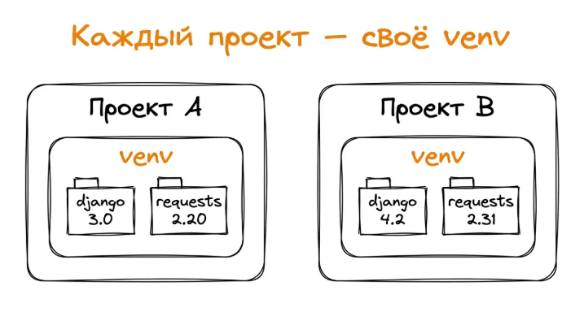

# Открытие файла для чтения (режим по умолчанию - 'r')

file = open('example.txt', 'r')
print(f"Файл открыт в режиме: {file.mode}")
file.close()

# Открытие файла для записи

file = open('new_file.txt', 'w')
print(f"Файл открыт в режиме: {file.mode}")
file.close()

# Открытие бинарного файла для чтения

file = open('image.jpg', 'rb')
print(f"Файл открыт в режиме: {file.mode}")
file.close()

  

# Библиотеки

Библиотека (модуль) – файл с кодом, содержащий функции, классы и переменные, которые можно использовать в своих программах. Это готовые наборы ранее написанного и отлаженного кода.

Импорт

```Python
# Прямой
import math

# Отдельные функции
from math import sqrt, floor 

# Переименование
import math as m
```

## Виды библиотек

1. Встроенные (включенные в стандартную библиотеку Python и доступные сразу после установки языка). `random, math, os, sys, json, collections, re, csv, unittest, datetime`
2. Сторонние библиотеки (созданы другими разработчиками, требуют дополнительной установки). `requests, pandas, numpy, matplotlib, beautifulsoup, fastapi, django, flask, selenium, tesnorflow, pytorch`
3. Собственные (созданые вами для организации своего кода)

#### Вывод атрибутов элемента

```Python
import random
attributes = dir(random)

print(attributes[:10])
```

Комплектующие дистрибутива Python:

- Интерпретатор
- IDLE (встроенная среда разработки)
- pip
- Стандартная библиотека
- Документация и утилиты

Дистрибутив - сборка, позволяющая установить ЯП на ПК `python-3.12.4-amd64.exe`.

## Встроенные библиотеки

Встроенная библиотека (стандартная библиотека) – это набор модулей, включённых в дистрибутив Python и готовых к использованию без дополнительной установки.

1. math

```Python
import math

math.pi
math.e
math.sin(math.pi / 4):.4f
math.cos(math.pi / 4):.4f
math.factorial(5)
math.gcd(12, 18)  # наибольший общий делитель 12 и 18: 6
```

2. random - генерация случайных чисел и выбор случайных элементов

```Python
import random

random.randint(1, 10)
random.random():.4f  # случайное число с плавающей точкой от 0 до 1: 0.3528

# Выбор случайного элемента последовательности
fruits = ["яблоко", ...]
random.choice(fruits)  # яблоко

# Перемешивание последовательности
numbers = [1, 2, 3, 4, 5]
random.shuffle(numbers)  # [3, 1, 5, 2, 4]
```

3. datetime - предоставляет классы для работы с датой и временем

```Python
import datetime

# Текущая дата и время
now = datetime.datetime.now()  # 2026-06-28 14:39:25.225090

# Задание конкретной даты
specific_date = datetime.date(2026, 12, 31)  # 2026-12-31

# Разница между датами
today = datetime.date.today()
new_year = datetime.date(today.year + 1, 1, 1)
days_until_new_year = (new_year - today).days

print('До нового года', days_until_new_year)

# Форматирование даты
formatted_string = now.strftime("%d.%m.%Y %H:%M")  # 15.07.2023 15:42
```

4. os - набор функций для взаимодействия с операционной системой

```Python
import os

# Получение текущей директории
current_dir = os.getcwd()

# Список файлов и папок в директории
files = os.listdir('.') 

# Информация о системе
sys_info = os.name

# Проверка существования файла/директории
file_exists = os.path.exists('cases.md')
```

5. json - предоставляет функции для работы с данными в JSON-формате

```Python
import json

# Словарь Python
person = {
    "name": "Иван",
    "age": 30,
    "city": "Москва",
    "languages": ["Python", "JavaScript", "SQL"]
}

# Преобразование Python-объекта в JSON
python_to_json = json.dumps(person, ensure_ascii=False, indent=4)

# Преобразование JSON в Python-объект
json_object = '{ "name": "Igor", "age": 29, "is_admin": True }'
json_to_python = json.loads(json_object)
```

`json.dumps` превращает Python-объект в JSON-строку. Это необходимо, чтобы отдать данные по API, сохранить в файл или передать в Django-шаблон.

- python_to_json рекурсивно преобразуется в json
- ensure_ascii=False отображает кириллицу
- indent=4 даёт отступы

`json.loads(string)` (load string) берёт json и превращает в Python-объект. Парсит (разбирает) строку по правилам JSON и строит из неё структуры данных Python.

`json.load(file_object)` - читает JSON из файла. На вход подаётся открытый файл (результат `open(...)`).

6. Collections - удобные структуры данных поверх базовых. В модуле также есть defaultdict, namedtuple, deque и другие.

```Python
from colleciton import Counter

text = "Programming on Python"
character_count = Counter(text.lower())  # # Counter({'o': 3, 'n': 3, 'p': 2, 'r': 2, 'g': 2, 'm': 2, ' ': 2, 'a': 1, 'i': 1, 'y': 1, 't': 1, 'h': 1})

print("Three most frequently chars")
for char, count in character_count.most_common(3):
  print(f"'{char}': {count}")

# 'o': 3
# 'n': 3
# 'p': 2
```

## Сторонние библиотеки

Сторонние библиотеки – это модули Python, которые не входят в стандартную библиотеку и разрабатываются независимыми разработчиками или организациями.

pip (package installer for python) - система управления пакетами, которая используется для установки и управления программными пакетами на языке Python. Pip скачивает пакеты из Python Package Index (PyPI), а также умеет обновлять, удалять, фиксировать версии зависимостей проекта.

PyPI (Python Package Index) – это хранилище программного обеспечения для ЯП Python. С его помощью можно найти нужный программный блок и внедрить его в свой проект. PyPI помогает находить и устанавливать ПО, разработанное сообществом Python. Авторы пакетов используют PyPI для распространения своего программного обеспечения.

#### Популярные сторонние библиотеки

| Библиотека | Описание                                                                                              | Назначение                                                           |
| -------------------- | ------------------------------------------------------------------------------------------------------------- | ------------------------------------------------------------------------------ |
| requests             | Удобная работа с HTTP-запросами                                                        | Взаимодействие с веб-ресурсами, API                 |
| pandas               | Удобная работа с табличными данными                                            | Обработка и анализ табличных данных             |
| SQLAlchemy           | ORM для работы с БД                                                                               | Взаимодействие с SQL и БД                                    |
| pillow               | Обработка изображений                                                                     | Редактирование и анализ изображений            |
| bs4                  | Парсинг HTML и XML                                                                                    | Извлечение данных с веб-страниц                     |
| django               | Полнофункциональный веб-фреймворк                                              | Крупные веб-проекты                                           |
| flask                | Микрофреймворк для веб-разработки                                               | Создание веб-приложений и API                            |
| fastapi              | Современный асинхронный фреймворк для создания API на Python      | Быстро строить REST/JSON-API                                      |
| tensorflow           | Глубокое обучение и нейронные сети                                              | Сложные модули глубокого обучения                |
| pytorch              | Глубокое обучение с динамическими вычислительными графами | Исследования в области глубокого обучения |
| matplotlib           | Визуализация данных                                                                         | Построение графиков и диаграмм                      |
| numpy                | Работа с массивами и математическими вычислениями                 | Научные вычисления, работа с массивами        |
| PyQt                 | Создание настольных приложений                                                    | Графические интерфейсы (GUI)                              |
| Pygame               | Создание игр и мультимедийных приложений                                  | Разработка 2D-игр                                                 |

## Виртуальное окружение

Виртуальное окружение (venv) – это изолированная среда Python, в которой можно устанавливать свои пакеты, не влияя на другие проекты или системный Python.



## Модули

Модуль – это просто файл с разрешением `.py`, содержащий код Python (функции, классы, переменные), который можно импортировать и использовать в других программах.

**Импорт всего модуля** - когда из одного модуля нужно достать много функций, при этом видеть, откуда они пришли.

**Импорт конкретных элементов** - обращение без префикса хорошо для пары часто вызываемых функций и плохо, когда через сотню строк кода забываешь источник.

**Импорт с переименованием** - когда имя модуля слишком длинное или конфликтует с названием переменной.

**Импорт всех элементов** - не рекомендуемый способ, добавляет все функции модуля в пространство имён: теряется источник имён, легко получить конфликт. Нормально только в REPL и иногда в тестах.

### Где Python ищет модули

Когда мы пишем `import mymath`, Python ищет файл mymath.py по списку директорий из `sys.path`. По умолчанию туда входят:

- Директория запускаемого файла (или текущая директория из REPL)
- Стандартная библиотека Python (math, os)
- site-packages - папка, куда pip install устанавливает сторонние пакеты

Поиск прекращается на первой найденной директории. Если рядом со скриптом лежит файл с тем же именем, что и стандартный модуль, Python подхватит наш файл вместо системного. Классическая ловушка: создать кастомный модуль random и перетереть встроенный `random`.

### Специальные переменные модуля

Модули в Python имеют несколько специальных переменных.

##### `__name__`

**`__name__`**: модуль как программа vs зависимость. Внутри P у каждого M есть переменная `__name__`, когда М импортируют, в ней лежит его имя `mymath`. Когда М запускают напрямую `python mymath`, P кладёт в неё специальное значение `__main__`, – это позволяет внутри модуля написать блок "делай это только при прямом запуске".

```Python
"""Модуль с математическими функциями"""

PI = 3.14159

def add(a, b):
  return a + b

def divide(a, b):
  if b == 0:
    raise ValueError("Деление на ноль невозможно")
  return a / b

# Этот блок выполняется только при прямом запуске
if __name__ == "__main__":
  	print(f'PI = {PI}')
  	print(f'add(2, 3) = {add(2, 3)}')
```

##### `__all__`

`__all__`: что попадает в from module import *

По умолчанию `from mymath import *` импортирует все имена, которые не начинаются с подчёркивания. Если хочется явно завиксировать публичный API модуля, добавляют `__all__` со списком имён

```Python
# Только эти имена попадут в from mymath import *
__all__ = ["PI", "add"]

PI = 3.14159
_INTERNAL = "не должен попасть наружу"

def add(a, b):
  return a + b


def subtract(a, b):
  return a - b

def _round_helper(value):
  """Внутренний помощник, не для публичного использования"""
  return round(value, 2)
```

Через `from mymath import *` пришли только PI и add, для импорта остальных нужно импортировать конкретно `from mymath import subtract`.

### Пакеты

Пакет - директория с файлом `__init__.py`. Когда модуль `mymath` разрастается, его можно разделить на несколько файлов и собрать в пакет. Когда выполняется команда `import mathlib`, Python видит этот `__init__.py` и понимает, что директория - это импортируемый пакет.

.Пример `__init__.py`

```Python
"""mathlib - пакет с математическими функциями"""

__version__ = "0.1"

# Re-export, чтобы пользователи могли писать from mathlib import add
from mathlib.basic import PI, add, subtract
from mathlib.advanced import multiply, divide
```

`mathlib/__init__.py` контролирует, что считается публичным API: имена, перечисленные через `from .basic import ...` и `from .advanced import ...`, доступны прямо как `mathlib.add`.

Если пакет разрастается, его можно делить над подпакеты со своими init.py.

### Правила организации модуля

1. **Единая ответственность**. Каждый модуль отвечает за одну конкретную задачу: `auth`, `formatters`. Если в файле две несвязанные темы, пора разделять.
2. **Понятные имена.** Описательные, но короткие, в стиле snake_case: `user_interface.py`.
3. **Порядок содержимого внутри файла:**

   1. Docstring - описание модуля в тройных кавычках в начале файла
   2. Импорты - сначала стандартная библиотека, потом сторонние пакеты, потом собственные модули
   3. Константы - глобальные неизменные значения
   4. Классы и функции - основное содержимо
   5. Блок `if __name__ == "__main__"`: код, который выполняется только при прямом запуске файла.
4. **Явные импорты:** `from module import specific_thing` вместо `from module import *`
5. **Приватные имена c** `b`. Функции и переменные для внутреннего пользования нужно начинать с подчёркивания (`_helper`, `_INTERNAL_CONST`). Это сигнал для других: "Не полагайтесь на это снаружи".

# Работа с файлами

Переменная живёт только во время работы программы. Для сохранения данные записывают файлом на диск, при следующем запуске - читают снова. Так устроена работа приложений.

**Файл** - именованный набор данных на диске.

Основные операции с файлами: открытие, чтение, запись, закрытие (освобождаем системные ресурсы)

## Открытие

Функция `open(file, mode)` открывает файл в указанном режиме. Возвращает объект файла, который можно использовать для чтения, записи и других операций с файлом.

Режимы открытия файлов

| Режим | Описание                                                                                    |
| ---------- | --------------------------------------------------------------------------------------------------- |
| r          | Чтение (по умолчанию)                                                              |
| w          | Запись (создание нового или перезапись существующего) |
| a          | Добавление записи в конец файла                                          |
| b          | Бинарный режим (rb для чтения бинарного файла)                  |
| t          | Текстовый режим                                                                       |
| +          | Обновление (чтение + запись)                                                  |

### Пример

```Python
write_file = open('example.txt', 'w')
write_file.write('hello\n')
write_file.write('hi')
write_file.close()

file = open('example.txt', 'r')


print(
    file.read(),
    file.mode
)
```

```Python
# Открытие файла для чтения (режим по умолчанию - 'r')
file = open('example.txt', 'r')
print(f"Файл открыт в режиме: {file.mode}")
file.close()

# Открытие файла для записи
file = open('new_file.txt', 'w')
print(f"Файл открыт в режиме: {file.mode}")
file.close()

# Открытие бинарного файла для чтения
file = open('image.jpg', 'rb')
print(f"Файл открыт в режиме: {file.mode}")
file.close()
```

### Чтение файла

```Python
with open('example.txt', 'a+') as f:
    f.write('Первая строка\nВторая строка\nТретья строка')

# Целиком
with open('example.txt', 'r') as file:
    content = file.read()
    print('Содержимое файла: ')

# Построчно
with open('example.txt', 'r') as file:
    print('Чтение файла построчно: ')
    for line in file:
        print('Строка: ', line.strip())

# Чанки символов
with open('example.txt', 'r') as file:
    first_10_chars = file.read(10)
    print(first_10_chars)
    next_10_chars = file.read(10)
    print( next_10_chars)

# Список строк
with open('example.txt', 'r') as file:
    lines = file.readlines()
    print(f'Список строк: {lines}')
```

### Запись

```Python
# Запись строки
with open('example.txt', 'w') as f:
    f.write('first line\n')
    f.write('second line')


# Несколько строк
lines = ["first", "second", "third"]
with open('example.txt', 'w') as f:
    for line in lines:
        f.write(line + '\n')
# writelines
with open('example.txt', 'w') as f:
    f.writelines([line + '\n' for line in lines])

# Добавление в конец
with open('example.txt', 'a') as f:
  f.write('asd')
  
with open('example.txt', 'r') as f:
    content = f.read()
    print(content)
```

## Контекстный менеджер `with`

Контекстный менеджер with гарантирует, что файл будет закрыт даже при возникновении ошибки. Прописывая логику вручную, легко забыть про `close()`.

### Обработка исключений при работе с файлами:

- Файл не существует (FileNotFoundError)
- Недостаточно прав для доступа к фалу (PermissionError)
- Диск заполнен
- Другие ошибки

```Python
try:
    with open("unknown.txt", "r") as f:
        content = f.read()
except FileNotFoundError:
    print("Файл не найден")
except PermissionError:
    print("Недостаточно прав")
except Exception as e:
    print("Произошла ошибка: ", e)
```

#### Перемещение указателя

```Python
with open('example.txt', 'r') as f:
    print(f.read(6))  # first
  
    # Перемещение указателя на начало файла
    f.seek(0)
    print(f.read(3))  # fir
  
    # Перемещение указателя на начало файла
    f.seek(10)
    print(f.read(3))  # ond
```

#### Получение текущей позиции

```Python
with open('example.txt', 'r') as f:
    print(f.tell())  # 0
  
    f.read(5)
    print(f.tell())  # 5
  
    f.readlines()
    print(f.tell())  # 22 (конец строки)
```

#### Указание пути при работе с файлами (os)

```Python
import os

# Текущий рабочий каталог
current_dir = os.getcwd()  # d:\Applications\courses\backend\python

# Объединение путей
combined = os.path.join(current_dir, 'data', 'file.txt')  # d:\Applications\courses\backend\python\data\file.txt

# Проверка наличия
is_exists = os.path.exists('example.txt')

# Получение имени файла и расширения
filename = os.path.join(os.getcwd(), 'example.txt')  # d:\Applications\courses\backend\python\example.txt
basename = os.path.basename(filename)  # example.txt
name, ext = os.path.splitext(basename)
print('Имя файла: ', name, 'Расширение: ', ext)
```

#### Указание пути при работе с файлами (Path)

cwd(), exists(), stem, suffix

```Python
from pathlib import Path

# Текущий каталог
current_path = Path.cwd()
print(f'Текущий каталог: {current_path}')  # d:\Applications\courses\backend\python

# Создание пути
data_file = current_path / 'data' / 'info.txt'
print(f'Путь к файлу: {data_file}')

# Проверка наличия
sample_path = Path('example.txt')
print(f'Файл {sample_path}: {sample_path.exists()}')

# Получение имени и расширения
document_path = Path("path/to/document.pdf")
print(f"Имя файла: {document_path.stem}, расширение: {document_path.suffix}")
```

## Особенности работы с текстовыми файлами

**Главная -** **учёт кодировки**. Кодировка - способ представления символов в виде байтов. Разные кодировки используют разные схемы для отображения символов. Чтобы компьютер мог работать с текстом на разных языках, были разработаны различные системы кодирования символов:

- ASCII (american standard code for information interchange) - самая простая кодировка из 128 символов (только латинские буквы, цифры и базовые символы)
- UTF-8 (unicode transformation format)- современный стандарт, поддерживающий все языки мира (включая эмодзи)
- Windows-1251 (cp1251) - кодировка для кириллицы, популярная в Windows

В P рекомендуется UTF-8 всегда, особенно если текст содержит не только латинские буквы

```Python
# Запись текста в разных кодировках
text = "Привет, мир! Hello, world! 你好，世界！"

#  UTF-8 (стандарт для международных текстов)
with open('example.txt', 'w', encoding='utf-8') as f:
    f.write(text)
  
  
# ASCII
try:
    with open('text_ascii.txt', 'w', encoding='ascii') as f:
        f.write(text)
except UnicodeEncodeError as e:
    print(f'Ошибка кодирования ASCII: {e}')
  
# cp1251 (кириллица на Windows)
with open('text_cp1251.txt', 'w', encoding='cp1251') as f:
    # Китайские символы будут заменены на ?
    f.write(text)
  
with open('example.txt', 'r') as f:
    print(f.read())
```

### Работа с большими файлами

При работе с большими файлами важно не загружать в память всё содержимое целиком, это может привести к проблемам:

- **Потребления памяти.** Если файл большой (гиги), он может занять всю доступную оперативную память, что приведёт к замедлению или даже сбою программы
- **Задержка**. Чтение всего файла сразу занимает время, и программа "зависает" до завершения чтения
- **Неэффективность**. Часто для обработки нужны не все данные сразу, а последовательный доступ к ним.

#### Более эффективный подход – построчное чтение.

В памяти находится только одна строка за раз. Обработка начинается немедленно, не нужно ждать загрузки всего файла. Можно прервать чтение в любой момент, если нужные данные не были найдены.

```Python
with open('big_file.txt', 'w') as f:
    for i in range(1000):
        f.write(f"Строка №{i+1}\n")
  
# Эффективное чтение по строкам
with open('big_file.txt', 'r') as file:
    line_count = 0
    for line in file:
        line_count += 1
  
        if line_count <= 5:
            print(line.strip())
      
    print(f'Всего строк: {line_count}')
```

#### Чтение фиксированными блоками

Для большего контроля над процессом чтения

```Python
with open('big_file.txt', 'r') as file:
    block_size = 100  # Размер блока в байтах
    blocks_read = 0
  
    while True:
        block = file.read(block_size)
  
        if not block:  # Если блок пустой, значит достигнут конец файла
            break
  
        blocks_read += 1
        if blocks_read <= 2:  # Показываем только первые два блока
            print(f'Блок {blocks_read}: {block[:50]}...')
      
    print(f'Всего прочитано блоков: {blocks_read}')
```

# Форматы JSON и CSV

Чтобы данные понимал не только наш скрипт, но и другие программы, были придуманы готовые форматы. Два наиболее частых - JSON и CSV. Json (javascript object notation) - формат обмена данными в вебе и API, ложится на словари и списки почти один в один. CSV (Comma-Separated Values) - простой табличный формат; открывается в Excel и Google Таблицах.

## JSON

JSON (Javascript Object Notation) – это текстовый формат обмена данными, похожий на списки и словари в Python. Он легко читается как человеком, так и машиной.

Типы данных json:

- Объекты (словари): `{"name": "Alice", ...}`
- Массивы (списки): `[1, 2, 3, 4]`
- Строки: `Hello, world`
- Числа: `42`
- Логические значения: `true`, `false`
- `null`: (в P это None)

#### Работа с json

```Python
import json

person = {
    "name": "Ann",
    'age': 28,
    "city": "Moscow",
    "languages": ["Python", "JavaScript"]
}

# Преобразование Python-объекта в JSON
json_string = json.dumps(person, ensure_ascii=False, indent=2)  # 'str'

# Преобразование JSON в Python-объект
parsed_data = json.loads(json_string)  # 'dict'

print(
    f'''Name: {parsed_data['name']}
Age: {parsed_data['age']}
City: {parsed_data['city']}
Languages: {', '.join(parsed_data['languages'])}'''
)
```

#### Запись в JSON и чтение из файла

```Python
import json

# Данные о студентах
students = [
    {"id": 1, "name": "Ivan", "scores": [85, 90, 78]},
    {"id": 2, "name": "Marry", "scores": [92, 88, 95]}
]

# Запись в файл
with open('students.json', 'w', encoding='utf-8') as file:
    json.dump(students, file, ensure_ascii=False, indent=2)
    print("Данные записаны в файл students.json")
  

# Чтение из файла
with open('students.json', 'r', encoding='utf-8') as file:
    loaded_students = json.load(file)
    print(f'Loaded {len(loaded_students)} students:')
  
    for student in loaded_students:
        avg_score = sum(student['scores']) / len(student['scores'])
        print(f'{student['name']}: average score: {avg_score:.1f}')
```

file (второй аргумент в json.dump) - это файловый объект, открытый для записи.

#### Основные методы модуля json

| Метод           | Описание                                        | Доп                                                                                                                                       |
| -------------------- | ------------------------------------------------------- | -------------------------------------------------------------------------------------------------------------------------------------------- |
| json.dumps(obj)      | Преобразует объект P в строку J | Возвращает строку, которую после можно отправить по сети или записать в файл |
| json.dump(obj, file) | Записывает объект P в J-файл       | Ничего не возвращает (только None), его задача - сразу сохранить данные                 |
| json.loads(str)      | Преобразует J-строку в P-объект | На вход ждёт str или bytes                                                                                                      |
| json.load(file)      | Читает J из файла в P-объект        | На вход принимает файловый объект                                                                               |

Параметр `ensure_ascii=False` позволяет корректно сохранять русские буквы и другие символы Unicode, а `indent` делает вывод более читаемым.

## CSV (Comma-Separated Values)

CSV (Comma-Separated Values) – это простой текстовый формат для представления табличных данных, где строки таблицы - это строки файла, а столбцы разделены запятыми (или другими разделителями).

```Python
Имя, Возраст, Город
Анна, 28, Москва
Иван, 35, Санкт-Петербург
```

#### Запись и чтение данных (данные в виде списка)

```Python
import csv

data = [
    ['Name', 'Age', 'City'],  # Заголовки
    ['Ann', '28', 'Moscow'], 
    ['Ivan', '35', 'Spb'], 
    ['Marry', '22', 'Kazan']
]

# Запись в csv-файл
with open('people.csv', 'w', newline='', encoding='utf-8') as file:
    writer = csv.writer(file)
    writer.writerows(data)
    print('Данные записаны в файл people.csv')


# Чтение из CSV-файла
with open('people.csv', 'r', encoding='utf-8') as file:
    reader = csv.reader(file)
    print(f'reader: {reader}')
  
    # Чтение заголовков (первая строка)
    headers = next(reader)
    print(f'\nHeaders: {headers}')
  
    # Чтение данных
    print('\nData:')
    for row in reader:
        print(f'{row[0]}, {row[1]} age, city {row[2]}'
```


- csv.writer(file) - создаёт объект-писатель, который знает, как правильно форматировать строки под csv: ставить разделители (по умолчанию - запятые), экранировать кавычки и т.д. writer - не функция, а объект, у которого есть методы вроде writerow и writerows.
- csv.reader(file) - создаёт объект-читатель, который разбирает csv-файл обратно в список списков. reader - итератор, его можно перебирать в цикле for, a `next()` позволяет вытянуть один элемент вручную
- writer.writerows(data) - записывает список строк в CSV-файл
- next(reader) - читает первую строку из CSV и возвращает её как список
- newline='' - критически важный параметр при работе с csv в python. В windows текстовый режим ('w') автоматически заменяет \n на \r\n, для csv это проблема в виде лишних пустых строк между строками данных. Модуль csv сам управляет переносами строк и ожидает, что файл открыт без автоматической конвертации. Указание newline='' отключает эту автоматическую замену: файл пишется ровно так, как этого хочет csv.


#### Использование DictReader и DictWriter (данные в виде словаря)

```Python
import csv

data = [
    {'Name': 'Алексей', 'Profession': 'Инженер', 'Salary': 85000},
    {'Name': 'Екатерина', 'Profession': 'Дизайнер', 'Salary': 75000},
    {'Name': 'Сергей', 'Profession': 'Программист', 'Salary': 110000}
]

# Запись в CSV с использованием DictWriter
with open('employees.csv', 'w', newline='', encoding='utf-8') as file:
    fieldnames = ['Name', 'Profession', 'Salary']  # Порядок и названия колонок
    writer = csv.DictWriter(file, fieldnames=fieldnames)
  
    writer.writeheader()  # Запись заголовков
    writer.writerows(data)  # Запись данных
    print('Данные сотрудников записаны в файл')
  
# Чтение с использованием DictReader
with open('employees.csv', 'r', encoding='utf-8') as file:
    reader = csv.DictReader(file)
  
    print('Employees:')
    for row in reader:
        print(f'Name: {row['Name']}, Profession: {row['Profession']}, Salary: {row['Salary']}')
```


`csv.DictWriter` и `csv.DictReader` - это удобные обёртки над обычными `writer`/`reader`, которые работают не со списками, а со словарями. Это облегчает код, позволяя обращаться к элементам по ключам вместо индексов.

- DictWriter создаёт объект, который знает, как превратить словарь в строку CSV: берёт значения по ключам из fieldnames и ставит их в нужные столбцы. Сам расставляет запятиые и обрабатывает кавычки, если в данных встречаются спецсимволы.
- DictReader - автоматически считает первую строку файла как заголовки, который становятся ключами словаря. Каждая строка csv превращается в словарь `row['Name']`
- writeheader() - пишет первую строку файла
- writerows(data) - проходит по списку словарей и для каждого делает строку CSV. writerow(row) - для одной записи


### Особенности работы с CSV

- **Разделители**. Хотя csv расшифровывается как "значения, разделённые запятыми", на практике могут использоваться и другие разделители (точка с запятой, табуляция)
- **Кавычки**. Если значение содержит разделитель или кавычки, оно заключается в кавычки
- **Экранирование**. Если внутри значения есть кавычки, оно экранируется

#### Чтение/запись с разделителем

```Python
import csv

data = [
    ['Товар', 'Цена', 'Наличие'],
    ['Ноутбук', '45000', 'Да'],
    ['Смартфон', '25000', 'Нет']
]

# Запись с использованием точки с запятой
with open('products.csv', 'w', newline='', encoding='utf-8') as file:
    writer = csv.writer(file, delimiter=';')
    writer.writerows(data)
    print('Данные записаны с разделителем ";"')

# Чтение с использованием правильного разделителя
with open('products.csv', 'r', encoding='utf-8') as file:
    reader = csv.reader(file, delimiter=';')
    for row in reader:
        print('  '.join(row))
      
"""
Товар  Цена  Наличие
Ноутбук  45000  Да
Смартфон  25000  Нет
"""
```


#### Анализ данных о продажах

Необходимо сохранить данные о продажах в CSV, а затем - проанализировать их и сохранить результаты в JSON

```Python
import json
import csv


sales = [
    ['Date', 'Product', 'Category', 'Price', 'Quantity'],
    ['2023-01-05', 'HP Laptop', 'Electronics', '45000', '2'],
    ['2023-01-10', 'Apple Smartphone', 'Electronics', '85000', '3'],
    ['2023-01-15', 'Book "Python"', 'Books', '1200', '5'],
    ['2023-02-10', 'Microwave', 'Home Appliances', '7000', '1']
]


# Записываем в csv
with open('sales.csv', 'w', newline='', encoding='utf-8') as file:
    writer = csv.writer(file)
    writer.writerows(sales)
  
  
# Читаем и анализируем данные
with open('sales.csv', 'r', encoding='utf-8') as file:
    reader = csv.reader(file)
    headers = next(reader)  # Пропускаем заголовки
  
    # Подготовка переменных для анализа
    total_revenue = 0
    sales_by_category = {}
  
    # Анализ данных
    for row in reader:
        date, product, category, price, quantity = row
        revenue = float(price) * int(quantity)
      
        # Общая выручка
        total_revenue += revenue
      
        # Выручка по категориям
        if category in sales_by_category:
            sales_by_category[category] += revenue
        else:
            sales_by_category[category] = revenue
          
    # Вывод результатов анализа
    print(f'\nОбщая выручка: {total_revenue} rub.')
    print(f'\nВыручка по категориям:')
    for category, rev in sales_by_category.items():
        print(f'{category}: {rev} rub.')
      
      
# Сохраняем результаты анализа
results = {
    "total_revenue": total_revenue,
    "sales_by_category": sales_by_category
}

# Формируем JSON-файл с результатами
with open('sales_analysis.json', 'w', encoding='utf-8') as file:
    json.dump(results, file, ensure_ascii=False, indent=2)
    print('Serialized in JSON!')
  
  
# Читаем JSON-файл
with open('sales_analysis.json', 'r', encoding='utf-8') as file:
    save_results = json.load(file)
  
    print('\nContents of the results JSON file:')
    print(json.dumps(save_results, ensure_ascii=False, indent=2))
      
      
      
      
      
      
      
      
      
      
      
      
      
      
      
      
      
      

# Читаем csv

# Логика

# Сериализуем в JSON

# Читаем JSON
```


В этом примере:

1. Создан CSV-файл с данными о продажах
2. Данные прочитаны и рассчитана выручка по категориям
3. Сохранены результаты анализа в JSON-файл
4. Прочитан сохранённый JSON, чтобы убедиться в корректности
