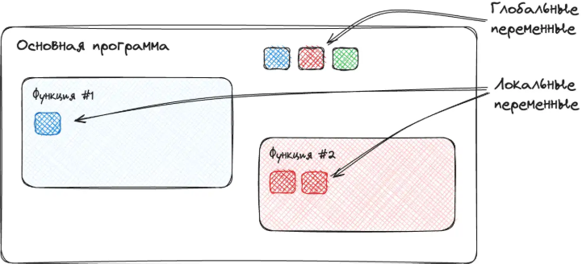
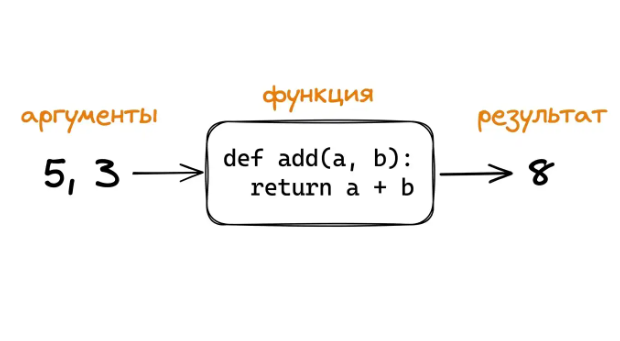
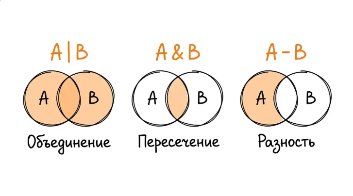

# Переменные

Переменная в Python - это имя, привязанное к объекту в памяти. Тип объекта Python определяет сам, и эту привязку можно изменить в любой момент.

```python
name = "Иван"
print("Привет, " + name + "!")
```

name - подпись, под которой Python запоминает, где в памяти лежит строка "Иван"

Множественное присваивание

```python
coordinates = (10, 20, 30)
x, y, z = coordinates

print(f"x={x}, y={y}, z={z}")
```

```python
x = y = z = 0
```

Обмен значениями

```python
a = 5
b = 10
a, b = b, a
```

- Справа сначала собирается кортеж (10, 5), потом он распаковывается слева. Никакой третьей переменной не нужно.

### Динамическая типизация

ДТ - тип переменной определяется во время выполнения и может меняться при присваивании нового значения:

```python
x = 10  # int
x = "десять"  # str
x = [1, 2, 3]  # list
```

### Практики нейминга

1. Описательные имена

```python
user_age = 25  # ok
age = 25  # not ok
```

2. избегать слишком коротких имён
3. snake_case
4. is_ и has_ для логических переменных
5. uppercase для констант (хотя в питоне нет констант)

### Область видимости

Область видимости переменной - это часть программы, в которой эта переменная доступна. Она определяет, где имя можно использовать и какому объекту оно соответствует.

Область видимости (scope) - правило, по которому Python решает, какая переменная имеется ввиду в каждом месте кода.

### Уровни видимости

- Глобальная область: всё, что объявлено в основном теле модуля. Видно из любой функции.
- Локальная: переменные, объявленные внутри функции; живут только пока функция выполняется.



#### Глобальные переменные

ГП определяются вне функций и доступны как внутри функций, так и снаружи:

```python
message = 'Привет, мир!'

def show_message():
	print(message)

show_message();
```

Чем больше глобалов, тем сложнее отлаживать код: чтобы понять, что делает функция, недостаточно смотреть на её аргументы - нужно ещё помнить, какие переменные снаружи она читает.

#### Локальные

Локалы создаются внутри функций и существуют только пока функция выполняется. После её завершения они исчезают из памяти:

```python
def calculate_sum():
	a = 10
	b = 20
	result = a + b
	print(f"Сумма внутри функций: {result}")

calculate_sum()

# Попытка обращения к локали извне
try:
	print(result)
except Exception as e:
	print(f"Ошибка: {e}")
```

Если имя локали и глобали совпадает, локаль имеет приоритет. Это называется shadowing: локальная заслоняет глобальную, не трогая её.

```python
x = 'glob'

def test_scope():
    x = 'locale'
    print(f'inside x = {x}')
  
print(x)  # glob
test_scope()  # locale
```

Изменение глобальной из локальной

```python
x = 'glob'

def modify_global():
    global x
    x = 'modif glob'
    print(f'inside x = {x}')
  
modify_global()  # locale
print(x)  # glob
```

- global говорит: эта функция не просто работает со своими аргументами, она лезет наружу. Этим стоит пользоваться только в крайних случаях.

#### UnboundLocalError

```python
x = 10

def show():
	print(x)
	x = x + 1

show()  # UnboundLocalError: local variable 'x' referenced before assignment
```

Причина: пайтон смотрит на функцию целиком до её выполнения и определяет локальные имена. Видит x - интерпретирует её как локальную и пытается прочитать, на выходе ошибка. Поэтому нужен глобал. Или другой подход: не трогать глобал, а принять x параметром и вернуть новое значение:

```python
def increment(value):
	return value + 1

x = 10
x = increment(x)
print(x)
```

Самый предсказуемый способ работать с данными - не модифицировать глобалы, а передавать значения через параметры и возвращать через ретёрн

```python
def add(a, b):
    return a + b

x = 4
y = 10

sum_result = add(x, y)
print(f"{x} + {y} = {sum_result}")
```

Такая функция "честная": её результат полностью определяется тем, что в неё пришло. Ничего закулисного. Это упрощает тестирование и чтение кода.

**global оправдан**, когда переменная действительно должна жить на уровне всей программы - например, **конфигурация** или **общий счётчик**.

### Типы

* str
* int, float
* bool
* collections (list, tuple, set, dict)
* NoneType (None)

float имеют ограниченную точность, в простых вычислениях возникают погрешности. Это связано с особенностями хранения дробных чисел в двоичном представлении: некоторые десятичные дроби в нём не представимы точно. Для финансовых вычислений и других задач, где точность критична, используют модуль decimal.

Нельзя сравнивать float напрямую

```python
print(0.1 + 0.2 == 0.3)  # False
```

Для сравнения использовать `math.isclose(a, b)`

```python
import math
print(math.isclose(0.1 + 0.2, 0.3))  # True
```

Отбрасывание дробной части

```python
math.trunc(3.99)  # 3
```

#### Округление к чётному

При попадании значения ровно посередине (0.5, 2.5) Python округляет не к большему, а к ближайшему чётному. Это называется банковским округлением (banker's rounding) и сделано для уменьшения статистической ошибки при больших объёмах округлений

```python
round(0.5)  # 1
round(1.5)  # 2
round(2.5)  # 2
round(3.5)  # 4
```

Встроенные числовые функции

```python
abs(-10)
max()
min()
sum()
```

Raw-строки упрощают работу с путями в Windows и с регулярными выражениями

```python
normal_path = "C:\\Users\\Username\\Documents"  # C:\Users\Username\Documents
raw_path = r"C:\Users\Username\Documents"  # C:\Users\Username\Documents
```

Неизменяемость строк

```python
language = "Python"

try:
    language[0] = "J"
except TypeError as e:
    print(f"Ошибка: {e}")
```

Изменение строки через сбор новой и присвоения в ту же переменную

```python
language = "Python"
language = "J" + "ython"
print(language)  # Jython
```

### Операции со строками

1. конкатенация
2. повторение

```python
border = "-" * 5  # -----
```

### Методы

- upper
- lower
- title
- capitalize

  Поиск и замена
- find
- count
- startswith
- endswith
- replace
- ```
  text = 'отличный день'
  contains = "отличный" in text
  print(f'Есть ли 'отличный': {contains}')  # True
  ```

  Разделение и объединение
- split
- join

  Удаление лишнего
- strip
- lstrip
- rstrip

### is

Оператор is сравнивает по идентичности:

- is сравнивает идентичность (это один и тот же объект в памяти или нет)
- == сравнивает значения (что у нас внутри)

```python
my_scores = [90, 85, 95]
friend_scores = [90, 85, 95]  # Такой же список, но другой объект
same_list = my_scores  # Тот же самый объект

print(my_scores == friend_scores)  # True
print(my_scores is friend_scores)  # False
print(same_list is my_scores)  # True
print(same_list is friend_scores)  # False
```

Правило: в большинстве случаев нужен '=='. Оператор is уместен только для проверок на специальные синглтоны: is None, is True, is False. Применять is к числам, строкам, спискам - почти всегда ошибка.

### Функции

Ф - именованный блок кода, выполняющий определённую задачу и который может быть вызван из других частей программы.



Параметры Ф

```python
def describe_pet(animal_type, pet_name):
	pass

# позиционные
describe_pet('собака', 'шарик')

# именованные
describe_pet(pet_name='мурка', animal_type='кошка')
```

Произвольное указание позиционных и именованных аргументов

```python
 # Произвольное количество позиционных аргументов args кортеж
def make_pizza(*toppings):
    print("Начинки:", toppings)
  
make_pizza('peperroni')
make_pizza('tomato', 'cucumber', 'onion', 'grebs')

# Произвольное количество именованных аргументов kwargs 
def build_profile(**user_info):
    print(user_info)
  
build_profile(name='Igor', location='Tchita', hobby='Programming')
```

### Условная конструкция

Условная конструкция - инструмент, позволяющий выполнять различные блоки кода в зависимости от истиности или ложности определённого условия.

```python
age = 16

if age >= 18:
	print("Вы совершеннолетний")
```

Тернарник

```python
значение_если_истина if условие else значение_если_ложь
```

```python
status = "совершеннолетний" if age >= 18 else "несовершеннолетний"
```

Идиомы для bool

```python
if is_active:  # truthy
if not my_list  # falsy
if not name:  # falsy
```

Идиомы в программировании - устоявшийся, узнаваемый способ решать типичную задачу на конкретном языке. Это не отедльный инструмент, а паттерн использования языка: набор приёмов, который сообщество программистов считает правильным или каноническим для определённой ситуации.

Проверка пароля

```python
password = "pase123"

if len(password) < 8:
    print('Пароль слишком короткий')
elif password.isalpha():
    print('Пароль должен содержать не только буквы')
elif password.isdigit():
    print('Пароль должен содержать не только цифры')
else:
    print('Пароль подходит')
```

Учебный пример условного оператора

```python
score = int(input())

if 90 <= score <= 100:
    print("A")
elif 80 <= score < 90:
    print("B")
elif 70 <= score < 80:
    print("C")
elif 60 <= score < 70:
    print("D")
else:
    print("F")
```

## Циклы

Ц позволяют выполнять один и тот же блок кода несколько раз: пройтись по элементам списка, повторить действие N раз, продолжать пока выполняется условие. Без них пришлось бы копировать одну и ту же логику для каждого шага вручную.

Итерация - однократное выполнение набора инструкций.

Цикл - конструкция, позволяющая выполнять блок кода многократно, пока выполняется определённое условие.

- for - для итерации по последовательности (списку, кортежу, строке)
- while - выполняется, пока условие истино

Итерация с индексами

```python
fruits = ["яблоко", "банан", "вишня"]

for index, fruit in enumerate(fruits):
    print(f'Индекс {index}: {fruit}')
```

while используем при заранее неизвестном количестве итераций

```python
count = 1

while count <= 5:
	print(count)
	count += 1
```

break - нештатное прерывание цикла

```python
for i in range(10):
	print(i, end=' ')
	if i == 5:
		print('exit')
		break
```

continue - пропуск текущей итерации и переход к следующей

```python
for i in range(10):
	if i % 2 == 0:
		continue
	print(i, end=" ")
```

else - отработка при штатном завершении цикла

```python
for i in range(5):
    print(i, end=" ")
else:
    print("\nШтатное завершение")
```

Вложенные циклы

```python
# Таблица умножения

for i in range(1, 4):  # строки
    for j in range(1, 4):  # столбцы
        print(f'{i} * {j} = {i*j}', end='\t')
    print()  # переход на новую строку после каждой строки таблицы
```

Вложенные циклы могут быть ресурсоёмкими, особенно при большом количестве итераций. Использовать с осторожностью, искать более эффективные альтернативы для обработки больших данных.

### Списковые включения

Списковые включения (или генераторы списков) - это элегантный способ создания списков в одну строку

```python
squares_comprehension = [i**2 for i in range(10)]
print(f'Через списковое включение: {squares_comprehension}')
```

с условием

```python
even_squares = [i**2 for i in range(10) if i % 2 == 0]  # условие называют фильтром
```

### Составные типы

СТ хранят сразу несколько значений под одним именем. Их 4 и они различимы по способу организации данных внутри.

Они похожи на контейнеры или коллекции, где можно организовывать и хранить связанные данные. 4 сложных типа:

- Списки - упорядоченные изменяемые коллекции элементов. Когда важен порядок и нужно изменять коллекцию
- Кортежи - упорядоченные неизменяемые. Для защиты данных от изменений (координаты, константы)
- Мнжества - неупорядоченные коллекции уникальных элементов. Только уникальные элементы
- Словари - коллекции пар ключ-значние. Для связи значений с уникальными ключами

Фигурные скобки {} без элементов создают пустой словарь, а не пустое множество (set())).

Список - важен порядок и данные могут меняться

Кортеж - данные не должны меняться и важен порядок

Множество - только уникальные элементы и не важен порядок

Словарь - данные организованы в пары ключ-значение

Списки можно менять

```python
fruits = ["яблоко", "банан", "вишня", "груша", "апельсин"]

fruits[0] = 'qiwi' 

# "qiwi", "банан", "вишня", "груша", "апельсин"]
```

Множества вставка в список через срез

```python
fruits = ["яблоко", "банан", "вишня", "груша", "апельсин"]

fruits[1:3] = ['a', 'b', 'c']
```

Методы списков:

- append
- extend
- insert(index, value)
- extend - расширение (вставка в конец)

```python
more_fruits = ["a", "b"]
fruits.extend(more_fruits)
[..., a, b]
```

- remove(value)
- pop(index) - удаляет и возвращает значение
- clear
- del
- index() - поиск первого вхождения элемента
- count() - подсчёт количества вхождений элемента
- sort())
- sort(reverse=True)
- sorted()

Объединение списков через "+"

```python
combined = fruits + ['ann', 'man']
```

### Копирование списков

- reference = original - один и тот же объект
- copy = original.copy() - два разных объекта

```python
original = [1, 2, 3]

# Присваивание не создаёт копию - обе переменные указывают на один объект
reference = original
reference.append(4)
print(original)  # 1234

# Правильные способы
# 1. copy()
copy1 = original.copy()

# 2. slice
copy2 = original[:]

# 3. list()
copy3 = list(original)

print(
    copy1 is original,  # False
    copy2 is original,  # False
    copy3 is original,  # False
)
```

## Кортежи

Кортеж - упорядоченная неизменяемая коллекция элементов разных типов. Когда у данных фиксированная форма (координаты, RGB-цвет, возвращаемое значение функции из нескольких частей) – это случай применения кортежа.

Основные свойства:

- Упорядоченность
- Неизменяемость
- Индексируемость
- Допуск дубликатов
- Содержание разных типов данных: целые числа, строки, и т.д.

Работа с кортежами

```Python
# Пустой кортеж
empty_tuple = ()

# Кортеж с одним элементом (обязательно с запятой)
single_item = (42, )

# Кортеж без скобок
coordinates = 10.5, 20.7, 30.9  # tuple

# Преобразование строки в кортеж
string_to_tuple = tuple("Python")  # ('P', 'y', 't', 'h', 'o', 'n')
```

Кортежи поддерживают обращения по индексу и слайсы

Методы: count, index

Операции (узнать длину, проверка наличия, повторение, конкатенация, распаковка)

```Python
fruits = ("apple", "banana", "cherry")

# Узнать длину
len(fruits)

# Проверить наличие элемента
'apple' in fruits

# Конкатенация
combined = fruits + ('elderberry', 'redberry')  # ('apple', 'banana', 'cherry', 'elderberry', 'redberry')

# Повторение
repeated = fruits * 2  # ('apple', 'banana', 'cherry', 'apple', 'banana', 'cherry')

# Распаковка
a, b, c = fruits  # apple banana cherry
```

Сравнение кортежей

```Python
(1, 2) < (1, 3)  # True
(2, 0) < (1, 9)  # False

# В первом случае элементы равны 1 == 1, python сравнивает сторые
```

Сортировка кортежей

```Python
people = [('Bob', 30), ("Anna", 25), ("Anna", 30)]
print(sorted(people))  # [('Anna', 25), ('Anna', 30), ('Bob', 30)]

# Сортировка идёт сначала по первому элементу (имени), а при равенстве - по второму (возрасту).
```

Можно создать новый кортеж на основе существующего

```Python
new_coordinates = (15.0, ) + coordinates[1:]
```

### Примеры использования кортежей

1. Возврат нескольких значений из функции

```Python

def get_user_info():
    name = 'Ann'
    age = 25
    is_admin = True
    return name, age, is_admin

# Распаковка результата
user_name, user_age, user_is_admin = get_user_info()
print(f"Name: {user_name}, Age: {user_age}, Admin: {user_is_admin}")
```

2. Фиксированные данные

```Python
# Дни недели - идеальный пример неизменяемой последовательности
DAYS_OF_WEEK = ("Monday", "Tuesday", ...)

# Использование
today_index = 4  # Friday
print(f'Today is {DAYS_OF_WEEK[today_index]}')
```

Роль кортежей: содержат фиксированную запись неизменяемых элементов в строгой последовательности `(name, age, email)`, в отличие от списка, хранящие произвольный набор схожих по смыслу данных. Кортеж - это "запись": позиции имеют конкретный смысл, – это структура со строгой последовательностью данных.

Выбор между кортежом и списком влияет на структуру, читаемость и смысловую нагрузку кода

Кортеж быстрее списка, использует меньше памяти, может быть ключом словаря, подходит для неизменяемых данных

Список медленнее кортежа, занимает больше места, не может быть ключом словаря, подходят для изменяемых коллекций


## Множества

Сеты решают 2 конкретные задачи: быстрая проверка членства (есть ли элемент в коллекции) и хранение только уникальных значений без дубликатов. Это неупорядоченная коллекция, основанная на математической концепции множества.

Множество в Python – это неупорядоченная коллекция уникальных элементов. Два ключевых свойства: неупорядоченность (элементы не индексируются и не имеют определённого порядка) и уникальность (каждый элемент встречается только один раз)

Характеристики - изменяемость (добавление/удаление элементов), неизменяемые элементы (внутрь можно положить только неизменяемые объекты вроде чисел, строк, кортежей), эффективность (оптимизированы для быстрой проверки вхождения элементов)

Поскольку множества основаны на математической концепции, у них есть операции объединения, пересечения, разности.

Множества в Python принимают роавно один аргумент – итерируемый объект (список, кортеж, строку), а не набор отдельных элементов.

Отличия способов создания:

```Python
{1, 2, 3}  # Литерал множества: сразу задаются элементы
set([1, 2, 3])  # Конструктор: передаём итерирумый контейнер, из него берутся элементы
```

### Операции с множествами

1. Проверка наличия элемента

```Python
fruits = {"Яблоко", "Банан", "Вишня"}

print("Яблоко" in fruits)
```


2. Добавление и удаление элементов

```Python
fruits = {"Яблоко", "Банан", "Вишня"}

# Добавление одного элемента
fruits.add("Персик")

# Добавление нескольких элементов
fruits.update(["Груша", "апельсин"])

# Удаление
fruits.remove("Яблоко")  # KeyError при отсутствии элемента

# Безопасное удаление
fruits.discard("Вишня")  # Не вызывает ошибку, если элемента нет

# Извлечение произвольного элемента
random_fruit = fruits.pop()

# Очистка множества
fruits.clear()

print(
    random_fruit
)
```


Итерация по множеству

```Python
colors = {"красный", "синий", "зеленый"}

for color in colors:
  print(color)

  # Красный синий зеленый -- порядок элементов не гарантирован
```


### Математические операции над множествами

Объединение, пересечение, разность. Диаграмма Венна:



#### Объединение (|)

```Python
a = {1, 2, 3}
b = {3, 4, 5}

union_set = a.union(b)
union_set_double = a | b

print(
    union_set,
    union_set_double,
)
```

#### Пересечение (&)

```Python
a = {1, 2, 3}
b = {3, 4, 5}

intersection_set = a.intersection(b)
intersection_set_double = a & b

print(
    intersection_set,  # 3
    intersection_set_double,  # 3
)
```

#### Разность (-)

```Python
a = {1, 2, 3}
b = {3, 4, 5}

difference_set = a.difference(b)
difference_set_double = a - b

print(
    difference_set,
    difference_set_double,
)
```


#### Сравнение множеств

```Python
a = {1, 2, 3}
b = {1, 2, 3, 4, 5}
c = {1, 2, 3}
d = {6, 7, 8}

print(
    a == c,
    a.issubset(b),
    a > b,
    b.issuperset(a),
    b > a,
    a.isdisjoint(d)  # нет ли у двух множеств одинаковых элементов
)
```


#### Неизменяемые множества

```Python
immutable_set = frozenset([1, 2, 3, 4])
print(immutable_set)

# Попытка изменить frozenset вызывает ошибку
try:
    immutable_set.add(1)
except AttributeError as e:
    print(f'Ошибка: {e}')
  
normal_set = {frozenset([1, 2]), frozenset([3, 4])}
print(normal_set)  {frozenset({3, 4}), frozenset({1, 2})}
```


#### Практические примеры

1. Удаление дубликатов из списка

```Python
numbers = [1, 2, 2, 3, 3, 3, 4, 5, 5]

filtered = list(set(numbers))
```


2. Нахождение общих элементов

```Python
users_group1 = ["Анна", "Иван", "Мария", "Петр", "Елена"]
users_group2 = ["Иван", "Ольга", "Елена", "Алексей"]

# Общие элементы
common_users = set(users_group1) & set(users_group2)

# Только первая группа (разность)
users_from_group1 = set(users_group1) - set(users_group2)

# Все уникальные элементы (объединение)
all_users = set(users_group1) | set(users_group2)
```


3. Проверка уникальности элементов

```Python
def are_all_unique(items):
    return len(set(items)) == len(items)

print(are_all_unique([1, 2, 3, 4, 5]))  # True
print(are_all_unique([1, 2, 3, 3, 3]))  # False
```

#### Ограничения и производительность

1. Элементы множества должны быть хэшируемыми (неизменяемыми)

```Python
valid_set = {1, "hello", (1, 2, 3)}
print(valid_set)  # {1, "hello", (1, 2, 3)}


# Ошибка с неизменяемыми типами данных
try:
    invalid_set = {1, [2, 3], {"a": 1}}
except TypeError as e:
    print(f'Ошибка: {e}')  # unhashable type: 'list'
```

Можно добавлять: числа, строки, кортежи с хэшируемыми элементами, frozenset

Нельзя добавлять: списки, словари, множества

Хэшируемый объект в Python - объект, у которого есть стабильный хэш: его значение не меняется в течении жизни объекта, и для него определён метод `__hash__()` . Плюс у него должен быть метод `__eq__()`, чтобы можно было сравнивать объекты на равенство.


2. Производительность. Множества оптимизированы для быстрых операций

```Python
import time


# Сравнение скорости поиска
data = list(range(10000))
data_set = set(data)

# Поиск в списке vs поиск в множестве
start = time.time()  # Возвращает текущее время в секундах  1782386634.5808556
print('start', start)
9999 in data  # Медленно: O(n)
list_time = time.time() - start  #  0.00012636184692382812


start = time.time()
9999 in data_set  # Быстро: O(1)
set_time = time.time() - start

print(f'Поиск в списке: {list_time:.6f}')  # f - формат числа с плавающей точкой (fixed-point), .6 - ровно 6 знаков после запятой
print(f'Поиск в множестве: {set_time:.6f}')
print(f'Множество быстрее в {list_time/set_time:.1f} раз')
```


Операции со сложностью O(1) (константное время):

- Проверка наличия элемента: `x in set`
- Добавление элемента: `set.add(x)`
- Удаление элемента `set.remove(x)`, `set.discard(x)`
