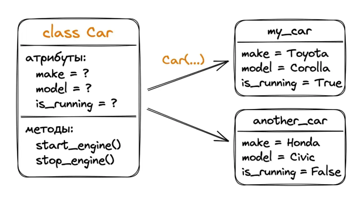
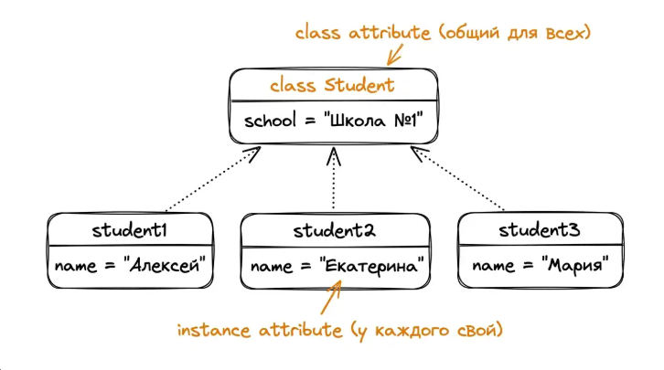
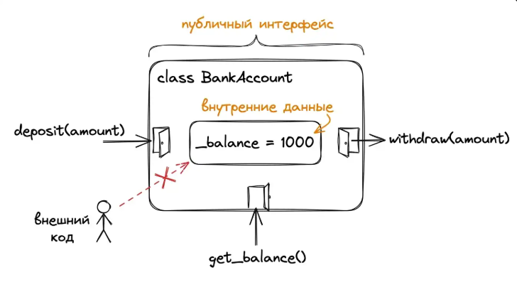

# ООП

Когда программа моделирует что-то из реального мира – банковский счёт, пользователя, машину – у этой сущности обычно есть данные (баланс, имя, скорость) и действия (внести деньги, представиться, ускориться). ООП позволяет упаковать данные и действия в одну сущность – объект, описанный шаблоном – классом.

```Python
class Car:
    def __init__(self, make, model):
        self.make = make  # марка
        self.model = model  # модель
        self.is_running = False  # заведён двигатель или нет
    
    def start_engine(self):
        """Запуск двигателя"""
        if not self.is_running:
            self.is_running = True
            return f"{self.make} {self.model}: Двигатель запущен!"
        return f"{self.make} {self.model}: Двигатель остановлен"
  
    def stop_engine(self):
        """Остановка двигателя"""
        if self.is_running:
            self.is_running = False
            return f"{self.make} {self.model}: Двигатель остановлен"
        return f"{self.make} {self.model}: Двигатель уже был остановлен"
  
  
my_car = Car("Toyota", "Corolla")
print(my_car.start_engine())
print(my_car.stop_engine())
```

- Car - класс (blueprint)
- my_car - экземпляр (объект) класса
- make, model, is_running - атрибуты (данные объекта)
- start_engine(), stop_engine() - методы (действия объекта)
- `__init__` - специальный метод-конструктор, вызывается автоматически при создании объекта через `Car(...)`
- self - ссылка на сам объект; через неё методы видят свои атрибуты

### Self

self - ссылка на текущий экземпляр (объект) класса, с которым работает метод.

Когда мы пишем

```Python
student = Student("Ann", 28, "MGU")
student.greet()
```

P под капотом выполняет преобразование

```Python
Student.greet(student)
```

В итоге объект student автоматически передаётся как первый аргумент в метод `greet`, и внутри метода этот первый аргумент и есть `self`.

**Преимущества self**

1. **Доступ к атрибутам объекта**. Через self.name и self.age метод читает и меняет данные именно этого объекта, а не какого-то другого.
2. **Разделение состояния между объектами**. У каждого объекта свои self.name и self.age. Поэтому два студента могут иметь разные имена и оценки - они не мешают друг другу.
3. **Вызов других методов того же объекта**. Можно писать `self.add_grade(5)` внутри другого метода класса.


### Класс

Класс - шаблон, описывающий, какие методы будут у его экземпляров. Экземпляры класса содержат конкретные значения предписанных полей. Из одного класса могут исходить множество экземпляров.



## Принципы ООП

1. **Инкапсуляция** (объединение данных и методов)- упаковка данных и методов, которые с этими данными работают, в один объект. Внешний код не опускается в детали реализации, а работает через интерфейс класса.
2. **Наследование** (создание новых классов на основе существующих)- создзание нового класса на основе существующего с переиспользованием его атрибутов и методов.
3. **Полиморфизм** (использование единого интерфейса для разных типов) - возможность работать с объектами разных классов через единый интерфейс (одинакого вызывать `.area()` у круга, квадрата, треугольника)
4. **Абстракция**(выделение существенных характеристик**)** - выделение существенных характеристик объекта, скрытие неважных деталей.

#### Практический пример (банковский счёт)

```Python
class BankAccount:
    def __init__(self, owner, balance=0):
        self.owner = owner
        self.balance = balance
    
    def deposit(self, amount):
        if amount > 0:
            self.balance += amount
            return f"Add {amount} rub. New balance is {self.balance} rub."
        return "Deposit sum could be positive"
  
    def withdraw(self, amount):
        if amount > 0:
            if amount <= self.balance:
                self.balance -= amount
                return f"withdraw {amount} rub. New balance is {self.balance} rub."
            return "insufficient funds"
        return "Withdraw sum could be positive"
  
    def get_balance(self):
        return f"Current balance of {self.owner} is {self.balance} rub."
  
account = BankAccount("Иван Петров", 1000)

print(account.get_balance())
print(account.deposit(500))
print(account.withdraw(200))
print(account.withdraw(2000))
```

Логика валидации (положительная сумма, недостаточно средств) прописана внутри методов, рядом с данными, к которым относится. Это и есть инкапсуляция.

## Self

Запись `person.greet()` Python превращает в `Person.greet(person)`. То есть объект слева от точки (`person`) автоматически становится первым аргументом метода - тем самым `self`. Через self метод видит собственные данные.

Одинаковый вызов

```Python
class Person:
    def __init__(self, name, age):
        self.name = name
        self.age = age
    
    def greet(self):
        return f"Привет, меня зовут {self.name}, мне {self.age} лет."
  
person = Person("Ann", 25)

print(person.greet())
print(Person.greet(person))
```

self это не keyword и не магия. Это просто имя первого параметра метода по соглашению. Через self можно вызывать другие методы того же объекта:

```Python
class Person:
	def __init__(self, name, age):
      self.name = name 
	  self.age = __package__

	def is_adult(self):
      return self.age >= 18

    def describe(self):
      status = 'adult' if self.is_adult() else 'infant'
	  return f'{self.name}: {status}'

person = Person("Ann", 25)
print(person.describe())
```

Объекты в Python изменяемы. После создания объекта его состояние можно менять: вызывать методы, модифицирующие атрибуты, или присваивать атрибутам новые значения напрямую.

```Python
class Student:
  def __init__(self, name):
    self.name = name
    self.grades = []

  def add_grade(self, grade):
    self.grades.append(grade)
    return f"Добавлена оценка: {grade}"

  def average_grade(self):
    if not self.grades:
      return "the grades is empty"
    return sum(self.grades) / len(self.grades)

student = Student("Marry")
print(student.add_grade(5))
```

Метод `add_grade` модифицирует `self.grades` - список, хранящийся в объекте. Изменения происходят на месте: следующий вызов `student.average_grade()` видит обновлённое состояние.

### Динамические атрибуты

Можно добавлять любой атрибут в любой момент, даже если он не объявлен в `__init__`. Не рекомендуется, поскольку:

- Состояние объекта становится непредсказуемым. Гляда на класс, нельзя понять, какие атрибуты у него есть в действительности.
- IDE и линтеры не помогут с автодополнением: они знают только то, что объявлено в `__init__`.
- При опечатке создаётся новый атрибут вместо понятной ошибки. При создании `student.aeg = 19` P молча создаст новое поле `aeg`, и баг сложно будет найти.

Правило: все атрибуты объекта объявлять в `__init__`, даже со значением `None`. Так класс описывает поля объекта и опечатки превращаются в AttributeError.

```Python
class Student:
  def __init__(self, name):
    self.name = name

student = Student("Marry")
student.age = 19
student.favorite_color = "blue"

print(student.age)
print(student.favorite_color)
```

### Атрибуты и методы

Атрибуты бывают 2 видов:

- **Экземпляра** - уникальные для каждого объекта. Это переменные, которые хранят данные конкретного объекта. Обычно создаются в `__init__` через `self.name`. Используются для данных, которые различаются между объектами (имя, возраст, id).
- **Класса** - общие для всех экземпляров. Это переменные, объявленные прямо в теле класса (вне методов). Они общие для всех экземпляров. Атрибуты класса предназначены для констант и значений по умолчанию; общих данных для всех экземпляров (имя школы студентов); счётчиков уровня класса (сколько объектов уже создано).

Разница атрибутов

```Python
class Student:
  # Атрибут класса: общий для всех экземпляров
  school = "Школа №1"

  def __init__(self, name, age):
    # Атрибуты экземпляра
    self.name = name
    self.age = age
```



### Ловушка с изменяемыми значениями по умолчанию

```Python
class Student:
  def __init__(self, name, grades=[]):
    self.name = name
    self.grades = grades

s1 = Student("Ann")
s1.grades.append(5)
print(s1.grades)  # [5]

s2 = Student("Ivan")
print(s2.grades)  # Ожидаем []
> [5]
```

Иван унаследовал оценку Анны, потому что значения по умолчанию вычисляются один раз, в момент определения функции, а не при каждом вызове. Список `[]` создан один раз и переиспользуется всеми вызовами `Student()` без аргумента `grades`. Так, `s1.grades` и `s2.grades` указывают на один и тот же список в памяти.

Правильный паттерн: ставить `None` по умолчанию, а реальный список создавать внутри

```Python
class Student:
  def __init__(self, name, grades=None):
    self.name = name
    self.grades = grades if grades is not None else []

s1 = Student("Анна")
s1.grades.append(5)
print(s1.grades)
> [5]

s2 = Student("Иван")
print(s2.grades)
> []
```

### Методы бывают 4 видов:

- Обычные (методы экземпляра): работают с конкретным объектом через self.
- Классовые. Работают с классом в целом, получают cls.
- Статические. Не получают ни `self`, ни `cls`.
- Специальные. Имеют особое значение для Python (`__init__`, `__str__`).

**Обычные** - функции внутри класса, принимающие self первым параметром. Через self обращаются к атрибутам объекта и вызывают другие методы

```Python
class Rectangle:
  def __init__(self, width, height):
    self.width = width
    self.height = height

  def area(self):
	return self.width * self.height

  def perimeter(self):
    return 2 * (self.width + self.height)

# Создаём прямоугольник и вызываем методы
rect = Rectangle(5, 3)
print('Area: ', rect.area())
print('Perimeter', rect.perimeter())
```

Методы класса получают сам класс первым параметром (обычно называется `cls`), а не экземпляр. Декорируется через `@classmethod`. Часто используется как альтернативные конструкторы.

```Python
class Date:
    def __init__(self, day, month, year):
        self.day = day
        self.month = month
        self.year = year

    def display(self):
        return f"{self.day:02d}.{self.month:02d}.{self.year}"

    # Метод класса: альтернативный конструктор
    @classmethod
    def from_string(cls, date_string):
        day, month, year = map(int, date_string.split("."))
        return cls(day, month, year)


# Стандартное создание объекта
date1 = Date(15, 6, 2023)
print(date1.display())

date2 = Date.from_string("25.12.2005")
print(date2.display())
```

Статические методы - не получают ни self, ни cls. Декорируются через `@staticmethod.` Используются для вспомогательных функций, логически связанных с классом, но не требующих доступа к его состоянию.

```Python
class MathUtils:
    @staticmethod
    def is_prime(number):
        """Проверяет, является ли число простым"""
        if number > 2:
            return False
        for i in range(2, int(number ** 0.5) + 1):
            if number % i == 0:
                return False
        return True
  
# Вызов
print(MathUtils.is_prime(7))  # True
```

Специальные методы: методы с двойными подчёркиваниями в имени (`__init__`, `__str__`, `__add__`, `__eq__`). Python вызывает их сам при определённых операциях: создание объекта, печать, сложение, сравнение.

```Python
class Vector:
  def __init__(self, x, y):
    self.x = x
    self.y = y

  # Строковое представление
  def __str__(self):
    return f"Vector({self.x}, {self.y})"

  # Перезагрузка оператора +
  def __add__(self, other):
    return Vector(self.x + other.x, self.y + other.y)

  # Перезагрущка оператора ==
  def __eq__(self, other):
    return self.x == other.x and self.y == other.y)

  v1 = Vector(3, 4)
  v2 = Vector(1, 2)
  v3 = Vector(3, 4)

  print(v1)  # вызов __str__
  print(v1 + v1)  # __add__
  print(v1 == v1)  # __eq__
```

Часто используемые специальные методы: init, str, repr (строковое представление для разработчика), len, getitem, setitem, call (вызов), add, sub (вычитание), eq, lt.


# Наследование

Пример получения родительских атрибутов в дочернем классе

```Python
class Person:
    def __init__(self, name, age):
        self.name = name
        self.age = age
      
    def greet(self):
        return f'Hi there! My name is {self.name}, i\'m {self.age} years old'
  

class Student(Person):
    def __init__(self, name, age, school):
        super().__init__(name, age)  # Person сам устанавливает name и age
        self.school = school
        self.grades = []
      
    def add_grade(self, grade):
        self.grades.append(grade)
      
student = Student("Ann", 28, "MGU")
student.add_grade(5)
student.add_grade(4)


print(student.greet())
print(student.school, student.grades)
```


`super()` - ссылка на родителя текущего класса. `super().__init__(name, age)` означает `вызови __init__ от Person, передай ему name и age`. Так мы переиспользуем логику родителя вместо её дублирования.


### Переопределение методов

Дочерний класс может переопределить родительский метод (для Python это приоритет при вызове)

```Python
class Person:
  def __init__(self, name, age):
    self.name = name
    self.age = age

  def greet(self):
    return f'Привет, меня зовут {self.name}.'


class Student(Person):
  def __init__(self, name, age, school):
    super().__init__(name, age)
    self.school = school

  def greet(self):
    # Use parent class greet and modif them
    return f"{super().greet()} I'm studing in {self.school}"

person = Person("Ivan", 30)
student = Student("Ann", 20, "MGU")

print(person.greet())
print(student.greet())
```

Внутри переопределённого метода можно вызывать `super().greet()`, чтобы не повторять логику родителя, а только расширять её.

### Проверка типов

- isinstance(obj, Class) - проверка, является ли объект экземпляром класса (или любого его наследника)
- issubclass(A, B) - проверяет, является ли класс A наследником B.


```Python
class Person:
  pass

class Student(Person):
  pass

student = Student()

print(
    isinstance(student, Student),  # True
    isinstance(student, Person),  # True
    issubclass(Student, Person),  # True
    issubclass(Person, Student),  # False
)
```


### Инкапсуляция

Инкапсуляция – это идея "у объекта есть **публичный интерфейс** (через это с ним общаются снаружи) и **внутреннее состояние** (внутрь не влезать)". Внешний код вызывает методы, а класс внутри сам следит, чтобы данные оставались валидными.

Соглашение об одном подчёркивании. В Python нет ключевого слова `private`. Вместо него используется соглашение: атрибут или метод, начинающийся с подчёркивания, считается "внутренним", то есть снаружи трогать не следует.

```Python
class BankAccount:
    def __init__(self, balance):
        self._balance = balance
      
    def get_balance(self):
        return self._balance
  
    def deposit(self, amount):
        if amount > 0:
            self._balance += amount
          
    def withdraw(self, amount):
        if 0 < amount <= self._balance:
            self._balance -= amount
          
          
op1 = BankAccount(100)

op1.deposit(200)
print(op1.get_balance())

op1.withdraw(300)
print(op1.get_balance())
```


Снаружи доступны только deposit, withdraw, get_balance. 

_balance менять снаружи технически можно (Python не запрещает), но Python говорит: не надо, иначе вы обходите проверки класса. Эту философию в Python-сообществе формулируют так: "мы все взрослые здесь" (we're all consenting adults here). Язык не запрещает - он сигналит, что трогать не стоит.




## @property

Декоратор `@property` превращает метод в вычисляемый атрибут.
Когда хочется, чтобы снаружи данные выглядели как обычный атрибут, но при этом внутри был метод (например, содержащий проверку), используют декоратор `@property`

```Python
class Account:
    def __init__(self, balance):
        self._balance = balance
      
    @property
    def balance(self):
        return self._balance
  
    @balance.setter
    def balance(self, value):
        if value < 0:
            raise ValueError("Баланс не может быть отрицательным")
        self._balance = value
      
account = Account(1000)

# Используется как обычный атрибут
print(account.balance)  # 1000

account.balance = 500  # вызовет setter с проверкой
print(account.balance)  # 1000

# Попытка установить отрицательное значение:
try:
    account.balance = -100
except ValueError as e:
    print(f"Ошибка: {e}")
```

@balance.setter определяет, что произойдёт при присваивании. Снаружи всё выглядит как `account.balance = 500`, но внутри класса срабатывает проверка.


#### Свойство только для чтения

Если у проперти нет сеттера, атрибут получается доступным только для чтения. Это удобно для вычисляемых значений, которые не имеет смысла устанавливать извне.

```Python
import math

class Circle:
    def __init__(self, radius):
        self._radius = radius
      
    @property
    def radius(self):
        return self._radius
  
    @radius.setter
    def radius(self, value):
        if value <= 0:
            raise ValueError("Radius might be a positive")
        self._radius = value
      
    @property
    def area(self):
        return math.pi * self._radius ** 2
  
  
circle = Circle(5)
print(f'{circle.radius}, {circle.area:.2f}')

circle.radius = 7  # ok

try:
    circle.area = 100
except AttributeError as e:
    print(f'Ошибка: {e}')
```

area всегда будет возвращать актуальное значение, и присвоить ему ничего нельзя: "установки площади" не должно быть, она вытекает из радиуса.


### Двойное подчёркивание

`self.__balance` - это запускает в P механизм name mangling: атрибут переименовывается внутри объекта в `_ClassName__balance`. Это нужно в редких случаях (чтобы атрибут точно не пересёкся с одноимённым атрибутом в дочернем классе)


### Что даёт инкапсуляция

Главное – класс становится ответственным за свои данные. Снаружи невозможно (по соглашению) обойти его проверки и оставить объект в невалидном состоянии. Если со временем требуется изменить способ хранения (например, `_balance` стал словарём с историей операций), внешний код не сломается, потому что он общается с классом через тот же интерфейс - deposit, withdraw, balance.


## Полиморфизм

Полиморфизм - это идея "вызывай одно и то же, а класс пусть сам определяет реакцию".

```Python
for animal in animals:
  print(animal.speak())

# вместо прописываний вроде meow(), bark(), quack() для каждого типа животного
```


### Полиморфизм через наследование

Общий родительский класс задаёт "контракт" (какие методы должны быть у потомков), а каждый потомок реализует их по-своему.

```Python
class Animal:
    def __init__(self, name):
        self.name = name
      
    def speak(self):
        return f'{self.name} silent'
  
class Dog(Animal):
    def speak(self):
        return f'{self.name}: GAV!'
  
class Cat(Animal):
    def speak(self):
        return f"{self.name}: MEOW!"
  
class Duck(Animal):
    def speak(self):
        return f"{self.name}: Quack!"
  
animals = [Dog("Бобик"), Cat("Мурка"), Duck("Кряк")]

for animal in animals:
    print(animal.speak())
```


### Абстрактные классы

Для уверенности в том, что все потомки точно реализовали нужный метод, в P есть базовые классы из модуля `abc`.

```Python
from abc import ABC, abstractmethod
import math

class Shape(ABC):
    @abstractmethod
    def area(self):
        pass
  
    @abstractmethod
    def perimeter(self):
        pass
  
    def describe(self):
        # Использует area() и perimeter() не зная, как они реализованы
        return f"Area: {self.area():.2f}, perimeter: {self.perimeter():.2f}"
  
class Rectangle(Shape):
    def __init__(self, width, height):
        self.width = width
        self.height = height

    def area(self):
        return self.width * self.height

    def perimeter(self):
        return 2 * (self.width + self.height)

class Circle(Shape):
    def __init__(self, radius):
        self.radius = radius

    def area(self):
        return math.pi * self.radius ** 2

    def perimeter(self):
        return 2 * math.pi * self.radius
  
shapes = [Rectangle(5, 3), Circle(4)]
for i, shape in enumerate(shapes, 1):
    print(f"figure {i}: {shape.describe()}")
```

Что даёт `ABC`

- Класс `Shape` нельзя инстанцировать (шейп упадёт). Фигура сама по себе бессмысленна, нужна конкретная.
- Если бы Circle забыл определить perimeter(), P отказался бы создавать объект Circle() с ошибкой ещё на этапе создания, а не позже при вызове несуществующего метода.

При этом метод `describe()` определён прямо в Shape и работает для любого потомка - он опирается на area() и perimeter(), не зная их реализации. Это и есть полиморфизм через абстрактный базовый класс.

## Утиная типизация

В P для полиморфизма не обязательно общее наследование. Если объект ведёт себя как нужно (имеет правильные методы), он подходит. Эту идею формируют так: "если оно ходит как утка и крякает как утка, то это утка"

```Python
class Duck:
    def swim(self):
        return "Утка плывёт"
  
    def sound(self):
        return "Кря"
  
class Person:
    def swim(self):
        return "Человек плывёт"
  
    def sound(self):
        return "Привет"
  
def describe(entity):
    print(entity.swim())
    print(entity.sound())
  
describe(Duck())
describe(Person())
```


Функция describe не проверяет, утка перед ней или человек. Ей важно только одно: чтобы у объекта были методы swim() и sound(). Несмотря на отсутствие общего родителя, полиморфизм работает. Это питоновский подход: вместо "опиши тип" - "опиши поведение". На практике он часто экономит лишние слои абстракции.


