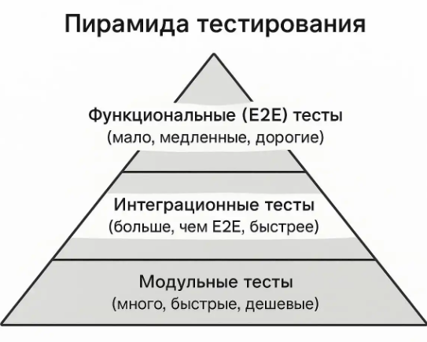

- Мемоизация - это техника оптимизации, при которой сохраняют результаты вызовов "дорогих" функций и при повторном вызове с теми же аргументами возвращают сохранённый результат вместо нового вычисления. Проще говоря: "Запомнили результат этих входных данных - потом просто достаём из памяти"
- БД - организованная коллекция данных, которая хранится и управляется специальной системой (СУБД). БД - система, мгновенно находящая нужную информацию среди миллионов записей.
- SQLAlchemy Core - это низкоуровневая часть библиотеки SQLAlchemy, которая даёт работать с БД через Python-конструкции вместо написания сырых SQL-строк.
- Тестирование ПО – процесс исследования и оценки программного продукта с целью проверки его соответствия заявленным требованиям и выявления потенциальных дефектов до того, как с ними столкнутся конечные пользователи.
- Фикстура – это функция-помощник, возвращающая состояние и автоматически передающаяся в тест по имени.
- Пайплайн - последовательность автоматизированных шагов, через которые проходит код: от момент совершения коммита до работы приложения у пользователей.
- CI (Continuous Integration) - непрерывная интеграция. Разработчики часто сливают свои изменения в общую ветку, и каждый такой коммит автоматически запускает пайплайн: код проверяют, собирают, прогоняют тесты. Цель - быстро ловить ошибки и не допускать сломанной сборки.
- CD (Cotinuous Delivery/Deployment) - непрерывная доставка/развёртывание. Кода всегда в состоянии, готовом к релизу (delivery). Его можно выкатывать на прод вручную в любой момент. Также (deployment) - если все проверки пройдены, код автоматически попадает в продакшн без участия человека
- **Пирамида тестирования** - визуализированная модель рекомендуемого соотношения различных типов тестов в проекте

- i/o-, cpu-bound - категории задач по тому, что становится узким местом при их выполнении: ввод-вывод или процессорные вычисления.
