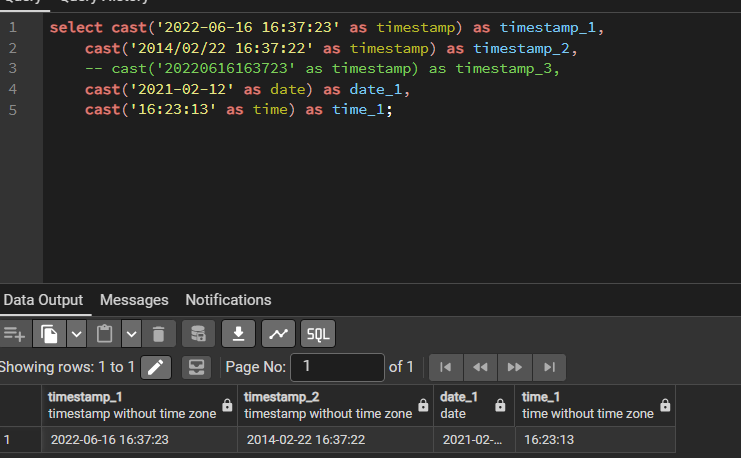
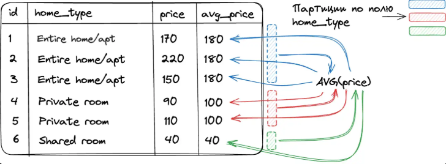
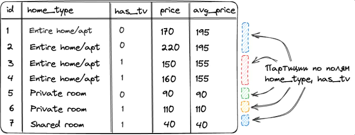
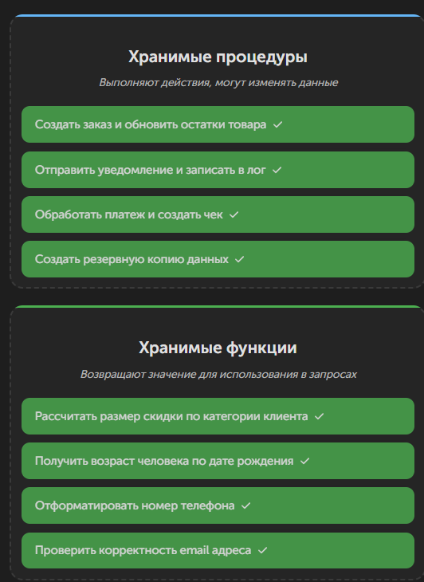
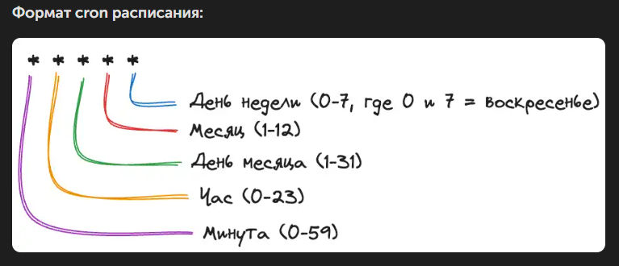

# Числовой тип данных

## Математические функции

| Имя функции | Описание                                                         |
| --------------------- | ------------------------------------------------------------------------ |
| POWER(num, power)     | Число в указанной степени                          |
| SQRT(num)             | Квадратный корень числа                             |
| LOG(base, num)        | Логарифм числа по указанному основанию |
| EXP(num)              | Вычисляет e***num*                                            |
| SIN(num)              | Синус                                                               |
| COS(num)              | Косинус                                                           |
| TAN(num)              | Тангенс                                                           |

## Округление чисел

4 функции: ceil, floor, round, trunc

- ceil, floor округляют число к ближайшему целому в большую или в меньшую сторону

```sql
select ceil(69.69) as ceiling, floor(69.69) as floor; -- 70 69
```

- round - округление к ближайшему целому любого числа, десятичная дробь которого больше или равна 0.5, иначе - в меньшую.

```sql
select round(69.499), round(69.5), round(69.501) -- 69 70 70 
```

round позволяет округлить число до некоторой части десятичных знаков после запятой (второй необязательный параметр)

```sql
select round(69.7171,1), round(69.7171, 2), round(69.7171, 3);
```

round принимает отрицательные значения. Цифры слева от десятичной точки числа становятся равными нулю на указанное в аргументе количество, а дробная часть обрезается

```sql
select round(69.7171,-1), round(69.7171,-2), round(69.7171,-3) -- 1690 1700 2000
```

**trunc аналогична round в способности принимать 2-й необязательный параметр, только вместо округления отбрасывает дробную часть**

```sql
select trunc(69.7979, 1), trunc(69.7979, 2), trunc(69.7979, 3)) -- 69.7 69.79 69.797
```

```sql
select trunc(69.7979, -1) -- 60
```

- -1 - обреж всё, что правее разряда десятков (единицы и дробная часть)
- разряд десятков - 6, разряд единиц - 9
- TRUNC отбрасывает всё после десятков, не округляя. Остаётся 60

```sql
trunc(69.1234, -1) -> 60 -- округление до десятков
trunc(109.1234, -2) -> 100 -- округление до сотен
trunc(1269.1234, -3) -> 1000 -- округление до тысяч
```

## Знаковые числа

SIGN - возвращает -1 при отрицательном числе, 0 - при нулевом, 1 - при положительном

```sql
select sign(-69), sign(0), sign(69); -- -1 0 1
```

ABS - абсолютное значение числа

```sql
select abs(-69), abs(0), abs(69);
```

# Дата и время

Самый сложный тип данных, поскольку:

- множество способов задания даты и времени
- наличие временных зон
- неочевидность вычислений некоторых значений на основании временных данных (сложность вычисления возраста)

### Способы генерации временных данных

- Скопировать данные из существующего столбца с временным типом данных
- Задать дату и время через строковое представление
- Получить временные данные путём вызова встроенных функций, возвращающих временной тип данных

Форматы:

- DATE `YYYY-MM-DD`
- TIMESTAMP `YYYY-MM-DD hh:mm:ss`
- TIME `hh:mm:ss`

Создаём временные значения через строковое представление



## CAST, оператор `::`

CAST, `::` - принудительное преобразование выражения в другой тип данных. Способ явно сказать базе: "возьми вот это значение и подставь его в другом типе данных"

```sql
CAST(выражение AS целевой_тип)
значение::тип_для_конвертации
```

- Выражение - то, что преобразуем (число, строка, дата и т.п.)
- Целевой_тип - во что превращаем (INT, VARCHAR, DATE, NUMERIC)

CAST умеет конвертировать значения в date, timestamp, time, numeric, varchar, integer, bigint, boolean, text

```sql
select cast('123' as int); -- результат 123 (число)
```

Пример: сравнение разных типов (если user_id - строка)

```sql
where cast(user_id as int) = 123;
```

```
select cast(12005.6 as integer) as cast_example, 12005.4::integer as operator_example;
```

**::** - синтаксический сахар PostgreSQL

### Функции генерации дат

1. TO_DATE - встроенная функция в PostgreSQL

   ```sql
   select to_date('November 13, 1998', 'Month DD, YYYY') AS date; -- 1998-11-13T00:00:00.000Z
   ```
2. CURRENT_DATE
3. CURRENT_TIME
4. NOW()

### Извлечение временных дат

| Функция            | Описание                                                                  |
| ------------------------- | --------------------------------------------------------------------------------- |
| EXTRACT(YEAR FROM date)   | Год для указанной даты                                         |
| EXTRACT(MONTH FROM date)  | Числовое значение месяца года (от 1 до 12) даты |
| EXTRACT(DAY FROM date)    | Порядковый номер дня в месяце (от 1 до 31)           |
| EXTRACT(HOUR FROM time)   | Значение часа (от 0 до 23) для времени                  |
| EXTRACT(MINUTE FROM time) | Значение минут (от 0 до 59) для времени                |

TIMESTAMP - не учитывает часовой пояс

TIMESTAMPTZ - учитывает часовой пояс

Пример с точным расчётом возраста:

```sql
select extract(year from age(now(), TIMESTAMP '1996-12-18 06:00:00'));
```

### Оконные функции

Оконные функции - мощный инструмент языка SQL, позволяющий проводить сложные вычисления по группам строк, которые связаны с текущей строкой.

```
select <оконная_функция>(<поле_таблицы>)
over (
	[PARTITION BY <столбцы_для_разделения>]
	[ORDER BY <столбцы_для_сортировки>]
	[ROWS|RANGE <определение_диапазона_строк>]
)
```

- оконная функция + поле - AVG(price)
- over определяет окно (группу строк), передаваемых в оконную функцию. Без параметров - вся таблица.
- partition by - выборка делится на непересекующиеся подмножества, где каждое содержит строки с одинаковыми значениями в одном или нескольких столбцах, образуя партиции.
- order by - порядок строк
- rows|range - диапазоны строк (сколько брать до и после текущей в окно)

Количество учащихся в каждом классе

```sql
SELECT
	Student.first_name,
	Student.last_name,
	Student_in_class.class,
	COUNT(*) OVER (PARTITION BY Student_in_class.class) AS student_count_in_class
FROM
	Student_in_class
JOIN
	Student ON Student_in_class.student = Student.id;
```

Выражение PARTITION BY Student_in_class.class разделяет все строки таблицы на партиции по полю `class`. Для каждой из строк в оконную функцию будут подаваться только те строки таблицы, где поле `class` совпадает с полем `class` в текущей строке.

Порядок выполнения оконных функций в SELECT:

```sql
FROM
WHERE
GROUP BY
HAVING
SELECT
FUNCTION() OVER() -- РАСЧЁТ ЗНАЧЕНИЙ ОКОННЫХ ФУНКЦИЙ
ORDER BY
```

#### Партиции

Партиции - подмножества строк, выделенные для оконной функции на основе одного или нескольких столбцов в таблице. Они служат для сегментации данных, позволяя выполнить более детальный анализ и расчёты вроде агрегации или ранжирования внутри каждой такой группы. Применяя партиционирование по типу жилья мы можем рассчитать в отдельной колонке среднюю цену для каждого типа жилья.



Высчитать среднюю цену по категориям

```sql
select home_type, price, avg(price) over (partition by home_type) as avg_price from rooms
```

PARTITION BY home_type делит все записи на разные партиции на основе уникальных значений столбца `home_type`

Партиция может быть выполнена по нескольким колонкам

```sql
select
	home_type, has_tv, price,
	avg(price) over (partition by home_type, has_tv) as avg_price
from rooms
```

Partition by создаёт уникальные партиции для каждой комбинации home_type / has_tv, позволяя вычислить среднюю цену жилья для текущей категории жилья с наличием или без наличия телевизора.



#### Сортировка внутри окна

Сортировка  в оконных функциях SQL - ключ к расширенному анализу данных. Она позволяет упорядочиввать данные внутри определённой группы или окна, обеспечивая более точные и нацеленные агрегатные вычисления. Это полезно при работе с временными рядами, где важен порядок событий, или при ранжировании данных внутри групп.

Пример: подсчёт общей суммы затрат на бронирование по каждому пользователю

```
select user_id, start_date, total as reservation_price,
sum(total) over (
	partition by user_id
	order by start_date -- сортировка по дате начала бронирования
) as total_expenses
from reservations
```

В результате добавления order by:

- Данные в рамках партиции стали отсортированы по дате начала бронирования
- Изменился способ подсчёта общей суммы затраченных средств: теперь сумма в рамках партиции накапливается, а не выводится как финальная. Это связано с одной особенностью использования сортировки без явного указания ROWS|RANGE в выражении OVER. Если в ROWS|RANGE ничего не указано, в оконной функции автоматически применяется правило RANGE BETWEEN UNBOUNDED PRECEDING AND CURRENT ROW. Это означает, что окно будет начинаться с первой строки и заканчиваться текущей строкой.

#### Диапазон строк

ROWS|RANGE позволяет указать рамках окна относительно текущей строки, которые будут использоваться для вычисления оконной функции. Можно указать, чтобы при подсчёте значений для текущей строки в оконную функцию отправлялись не все записи в рамках текущей партиции, а только N записей до текущей строки и N после.

#### Рамки окон

Окно - динамический набор строк, который скользит по результату запроса, образуя различные наборы данных для каждой строки в зависимости от заданного определения окна. Окно определяет подмножество строк, которые рассматриваются SQL-функцией при выполнении вычислений.

```sql
select func(field)
over(
...
ROWS|RANGE BETWEEN start AND end
)
```

Окно определяет, какие конкретные строки в каждой партиции будут использоваться для вычисления оконной функции для каждой строки. Окно может изменяться от строки к строке.

Например, первое окно состоит из 1 записи (потому что предыдущих записей нет), второе окно содержит 1 и 2 вторую запись, третье - 2 и 3 запись и т.д.

Если в оконной функции нет ROWS|RANGE, то окно по умолчанию совпадает с партицией.

- Партиция делит набор результатов на непересекающиеся подмножества с строками и значения для столбцов.
- Оконные функции применяются отдельно к каждой партиции, как если бы каждая из них была отдельным набором данных.

Если нужно включить в выборку две предыдущие записи и текущую строку

```sql
ROWS|RANGE between 2 preceding and current row
```

Для выборки текущей строки и всех последующих

```sql
ROWS|RANGE current row and unbounded following
```

Возможные определения границ окна:

- unbounded preceding - все строки, предшествующие текущей
- n preceding - n строк до текущей строки
- current row - текущая строка
- n following - n строк после текущей строки
- unbounded following  - все последующие строки

**ROWS** - основан на физических строках (определение окна основывается на физическом положении строк относительно текущей строки) и точной границе. Это делает поведение предсказуемым и конкретным.

**RANGE** - определяет границы окна на основе значений столбцов, упорядоченных в соответствии с order by в оконной функции. Границы могут варьироваться в зависимости от данных, что обеспечивает гибкость окна, но делает его потенциально менее предсказуемым.

#### Виды оконных функций:

1. Агрегатные. Выполняют на наборе данных арифметические вычисления и возвращают итоговое значение (sum, count, avg, max, min).
2. Ранжирующие. Ранжирование значения для каждой строки в окне.

   - ROW_NUMBER - номер строки для нумерации
   - RANK - ранг каждой строки
   - DENSE_RANK - возвращает ранг каждой строки без пропусков рангов и после ранг увеличивается на единиицу, а не на количество строк.
3. Смещающие. Функции, позволяющие перемещаться и обращаться к разным строкам в окне относительно текущей строки, а также обращаться к значениям в начале или конце окна.

   - LAG - обращение к данным из предыдущих строк окна
   - LEAD - к следующим строкам
   - FIRST_VALUE - первое значение в окне
   - LAST_VALUE

## Транзакции

Транзакции - последовательность операций с базой данных, которые выполняются как единое целое.

Блокировка - метод ограничения доступа к данным для обеспечения корректной обработки транзакций. Серверы баз данных используют блокировки, чтобы управлять одновременным доступом к данным, чтобы пока одна транзакция работала с данными, другие транзакции не могли их изменять. Когда данные в базе блокируются, другие пользователи, желающие изменить или прочитать эти же данные, должны подождать окончания блокировки.

**Гранулярность блокировок**

- Блокировка таблиц. Не позволяет нескольким пользователям одновременно изменять данные в одной таблице. Требует небольшого времени, но при увеличении числа пользователей может привести к долгим ожиданиям.
- Блокировка страниц. Не позволяет нескольким пользователям изменять данные в одной и той же странице (страница - сегмент памяти, обычно в диапазоне от 2 до 16 кбайт) таблицы одновременно. Требует большого объёма дополнительных действий, но позволяет нескольким пользователям изменять одну и ту же таблицу, если они работают с разными строками.
- Блокировка строк. Не позволяет нескольким пользователям одновременно изменять одну и ту же строку в таблице.

PostgreSQL использует многоверсионное управление конкурентностью (MVCC) и поддерживает блокировку строк по умолчанию.

- BEGIN, START TRANSACTION - начало транзакции
- COMMIT - применение транзакций. Даёт команду серверу пометить изменения как постоянные и освободить все ресурсы (блокировки строк), использовавшиеся во время транзакции
- ROLLBACK - возврат данных в состояние до начала транзакции. После завершения отката также любые ресурсы, используемые транзакцией, освобождаются.
- SAVEPOINT - точка сохранения транзакции.

  ```
  SAVEPOINT my_savepoint;
  ```

  ```
  rollback to my_savepoint;
  ```

## Хранимые процедуры и функции

Хранимые процедуры и функции - это заранее написанные и сохранённые в БД SQL-скрипты, которые можно вызывать по имени.

Обусловленность:

- Повторное использование кода
- Производительность - код выполняется прямо на сервере БД, что часто быстрее обычных запросов
- Безопасность - можно предоставить доступ к процедуре, не давая прямого доступа к таблицам
- Централизованная логика - вся бизнес-логика находится в одном месте, в базе данных.

**Процедуры** используют, когда необходимо:

- выполнить последовательность операций (создать заказ, списать товар со склада)
- изменить данные в нескольких таблицах одновременно
- реализовать сложную бизнес-логику
- вернуть несколько результирующих наборов

Создание процедуры оформления заказа:

```sql
CALL create_order(customer_id = 123, product_id = 456, quantity = 2);
```

Такая процедура может проверять наличие товара на складе, создать запись в таблице заказов, обновить остатки товара, добавить запись в историю операций.

**Функции** используют, когда нужно:

- выполнить вычисления и вернуть результат
- создать переиспользуемую формулу
- преобразовать данные определённым образом
- использовать результат в других SQL-запросах

Функция для расчёта скидки:

```sql
-- Пример использования функции в запросе
select
...
calculate_discount(price, customer_type) as discount_amount
from products;
```

Функция принимает цену и тип клиента, а возвращает размер скидки, которую можно использовать в любых запросах.

Правило выбора:

- Функция -> нужно получить одно значение для использования в запросе
- Процедура -> нужно выполнить набор действий или изменить данные



#### Хранимые функции

Хранимые функции - именованный блок SQL-кода, который принимает параметры, выполняет вычисления и всегда возвращает одно значение определённого типа.

Общая структура хранимой функции

```sql
create or replace function fname(p1 TYPE, p1 TYPE)
returns type_of_return
language plpgsql
as $$
BEGIN
	-- логика функци
	return res
END;
$$;
```

- `AS  $$ ... $$` - долларовое квотирование, специальный способ обрамления тела функции. Позволяет избежать экранирования символов внутри функции.

Функция определения совершеннолетия человека

```sql
create or replace function is_adult(birth_date DATE)
returns boolean
language plpgsql
as $$
BEGIN;
	RETURN EXTRACT(YEAR FROM AGE(CURRENT_DATE, birth_date)) >= 18;
END;
$$;
```

Использование функции

```sql
select
	is_adult('2010-05-15') as child_status,
	is_adult('2000-03-20') as adult_status
```

Использование функции в запросе:

```sql
...
select
...
is_adult(birthday) as is_adult
from student
where is_adult(birthday) = TRUE
```

Пример функции, выполняющей SQL-запрос в своём теле

```sql
CREATE OR REPLACE FUNCTION get_student_lessons_count(student_id INT, target_date DATE)
RETURNS INT
LANGUAGE plpgsql
AS $$
DECLARE -- объявление переменной (до начала тела функции)
    lessons_count INT;
BEGIN
	-- Сохранение результата запроса в переменную
    SELECT COUNT(*) INTO lessons_count -- INTO - сохраняет результат в переменную 
    FROM Schedule s
    INNER JOIN Student_in_class sic ON s.class = sic.class
    WHERE sic.student = student_id
      AND s.date = target_date;

    RETURN lessons_count;
END;
$$;

-- SELECT get_student_lessons_count(1, '2019-09-01') AS lessons_today;
```

Просмотр существующих функций:

```sql
SELECT routine_name, routine_type
FROM information_schema.routines
WHERE routine_type = 'FUNCTION' AND routine_schema = 'public';
```

Удаление функции

```sql
drop function if exists is_adult(date);
```

#### Хранимые процедуры

Хранимые процедуры - это программные блоки, которые выполняют определённую последовательность действий в БД. В отличие от функций, процедуры могут изменять данные, выполнять сложную бизнес-логику, но не могут возвращать значения.

```sql
create or replace procedure proc_name(p1 type, p2 type)
language plpgsql -- процедурный язык postgresql
as $$
BEGIN
-- Логика процедуры
END
$$;
```

Процедурный язык в контексте баз данных - язык, который добавляет в SQL управляющие конструкции (циклы, условия, переменные, обработку ошибок), чтобы можно было писать не просто отдельные запросы, а полноценную логику "по шагам".

Просмотр существующих процедур

```sql
select routine_name, routine_type
from information_schema.routines
where routine_type = 'PROCEDURE' AND routine_schema = 'public';
```

Удаление процедуры

```sql
DROP PROCEDURE IF EXISTS add_student(VARCHAR, VARCHAR, DATE);
```

## Операторы IF, CASE, WHILE

IF - оператор выполнения кода в зависимости от условий

```sql
if cond then
	-- code if true
elsif other_cond then
	-- code
end if;
```

Функция определения возраста студента

```sql
create or replace function categorize_student_by_age(student_id INT)
returns varchar(20)
language plpgsql
as $$
declare
	student_age INT;
	category VARCHAR(20);
BEGIN
	-- Получаем возраст студента
	SELECT EXTRACT(YEAR FROM AGE(CURRENT_DATE, birthday))
	INTO student_age
	FROM Student
	WHERE id = student_id;

	-- Определяем категорию по возрасту
	IF student_age < 18 then
		category := 'Несовершеннолетний';
	elsif student_age between 18 and 25 then
		category := 'Молодой';
	else
		category := 'Взрослый';
	END IF;

	RETURN category;
END;
$$;

-- Использование функции
SELECT categorize_student_by_age(1) AS age_category;
```

CASE - элегантный способ обработки множественных условий

Синтаксис CASE

```sql
CASE
	WHEN cond1 THEN res1
	WHEN cond2 THEN res2
	ELSE default res
END CASE;
```

```sql
category := CASE
	WHEN student_age < 18 THEN 'Несовершеннолетний'
	WHEN student_age BETWEEN 18 AND 25 THEN 'Молодой'
	ELSE 'Взрослый'
END CASE;
```

WHILE - повторное выполнение кода при истиности условия

```sql
while cond loop
	-- код, выполняемый в цикле
end loop;
```

```sql
while i <= count_subjects loop
	insert into subject (id, name)
	values 
	(
		subject_id + i,
		'Test Subject ' || i
	);

	i := i + 1;
end loop;
```

## Запланированные события (Events)

В реальных приложениях часто возникает необходимость выполять определённые действия автоматически и по расписанию: очищать старые записи, обновлять статистику, формировать отчёты. Для таких задач SQL предоставлять механизм запланированных событий.

Событие - это задача, которую база данных запускает сама по расписанию. После настройки она работает автоматически.

В PostgreSQL для автоматического выполнения задач используется расширение pg_cron. Это расширение позволяет планировать SQL-команды с использованием синтаксиса cron (как в Unix-системах).

Запланированные события помогают автоматизировать следующие задачи:

- **Очистка данных**: удаление устаревших записей логов или временных данных
- **Обновление статистики**: пересчёт агригированных данных для аналитики
- **Генерация отчётов**: автоматическое формирование периодических отчётов
- **Резервное копирование**: создание копий важных данных

#### Включение планировщика

Установка расширения pg_cron;

```
create extension if not exists pg_cron;
```

Удаление логов старше 30 дней каждый день в 03:00 утра

```sql
select cron.schedule(
	'cleanup_old_logs', -- имя задачи
	'0 3 * * *', -- расписание в формате cron (минута час день месяц день_недели)
	'DELETE FROM logs WHERE created_at < NOW() - INTERVAL ''30 DAYS'''
)
```

Формат cron-расписания



Примеры расписаний:

- `*/5 * * * *` - каждые 5 минут
- `0 * * * *` - каждый час (в начале часа)
- `0 0 * * *` - каждый день в полночь
- `0 0 * * 0` - каждое воскресенье в полночь
- `0 9 1 * *` - 1 числа каждого месяца в 9:00

#### Обновление статистики продаж (каждый час)

```sql
select cron.schedule(
	'every_day',
	'0 * * * *, -- каждый час (в начале часа)
	$$
	UPDATE product_stats SET
		total_sales = (SELECT SUM(amount) FROM orders WHERE product_id = product_stats.product_id),
		last_updated = NOW()
	$$
)
```

#### Задача на удаление события в конце периода

```sql
select cron.schedule(
	'remove_seasonal_discount',
	'0 0 1 1 *', -- 1 января в полночь
	$$SELECT cron.unschedule('seasonal_discount')$$
);
```


#### Просмотр всех запланированных задач

```sql
SELECT * FROM cron.job;
```

#### Просмотр истории выполнения задач

```sql
select * from cron.job_run_details
order by start_time desc
limit 10
```

#### Удаление запланированной задачи

```sql
-- удаление по id
select cron.unschedule('cleanup_old_logs');

-- удаление по id
select cron.unschedule(42);
```


### Нюансы при работе с событиями

- Права доступа: для использования pg_cron требуются права суперпользователя или специальная настройка
- Временная зона: задачи pg_cron выполняются по временной зоне postgresql (SHOW timezone;)
- Производительность: pg_cron проверяет расписание каждую секунду, поэтому минимальная точность - 1 минута.
- Логирование: все выполнения задач сохраняются в таблице `cron.job_run_details`, что полезно для отладки.

Запланированные события - это мощный инструмент для автоматизации рутинных задач в базе данных. Они помогают поддерживать чистоту данных, обновлять статистику и выполнять регламентные операции без участия разработчиков.
