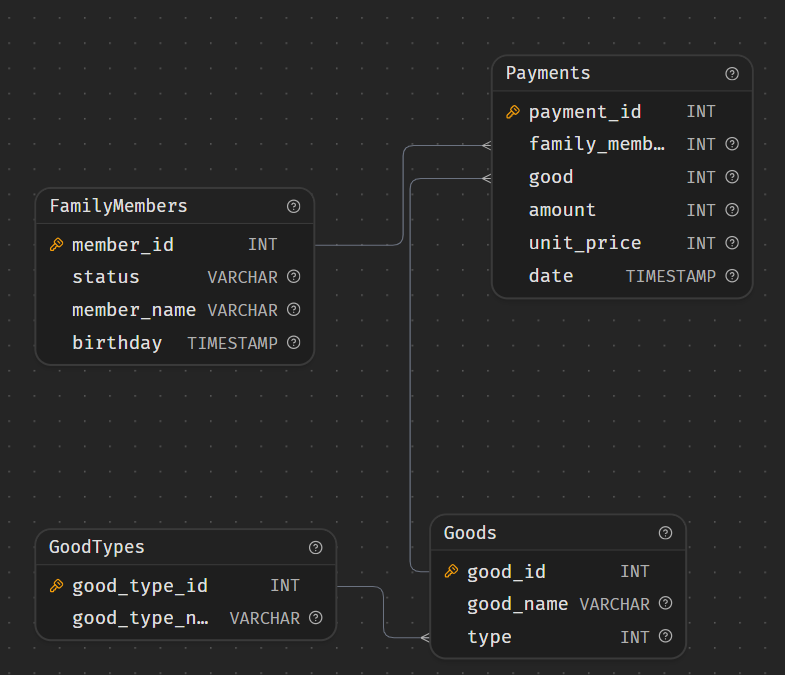

# Товары, не купленные в 2005 году

Определить, какие товары не покупались в 2005 году. Все доступные к покупке продукты находятся в таблице Goods. Поля в результирующей таблице: good_name

```SQL
SELECT g.good_name FROM Goods g
LEFT JOIN Payments g
	ON g.good_id = p.good
	AND p.date >= '2005-01-01'
	AND p.date < '2006-01-01'
WHERE p.payment_id IS NULL;
```

Логика: пытаемся приципить к каждому товару его покупки за 2005 год. Если не получилось (null) - значит, в 2005 его не покупали. В ON прописано условие: мы ищем не любые покупки этого товара, а именно покупки этого товара в 2005 году.

**Второй вариант**

```SQL
SELECT g.good_name
FROM Goods g
WHERE NOT EXISTS (
  SELECT 1
  FROM Payments p
  WHERE p.good = g.good_id
  	AND p.date >= '2005-01-01'
  	AND p.date < '2006-01-01'
);
```

Это прямо читается как "выбери товары, для которых не существует покупки в 2005 году."

# Товары, купленные более одного раза

Определить товары, которые покупали более 1 раза

```SQL
select DISTINCT g.good_name from goods g 
join Payments p on p.good = g.good_id
GROUP BY g.good_id
HAVING COUNT(*) > 1
```

# Кто покупал картошку

Определить, кто из членов семьи покупал картошку (potato)

```SQL
select distinct status from FamilyMembers
join Payments on Payments.family_member = FamilyMembers.member_id
join Goods on Goods.good_id = Payments.good
where Goods.good_name = 'potato';
```

# Траты членов семьи в 2005 году

Определить, сколько потратил в 2005 году каждый из членов семьи. В результирующей выборке не выводите тех членов семьи, которые ничего не потратили.

Используйте конструкцию "as costs" для отображения затраченной суммы членом семьи. Это необходимо для корректной проверки.

Поля в результирующей таблице: member_name, status, costs

```SQL
SELECT fm.member_name, fm.status, SUM(p.unit_price * p.amount) as costs FROM Payments p
JOIN FamilyMembers fm on fm.member_id = p.family_member
WHERE p.date >= '2005-01-01'
AND p.date < '2006-01-01'
GROUP BY fm.member_name, fm.status;
```


# Найдите самый дорогой деликатес (delicacies) и выведите его цену

```SQL
select g.good_name, p.unit_price as unit_price from Goods g 
join Payments p on p.good = g.good_id
join GoodTypes gt on gt.good_type_id = g.type
where gt.good_type_name = 'delicacies'
order by unit_price DESC LIMIT 1;
```

# Кто и сколько потратил в июне 2005 года

Определить, кто и сколько потратил в июне 2005

```SQL
select fm.member_name, SUM(p.unit_price * p.amount) as costs from FamilyMembers fm join Payments p on p.family_member = fm.member_id
    where date BETWEEN '2005-06-01T00:00:00.000Z' AND '2005-06-30T00:00:00.000Z'
GROUP BY fm.member_name;
```
