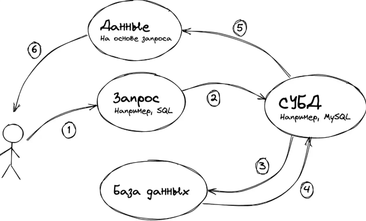
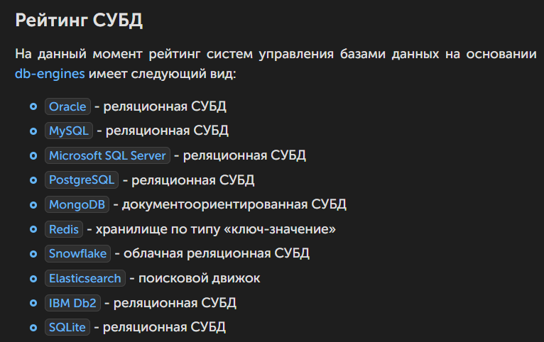
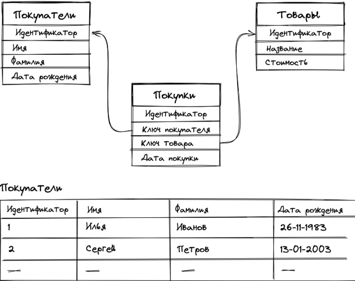
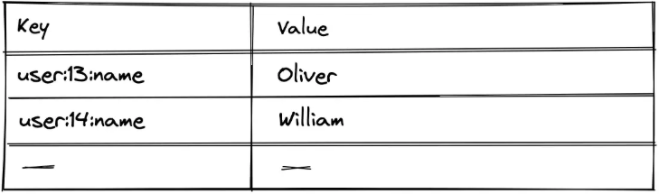
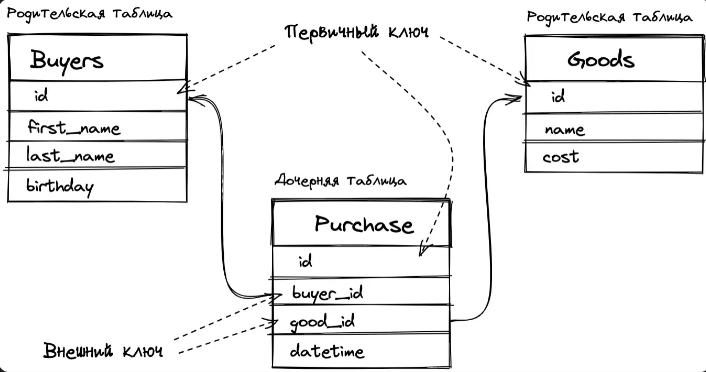
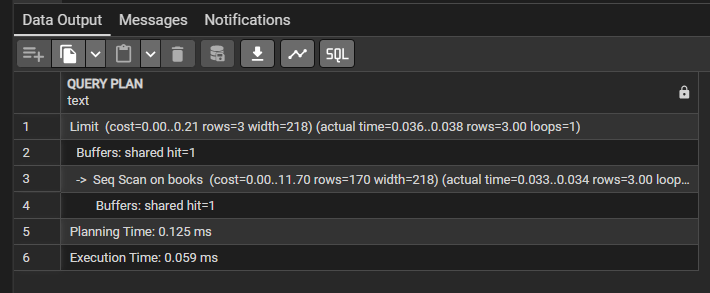
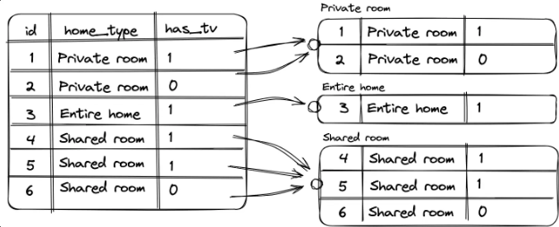
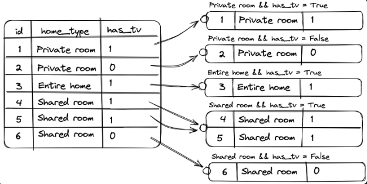
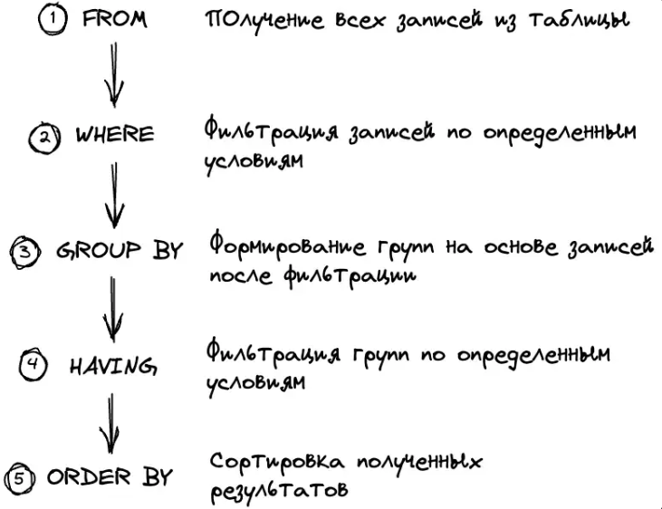
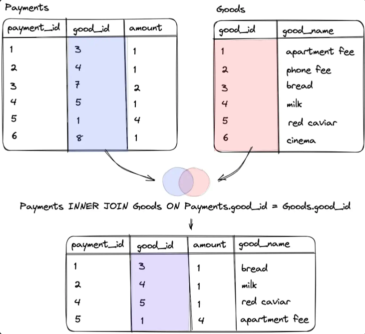

# Рекомендации

### Использование кавычек

В SQL для строковых литералов (текстовых значений) стандарт предписывает использовать одинарные кавычки (`'`)

```sql
select member_name from FamilyMembers where status = 'father'
```

- `'father'` в одинарных воспринимается БД как строковое значение (литерал)
- `father` без кавычек СУБД считает идентификатором - то есть именем столбца, таблицы или другого объекта.

Двойные кавычки в SQL используют не для текста, а для идентификаторов (имён таблиц, колонок и т.д.), чтобы:

- Сохранить регистр букв (в PostgreSQL имена без кавычек автоматически приводятся к нижнему регистру)
- Если имя совпадает с зарезервированным словом. Например, если колонка названа `order`, её придётся писать как `"order"`, иначе SQL воспримет это как команду сортировки
- Если в имени есть пробелы или спецсимволы. Например: `"Family Members"`, `"status-code"`

### Стили написания проверок

```sql
select member_name, birthday from FamilyMembers where status IN ('father', 'mother')
vs.
select member_name, birthday from FamilyMembers where status = 'father' OR status = 'mother'
```

- `IN` использовать, когда список значений для проверки небольшой, но его удобнее представить как набор (например, `IN ('father', 'mother', 'grandparent')`). Это делает код лаконичнее, читаемее и проще для поддержки. Меньше шансов ошибиться с расстановкой скобок или пропустить условие при добавлении нового значения.
- `OR` использовать для сложных, разнородных, использующих равенство или операторы (вроде `LIKE`) условий. `IN` может быть не так удобно, `OR` оправдан, еслинужно явно показать логику условия - для человека, читающего код, цепочка `OR` может быть нагляднее в специфичных случаях.

  Нужно ориентироватьсяна читаемомость: если список значений удобно записать в виде набора - `IN`, если условия разнородные и сложные - `OR`.

  # Рекомендации

  ### Использование кавычек

  В SQL для строковых литералов (текстовых значений) стандарт предписывает использовать одинарные кавычки (`'`)


  ```sql
  select member_name from FamilyMembers where status = 'father'
  ```

  - `'father'` в одинарных воспринимается БД как строковое значение (литерал)
  - `father` без кавычек СУБД считает идентификатором - то есть именем столбца, таблицы или другого объекта.

  Двойные кавычки в SQL используют не для текста, а для идентификаторов (имён таблиц, колонок и т.д.), чтобы:

  - Сохранить регистр букв (в PostgreSQL имена без кавычек автоматически приводятся к нижнему регистру)
  - Если имя совпадает с зарезервированным словом. Например, если колонка названа `order`, её придётся писать как `"order"`, иначе SQL воспримет это как команду сортировки
  - Если в имени есть пробелы или спецсимволы. Например: `"Family Members"`, `"status-code"`

  ### Стили написания проверок

  ```sql
  select member_name, birthday from FamilyMembers where status IN ('father', 'mother')
  vs.
  select member_name, birthday from FamilyMembers where status = 'father' OR status = 'mother'
  ```

  - `IN` использовать, когда список значений для проверки небольшой, но его удобнее представить как набор (например, `IN ('father', 'mother', 'grandparent')`). Это делает код лаконичнее, читаемее и проще для поддержки. Меньше шансов ошибиться с расстановкой скобок или пропустить условие при добавлении нового значения.
  - `OR` использовать для сложных, разнородных, использующих равенство или операторы (вроде `LIKE`) условий. `IN` может быть не так удобно, `OR` оправдан, еслинужно явно показать логику условия - для человека, читающего код, цепочка `OR` может быть нагляднее в специфичных случаях.

    Нужно ориентироватьсяна читаемомость: если список значений удобно записать в виде набора - `IN`, если условия разнородные и сложные - `OR`.
- 
- **База данных** - набор данных, хранящихся в структурированном виде. Хранилище сведений.
- **СУБД** - совокупность языковых и программных средств, осуществляющая доступ к данным, позволяющая их создавать, менять, удалять, а также обеспечивающая безопасность данных. Это система, позволяющая создавать базы данных и манипулировать сведениями из них.

Схема работы с БД:



Рейтинг СУБД:



## Виды БД

### Реляционные

Реляционными называются базы, в основе которых лежит реляционная модель. В такой базе данные структурированы в виде таблиц, содержащих строки и столбцы. Данные организованы в виде набора таблиц, называемых отношениями, состоящих из столбцов и строк. Каждая строка таблицы представляет собой набор связанных значений, относящихся к одному объекту или сущности, и может быть помечена уникальным идентификатором (pk), а строки из нескольких таблиц могут быть связаны с помощью внешних ключей.



#### Особенности реляционных бд

- Модель данных определена заранее и является сторого типизированной
- Данные хранятся в таблицах, состоящих из столбцов и строк
- На пересечении каждого столбца и строчки допускается только одно значение
- Каждый столбец проименован и имеет определённый тип, которому следуют значения со всех строк в данном столбце
- Столбцы располагаются в определённом порядке, который определяется при создании таблицы
- В таблице может не быть ни одной строчки, но обязательно должен быть хотя бы 1 столбец
- Запросы к БД возвращают результат в виде таблиц

Примеры РБД (по рейтингу): Oracle, MySQL, Microsoft SQL Server, PostgreSQL, IBM D62, Microsoft Access

### Key-value базы данных

Key-value БД - это тип баз данных, которые хранят данные как совокупность пар "ключ-значение", в которых ключ служит уникальным идентификатором. Ключи и значения могут быть простыми или сложными объектами.



**Преимущества:**

- Скорость работы
- Простота модели хранения данных
- Гибкость: значения могут быть любыми, включая JSON

**Недостатки:**

- Плохое масштабирование по мере усложнения моделей данных
- Неэффективность при работе с группой записей
- Принудительная фильтрация полученных данных (в выдаче есть "мусорные" данные)
- Отсутствие языка запросов. Логика из БД перекладывается на код приложения.

Примеры (по рейтингу): Redis, Memcached, Etcd

### Документоориентированные БД

Документоориентированные БД - это тип БД, направленный на хранение и запрос данных в виде документов, подобным JSON. В отличие от других БД, документоориентированные оперируют "документами", сгруппированными по коллекциям. Документ представляет собой набор атрибутов (ключ и соответствующее ему значение). Значения могут быть как простыми типами данных (строки, числа, даты), так и более сложными, такими как вложенные объекты, массивы и ссылки на другие объекты.

На примере MongoDB

```json
user good purchase = [{
	_id: ObjectID("aaaaaaaaaaaaaaaaaaa1"),
	name: "Danial",
	email: "xx@xx.xx",
	purchases: [
		# Указатель на документы коллекции Purchase
		ObjectId("bbbbbb1"),
		ObjectId("bbbbbb2")
	],
}, {
	_id: ObjectID("oooooooooooooo1"),
	name: "Oliver",
	purchases: [],
}, ....]
```

#### Особенности документоориентированных БД

1. В документоориентированных БД отсутствует схема данных, что позволяет добавлять новую информацию в некоторые записи, не требуя при этом, чтобы все остальные записи в БД имели одинаковую структуру (в реляционных БД структура строго предопределена и каждая запись содержит одни и те же поля, даже если поле не используется - оно присутствует в пустом виде).
2. Документы в БД адресуются с помощью уникального ключа (обычно это автогенерируемая строка). По нему можно, например, извлекать запись или ссылаться на другие документы
3. Собственный язык запросов с синтаксисом и функционалом (производительность отличается от одной реализации к другой)

Пример запроса

```python
db.users.find({"name": "Daniel"})
```

Документоориентированные БД (по популярности): MongoDB, Couchbase, Firebase

# Ключи

## Первичный

Любая СУБД имеет встроенную систему целостности и непротиворечивости данных. Эта система работает на наборе правил, определённых в схеме базы данных. Первичный ключ и внешние ключи как раз являются одними из таких правил.

**Первичный ключ (ключевое поле)** - это поле (или набор полей), значение которого однозначно определяет запись в таблице. Необходимо для избежания неоднозначности при поиске в таблицах. Наличие первичного ключа необязательно, а целостность данных может определяться на уровне приложения. Первичный ключ можеть быть лишь один в каждой таблице. Этот ключ может состоять из нескольких полей таблицы, но он всегда один.

## Внешний

**Внешний ключ - это поле (или набор полей)** в одной таблице, которое ссылается на первичный ключ в одной таблице. Таблица с внешним ключом называется дочерней таблицей, а таблица с первичным ключом - ссылочной или родительской. Правило внешнего ключа гарантирует, что при создании записей в дочерней таблице, значение поля, являющегося внешним ключом, есть в родительской таблице.

Наличие внешнего ключа - это необязательное требование, как и в случае в первичным ключом. Если внешнего ключа нет, СУБД не будет проверять, что при создании записи в таблице `Purchase` и полях `buyer_id` и `good_id` лежат значения, которые определены в соответствующих таблицах в поле `id`.

Наглядно:



# SQL

**SQL (Structured Query Language)** - язык структурированных запросов, который используется в качестве эффективного способа сохранения данных, поиска их частей, обновления, извлечения и удаления из базы данных.

Обращение к реляционным СУБД осуществляется благодаря SQL. С помощью него осуществляются основные манипуляции с базами данных:

- Извлечение
- Вставка
- Обновление
- Удаление
- Создание новой БД
- Создание новых таблиц
- Создание хранимых процедур в БД
- Создание представлений в БД
- Установление разрешений для таблиц, процедур и представлений

## Диалекты SQL

SQL - универсальный язык для всех реляционных систем управления БД, но многие СУБД вносят свои изменения в язык, применяемый в них, тем самым отступая от стандарта. Такие языки называют диалектами или расширениями языка.

- T-SQL - диалект Microsoft SQL Server
- PL/SQL - диалект Oracle Database
- PL/pgSQL - диалект PostgreSQL

## Литералы

Литерал - это указанное явным образом фиксированное значение, например, число `12` или строка `'SQL'.`

Основные литералы в SQL:

- Строковый
- Числовой
- Логический
- NULL
- Дата и время

#### Строковый

Строки - это последовательность символов, заключённых в одинарные кавычки (''). В PostgreSQL двойные кавычки используются для идентификаторов (имён таблиц, столбцов), для строковых литералов их использовать нельзя.

Для использования экранированных последовательностей используются E-строки

```sql
select E'asd \t sad'
```

#### Числовой

- Включает в себя целые и дробные числа
- Может иметь только целую, только дробную часть или обе сразу (`.2`, `1.1`, `10`)
- Может быть положительным или отрицательным
- Может быть представлено в экспоненциальном виде (`1e3` (=1000), `1e-3`(=0.001))

Для использования экранированных последовательностей используются E-строки

```sql
select E'asd \t sad'
```

**Арифметические операторы** (%, *, +, -, /)

```sql
select (5 * 2 - 6) / 2 AS Result;
```

#### Дата и время

Могут быть представлены в формате строки или числа. Указать дату в запросе можно с помощью строки '1970-12-30' или '19701230'

```sql
select * from familymembers where birthday > '1970-12-30'
```

| col1                   | col2                                                                                          | col3                                        |
| ---------------------- | --------------------------------------------------------------------------------------------- | ------------------------------------------- |
|                        | Описание                                                                              | Формат                                |
| Дата               | Интерпретируется как дата со временем, равным нулю | `YYYY-MM-DD`, `YYYYMMDD`                |
| Время             | Содержит только время без конкретной даты                 | `hh:mm:ss`, `hh:mm`, `hh`, `ss`     |
| Дата и время | Дата с возможностью указать время                                | `YYYY-MM-DD hh:mm:ss`, `YYYYMMDDhhmmss` |

#### Логический

Логический литерал - значения `TRUE` или `FALSE`, означающие истинность или ошибочность какого-либо утверждения.

#### NULL

Значение `NULL` означает "нет данных", "нет значения". Оно необходимо для отличия пустых значений (строка нулевой длины или пробел) от ситуации, когда значение отсутсвует вовсе.

## Функции

Встроенная функция - реализованный в СУБД кусок кода, с помощью которого можно выполнять преобразования строковых, числовых и других данных в запросах. Каждая функция принимает набор аргументов определённого типа, выполняет заложенные в неё операции и обязательно возвращает один из возможных литералов. Может принимать ноль аргументов (`NOW())`.

- UPPER()

  ```sql
  select UPPER('hello world') as upper_string;
  ```
- LOWER()

  ```sql
  select UPPER('hello world') as upper_string;
  ```
- EXTRACT() - извлекает часть даты (год, месяц, день и т.д.) для указанной даты

  ```sql
  select EXTRACT(YEAR FROM DATE '2002-02-02') as year;
  ```
- POSITION() - осуществляет поиск подстроки в строке, возвращая позицию её первого символа. Отсчёт начинается с единицы, а не с нуля. Функция работает посредством сравнения исходной строки с искомой

  ```sql
  select POSITION('oshust' in 'igoroshust') as idx;
  ```
- LENGTH() - возвращает длину указанной строки

  ```sql
  select length('igoroshust') as name_length;
  ```
- LEFT() - возвращает заданное количество крайних левых символов строки

  ```sql
  select left('igoroshust', 3) -- igo
  ```

## DISTINCT

DISTINCT - оператор, использующийся для избежания дублирования строк в выдаче.

Синтаксис:

```sql
select distinct поля_таблицы from наименование_таблицы;
```

## WHERE

Where - оператор для выборки по конкретному условию. Если запись удовлетворяет этому условию, то попадает в результат, иначе отбрасывается.

## EXPLAIN

Explain - команда в SQL, которая не выполняет запрос по-настоящему, а показывает план его выполнения: как именно БД собирается его решать, какие шаги сделает, какие индексы использует и сколько примерно строк придётся обработать. Это главный инструмент для поиска узких мест и оптимизации запросов.

```sql
EXPLAIN (ANALYZE, BUFFERS) -- В некоторых ANALYZE и BUFFERS не нужны
SELECT title FROM books LIMIT 3
```

покажет результат:



## Логические операторы

Логические операторы используются для объединения нескольких условий в одном SQL-запросе. С их помощью отбираются только нужные для конкретной выдачи строки. В порядке приоритета: NOT, AND, XOR (выбор строк, где выполняется одно из двух условий, но не оба сразу), OR

В postgreSQL нет оператора `XOR`, поэтому используется комбинация `AND` + `OR` для достижения того же результата

```sql
SELECT * FROM trip
WHERE(town_from = 'Moscow' AND town_to != 'Paris')
OR (town_from != 'Moscow' AND town_to = 'Paris')
```

При работе с логическими операторами важно обращать внимание на порядок их использования.

## Операторы IS NULL, BETWEEN, IN

`IS NULL` позволяет проверить, отсутствует ли значение в поле

```sql
select * from teacher where middle_name is null
```

`IS NOT NULL` вывод существующих записей

```sql
select * from teacher where middle_name is not null
```

`BETWEEN min AND max` позволяет узнать, расположено ли проверяемое значение столбца в интервале между min и max, **включая сами значения `min` и `max.`**

Идентичен условию

```sql
... WHERE field >= min AND field <= max
```

Пример

```sql
select * from Payments
where unit_price BETWEEN 100 AND 500;
```

`IN` позволяет узнать, входит ли проверяемое значение столбца в список определённых значений

```sql
select * from familymembers
where status in ('father', 'mother');
```

## LIKE

Оператор `LIKE` используется при условных запросах, когда мы хотим узнать, соответствует ли строка определённому шаблону. Используется для поиска по строковым полям.

```sql
... WHERE field_name [NOT] LIKE template_string
```

В PostgreSQL шаблоны чувствительны к регистру. Для поиска без учёта регистра нужно использовать `ILIKE`.

Спец.символы:

- `%` - последовательность любых символов (число символов в последовательности может быть от 0  и более)
- `_` - любой единичный символ

Например, мы хотим найти пользователей, чья почта лежит в домене второго уровня 'hotmail', то нужно отобрать записи, отвечающие условиям:

- после символа `@` следует `hotmail`
- после `hotmail` следует `.` и далее любая последовательность символов

```sql
select name, email from users where email LIKE '%@hotmail.%'
```

Строки, начинающиеся на `begin` и заканчивающиеся на `end`:

```sql
... where field_name LIKE 'begin%end'
```

**ESCAPE-символ**

Если вместо символа по умолчанию (`\`) нужно использовать другой символ экранирования, его можно указать с помощью `ESCAPE`.

```sql
... where field_name LIKE 'template_string' ESCAPE 'shielding_char' -- символ экранирования
```

Тот же запрос с явным указанием символа

```sql
select job_id from jobs 
where progress LIKE '3!%' ESCAPE '!'; -- символ ! выполяет роль \
```

## Регулярные выражения

Операторы `~` и `~*` в PostgreSQL используются для поиска и обработки строковых данных с помощью регулярных выражений. Регулярные выражения предоставляют мощные возможности для сложных шаблонов поиска, которые трудно реализовать с помощью оператора LIKE.

- Regexp используютя для сложных условий (гибкий поиск по нескольким условиям, использование специальных символов и диапазонов)
- LIKE - для простых условий (вхождение подстроки, начало/окончания строки по конкретному символу)

LIKE сопоставляет строку со всем шаблоном целиком, а regexp ищет совпадение внутри строки. Для проверки начала или конца строки, используются спец.символы `^` и `$`.

```sql
... WHERE table_field ~ 'pattern'; -- с учётом регистра
... WHERE table_field ~* 'pattern'; -- без учёта регистра
```

pattern - регулярное выражение, задающее шаблон поиска.

Важно:

- Чувствительны к регистру
- Необходимо экранировать символы ввиду их особого значения (.*+?[](){}|\\\). Экранирование через `\`.

| Символы и структуры | Назначение                                                                                                                    |
| ------------------------------------ | --------------------------------------------------------------------------------------------------------------------------------------- |
| *                                    | 0 или более экземпляров предшествующего шаблона                                                |
| +                                    | 1 или более экземпляров предшествующего шаблона                                                |
| ?                                    | 0 или 1 экземпляр предшествующего шаблона                                                             |
| .                                    | Любой одиночный символ                                                                                              |
| ^                                    | Соответствие началу строки                                                                                      |
| $                                    | Соответствие окончанию строки                                                                                |
| [abc]                                | Любой символ из квадраных скобок                                                                            |
| [^abc]                               | Любой символ, не указанный в квадратных скобках                                                 |
| [А-Я], [A-Z]                       | Соответствие любой заглавной букве кириллического и латинского алфавита |
| [а-я], [a-z]                       | Соответствие любой строчной букве кириллического и латинского алфавита   |
| [0-9]                                | Соответствие любой цифре                                                                                          |
| p1(верт.черта)p2            | Соответствие одну из паттернов -`p1` или `p2`                                                         |
| {n}                                  | `n` экземпляров предшествующего шаблона                                                              |
| {m, n}                               | от `m` до `n` экземпляров предшествующего шаблона                                              |

Пример использования:

```sql
select * from authors where first_name ~ 'н$' -- заканчивается на н
select * from authors where first_name ~ '^И' -- начинается на И
select * from authors where first_name ~ 'н{1,2}' -- бува н от 1 до 2

select * from users where phone_number ~ '^[^28]*$'; -- номера без 2, 8
```

Осторожно: регулярные выражения плохо работают с индексами.

## ORDER BY

ORDER BY - конструкция для упорядочивания записей. При выполнении SELECT-запроса строки по умолчанию возвращаются в неопределённом порядке. Фактический порядок строк в этом случае зависит от плана соединения и сканирования, а также от порядка расположения данных на диске.

- ASC - по возрастанию (по умолчанию)
- DESC - по убыванию

Пример: выдача названий в алфавитном порядке

```sql
select name from company order by name;
```

При булевом типе: false идёт перед true (asc), true идёт пере false (desc)

При NULL: NULL идут последними (asc), NULL идут первыми (desc)

**По нескольким столбцам**

```sql
... order by one [asc|desc], two [asc|desc]
```

Данные будут сортироваться по первому столбцу, но если будут несколько записей с совпадающими значениями в первом столбце, то они сортируются по второму столбцу (обратная сортировка). Количество столбцов, по которым можно отсортировать, не ограничено. Второй столбец не влияет на общую расстановку строк глобально, он работает только как "развязыватель" совпадений внутри групп первого уровня.

Нюанс: для детерминированности результата во второй столбец добавляют `id`. Если в order by один столбец, то при совпадающих значениях порядок строк не гарантирован - субд может вернуть их в любом порядке. В проде часто добавляют "запасной" столбец (по id), чтобы результат бы детерминированным

## GROUP BY

GROUP BY - оператор для создания (образования) групп записей в выборке. GROUP BY перечисляет исходные столбцы, по которым нужно собрать строки, в группы.



Все NULL-значения трактуются как равные, при группировке по NULL-полю все строки попадут в одну группу.

При group by мы можем выводить только:

- **Литералы** (указанные явным образом самостоятельные фиксированные значения)
- **Результаты агрегатных функций** (вычислительные значения на основании набора значений), например, `AVG`
- **Поля группировки** (мы можем их выводить, как как в рамках одной группы поля, на основании которых осуществлялась группировка, одинаковые)

Пример

```sql
select home_type, avg(price) as avg_price from rooms group by home_type
```

Выполненный запрос сначала разбивает все записи из таблицы `rooms` на 3 группы по полю home_type, далее для каждой группы суммирует все значения, взятые из поля `price` у каждой записи, входящей в текущую группу, и затем полученный результат делится на количество записей в данной группе.

**Двойная группировка**

При группировке по 2 и более полям принцип остаётся такой же, только образовавшиеся группы дополнительно разбиваются на более мелкие в зависимости от второго поля группировки



Группировка данных по типу жилья с количеством записей

```sql
select home_type, COUNT(*) as count_rooms from Rooms group by home_type
```

## Агрегатные функции

Агрегатная функция - это функция, которая выполняет вычисление на наборе значений и возвращает одиночное значение.

- SUM()
- AVG()
- COUNT()
- MIN()
- MAX()

Агрегатные функции применяются для значений, не равных `NULL`. Исключением является функция `COUNT(*)`.

```sql
select home_type, count(*) as amount from rooms
group by home_type
order by amount desc
```

При использовании агрегатных функций необходимо использовать group by, потому что агрегатные функции сводят множество строк в одну, а SQL должен понимать, по каким группам это делать.

## HAVING

Having - оператор для фильтрации групп.

```sql
select home_type, AVG(price) as avg_price from Rooms
group by home_type
HAVING AVG(price) > 50
```

В pg алиасы, объявленные в SELECT, недоступны в HAVING.

Наличие HAVING обусловлено порядком выполнения SQL-запроса: from-where-group by-having-order by.



```sql
SELECT [константы, агрегатные функции, поля_группировки]
FROM имя_таблицы
WHERE условия_на_ограничение_строк
GROUP BY поля_группировки
HAVING условие_на_ограничение_строк_после_группировки
ORDER BY условие_сортировки
```

Пример: выведите типы комнат (поле **home_type**) и разницу между самым дорогим и самым дешевым представителем данного типа. В итоговую выборку включите только те типы жилья, количество которых в таблице Rooms больше или равно 2.

```sql
SELECT home_type, MAX(price) - MIN(price) AS difference FROM Rooms GROUP BY home_type HAVING COUNT(*) >= 5
```

## JOIN

JOIN служит для объединения информации из нескольких таблиц

### INNER - внутренний (по умолчанию)

INNER JOIN возвращает только те строки, для которых есть совпадение в обеих таблицах по условию `ON`. Если в одной таблице есть запись, а в другой для неё нет пары - такая строка в результат не попадёт.

### OUTER - внешний (внешнее соединение делится на left, right, full)

OUTER JOIN возвращает не только совпадения, но и "одинокие" строки из одной из таблиц. В местах, где пары нет, будет `NULL`.

```pgsql
select family_member, member_name, amount * unit_price AS price FROM Payments
INNER JOIN FamilyMembers
	ON Payments.family_member = FamilyMembers.member_id
```

LEFT OUTER JOIN - все строки из левой таблицы (из FROM) и совпадающие из правой. Если для левой таблицы нет пары справа - в колонках правой будет NULL.

```sql
select a.name, b.title
from authors a
left join books b on a.id = b.author_id
```

RIGHT OUTER JOIN - возвращает все строки из правой таблицы и NULL-значения для левой в случае отсутствия.

```sql
select a.name, b.title
from authors a
right join books b on a.id = b.author_id;
```

FULL OUTER JOIN - возвращает все строки из обеих таблиц и NULL на пустых ячейках.

```sql
select a.name, b.title
from authors a
full join books b ON a.id = b.author_id
```

Вывод всех данных из одной таблицы при объединении

```pgsql
select title, authors.* from books
join authors on books.author_id = authors.id
```

При работе с многотабличными запросами рекомендуется использовать алиасы. Правила нейминга алиасов: использовать логические сокращения (первые буквы названия таблицы), избегать слишком коротких (однобуквенных) или неочевидных псевдонимов

Получение данных только из левой таблицы:

```sql
select поля_таблиц
from левая_таблица
left join правая_таблица on
правая_таблица.ключ = левая_таблица.ключ
where правая_таблица.ключ is null
```

Данные из обеих таблиц (совпадения)

```sql
select поля_таблиц
from левая_таблица
inner join правая_таблица on
правая_таблица.ключ = левая_таблица.ключ
```

Данные, не относящиеся к обеим таблицам сразу

```sql
select поля_таблиц
from левая_таблица
full outer join правая_таблица
on правая_таблица.ключ = левая_таблица.ключ
where левая_таблица.ключ is null or правая_таблица_ключ is null
```

### Внутреннее соединение

Внутреннее соединение - соединение, при котором находятся пары зависимостей из двух таблиц, удовлетворяющие условию соединения, образуя в результате новую таблицу, содержащую поля из первой и второй исходных таблиц



Поскольку в условии указано равенство полей `Payments.good_id` и `Goods.good_id`, то при внутреннем соединении в итоговой выборке окажутся только записи, где в обеих таблицах есть одинаковое значение `good_id`.

#### Where для объединения

```sql
select family_member, member_name from payments, familymembers 
where payments.family_member = familymembers.member_id
```

## LIMIT

LIMIT - оператор для ограничения выборки, позволяющий извлечь определённый диапазон записей из одной или нескольких таблиц

```sql
select поля_выборки
from список_таблиц
LIMIT количество_записей_для_вывода [OFFSET количество_пропущенных_записей];
```

Если не указать OFFSET, отчёт будет вестись с начала таблицы

Вывести строки с 3 по 5

```sql
select * from table limit 3 offset 2
```

## Подзапросы

Подзапросы являются одним из самых мощных инструментов в SQL, который можно использовать в любых видах запросов.

Подзапрос - это запрос, использующийся в другом SQL-запросе. Подзапрос всегда заключён в круглые скобки и обычно выполняется перед основным запросом. Подзапрос возвращает результирующий набор, который может быть одним из следующих:

- Одна строка или один столбец (чаще всего используется в условиях ограниченной выборки с помощью операторов сравнения). Обязательно, чтобы вернулось скалярное значение (1 строка и 1 колонка)

  ```sql
  select (select name from company limit 1) as company_name;
  ```

  ```sql
  select * from familymembers
  where birthday = (select max(birthday) from familymembers)
  ```
- Несколько строк с одним столбцом

  ```sql
  SELECT 200 > ALL(SELECT price FROM Rooms) -- true
  ```
- Несколько строк с несколькими столбцами

  ```sql
  select * from reservations
  where (room_id, price) in (select id, price from rooms)
  ```

В зависимости от типа результирующего набора подзапроса, определяются операторы, которые могут использоваться в основном запросе.

Пример: получение списка всех бронирований самого дорогого на данный момент жилого помещения:

```sql
select * from reservations 
where reservations.room_id = (
	select id from rooms order by price desc limit 1 -- 21
)
```

#### Подзапросы с несколькими строками

Позволяют использовать операторы

- `ALL` - сравнение отдельного значения с каждым значением в наборе, полученным подзапросом. Условие вернёт TRUE, только если все сравнения отдельного значения со значениями в наборе вернут TRUE.
- `IN` - проверка входа конкретного значения в набор значений. В качестве набора может использоваться подзапрос, возвращающий несколько строк с одним столбцом.
- `ANY` - возвращает TRUE, если хотя бы 1 сравнение отдельного значения со значением в наборе вернёт True.

Проверка, для всех ли жилых помещений выполняется условие, что оно дешевле 200

```sql
SELECT 200 > ALL(SELECT price FROM Rooms) -- true
```

#### Коррелированные подзапросы

Коррелированные запросы ссылаются на один или несколько столбцов основного запроса. Некоррелированные подзапросы = независимые. Они могли выполняться автономно от основного запроса и мы могли увидеть результат их работы до того, как он будет применён в основном запросе.

Пример: кто и сколько потратил

```sql
 select familymembers.member_name, (
	select sum(payments.unit_price * payments.amount)
	from payments
	where payments.family_member = familymembers.member_id
) as total_spent
from familymembers;
```

Коррелированный подзапрос отличается от некоррелированного тем, что он выполняется не один раз перед выполнением запроса, в который он вложен, а для каждой строки, которая может быть включена в окончательный результат. В примере выше возвращается 8 записей, и для каждой из них выполняется коррелированный подзапрос.

Влияние на производительность: коррелированные подзапросы могут стать причиной проблем с производительностью, особенно если содержащий запрос возвращает много строк, так как коррелированный подзапрос будет выполняться для каждой строки содержащего запроса отдельно.

## Обобщённое табличное выражение, оператор WITH

CTE (Common Table Expression) - обобщённое табличное выражение - это временный результирующий набор данных, к которому можно обращаться в последующих запросах. Для написания обобщённого табличного выражения используется оператор `WITH`.

```sql
WITH Aeroflot_trips AS
	(SELECT TRIP.* FROM Company)
		INNER JOIN Trip ON Trip.company = Company.id WHERE name = 'Aeroflot')

SELECT plane, COUNT(plane) AS amount FROM Aeroflot_trips GROUP BY plane;
```

Выражение с with считается временным, потому что результат не сохраняется где-либо на постоянной основе БД, а действует как временное представление, которое существует только на время выполнения запроса, то есть оно доступно только во время выполнения операторов select, insert, update, delete, merge. Оно действительно только в том запросе, которому он принадлежит, что позволяет улучшить структуру запроса, не загрязняя глобальное пространство имён.

```sql
WITH название_cte [(столбец_1 [, столбец_2])] AS (подзапрос)
	[, название_cte [(столбец_1 [(столбец_1 [, столбец_2]) AS (подзапрос)])
```

#### Все полёты компании Aeroflot (табличное выражение)

```sql
with aeroflot_trips as
	(select plane, town_from, town_to) from company
		inner join trip on Trip.company = Company.id where name = 'Aeroflot')

select * from Aeroflot_trips;
```

c переименованными колонками

```sql
with aeroflot_trips (airplane, origin_city, destination_city) AS
	(SELECT plane, town_from, town_to FROM company join Trip on Trip.company = Company.id WHERE name='Aeroflot')

select * from aeroflot_trips;
```

объёдинение нескольких табличных выражений с помощью with

```sql
with aeroflot_trips as (select trip.* from company inner join trip on trip.company = company.id where name='aeroflot'), don_avia_trips as (select trip.* from company join trip on trip.company = company.id where name = 'don_avia')

select * from don_avia_trips union select * from aeroflot_trips;
```

**Рекурсия в CTE**

CTE могут быть использованы для выполнения рекурсивных запросов, позволяющих итеративно обрабатывать данные, например, для работы с иерархическими структурами данных, такими как "руководитель - подчинённый".

Рекурсивный CTE состоит из двух частей:

- Начальный набор данных, который не содержит рекурсивных ссылок
- Рекурсивная часть: запрос, который ссылается на CTE для продолжения рекурсии

```sql
with recursive cte_name (col_1, col_2, ...) as (
	-- Начальный набор данных
	select col_1, col_2, ...
	from table
	where cond

	UNION ALL

	-- Рекурсивная часть
	select col_1, col_2, ...
	from cte_name
	join table on cte_name.col = table.col
	where cond
)

select * from cte_name
```

Пример: иерархия руководителей и подчинённых

```sql
with recursive as (
	-- start
	select id, name, managerId
	from employees
	where managerId = 1 -- только подчинённые John Smith

	union all

	-- recursive (подчиненные подчинённых)
	select e.id, e.name, e.managerId
	from employees e
	join subordinates s on e.managerId = s.id
)

select * from subordinates;
```

Рекурсивный процесс в примере выше повторяется для каждого нового набора подчинённых, пока не будут выбраны все уровни иерархии.

CTE добавлены в SQL для упрощения сложных длинных запросов, особенно с множественными подзапросами. Их главная задача - улучшение читабельности, простоты написания запросов и их дальнейшей поддержки. Это происходит за счёт сокрытия больших и сложных запросов в созданные именованные выражения, которые потом используются в основном запросе.

## Union

Оператор объединения запросов

```sql
select ...
union [all]
select ...
```

union по умолчанию убирает повторения в результирующей таблице. Для отображения с повторением есть необязательный параметр all.

Для корректной работы union необходимо, чтобы результирующие таблицы каждого SQL-запроса имели одинаковое число столбцов с совместимыми типами данных и той же самой последовательности.

Схожие с Union операторы:

**- INTERSECT** комбинирует два запроса SELECT, но возвращает записи только первого SELECT, которые имеют совпадения во втором элементе SELECT (ИМЕЮТ СОВПАДЕНИЕ)

**- EXCEPT** комбинирует два запроса select, но возвращает записи только первого select, которые не имеют совпадения во втором элементе select (НЕ ИМЕЮТ СОВПАДЕНИЯ)

## Условная логика (оператор case)

Условна логика - наличие у программы нескольких путей выполнения в зависимости от каких-то условий (например, проверить возраст человека и вывести заключение - совершеннолетний или несовершеннолетний).

Сигнатура

```sql
case
	when cond_1 then return_value_1
	when cond_2 then return_value_2
	when cond_n then return_value_n
	[ELSE return_default_value]
end
```

Определить возраст

```sql
select first_name, last_name,
CASE
	WHEN EXTRACT (YEAR FROM AGE(NOW(), birthday)) >= 18 THEN 'Cовершеннолетний'
	ELSE 'Несовершеннолетний'
END AS status
FROM Student
```

Определить класс

```sql
SELECT name,
CASE
  WHEN SUBSTRING(name, 1, POSITION(' ' IN name) - 1) IN ('10', '11') THEN 'Старшая школа'
  WHEN SUBSTRING(name, 1, POSITION(' ' IN name) - 1) IN ('5', '6', '7', '8', '9') THEN 'Средняя школа'
  ELSE 'Начальная школа'
END AS stage
FROM Class
```

- substring(строка, начальная позиция, длина) - вырезает часть строки по заданным параметрам

### Функции для условной логики

Функции для условной логики особенно полезны при работе с NULL-значениями.

**COALESCE** - работа с NULL-значениями. Возвращает первое не-NULL значение из списка аргументов. Это намного удобнее, чем писать длинные CASE-выражения для обработки NULL. Использовать, когда нужно заменить NULL-значения на значения по умолчанию.

```sql
coalesce(val_1, val_2, val_N)
```

Заменить null-значения на "Empty"

```sql
select first_name, COALESCE(middle_name, 'Empty') as middle_name, last_name from Teacher
```

**NULLIF** - для замены какого-либо значения на NULL. Это может быть полезно для фильтрации и обработки "пустых" значений. Используется, когда нужно превратить определённые значения в NULL.Если равны - преврати в NULL, иначе - оставь как есть.

```sql
nullif(val_1, val_2)
```

NULLIF возвращает NULL, если val_1 равно val_2, иначе возвращается val_1

#### Примеры применения NULLIF

**Защита от деления на ноль**

```sql
select price / nullif(quantity, 0) as unit_price from products;
```

**Превратить пустые значения в NULL**

```sql
select nullif (phone, '') as phone from customers;
```

Функции COALESCE и NULLIF делают код более читаемым и являются частью стандарта SQL.

#### Подготовка данных для сравнения

Агрегатные функции (count, avg, sum) игнорируют null. Если есть заглушки вроде 0 или '', которые портят статистику, их превращают в null

```sql
select avg(nullif(rating, 0)) from reviews;
```

#### Упрощение сложных CASE, где много "Если равно X, то NULL"

```sql
nullif(status, 'canceled') -- если статус отменён - считать отсутствующим
```

## INSERT

Два стиля:

1. INSERT INTO ... VALUES ...
2. INSERT INTO ... SELECT ...

INSERT INTO ... SELECT используется для вставки данных, полученных из запроса. Позволяет копировать данные из одной таблицы в другую или вставлять результаты сложных вычислений:

```sql
INSERT INTO Goods (good_id, good_name, type)
SELECT 20, 'Table', 2;

-- Копирование из другой таблицы
INSERT INTO Goods (good_id, good_name, type)
SELECT good_id + 100, good_name, type
FROM Goods
WHERE type = 2;
```

Этот вариант используется для копирования данных между таблицами, вставки результатов вычислений или когда данные зависят от существующих записей в базе.

**Автогенерация первичного ключа**

- SMALLSERIAL
- SERIAL
- BIGSERIAL

## UPDATE

UPDATE - оператор обновления записей. Обязательно использовать с where (желательно ещё транзакцию задействовать)

```sql
update table_name set
column_name = 'value'
where cond
```

Пример с транзакцией:

```sql
-- begin;

-- update books set
-- genre = 'Фантастика'
-- where id = 44;

-- SAVEPOINT step1;

-- select genre from books where id = 44

-- rollback;

-- rollback to savepoint step1;

-- commit;
```

## DELETE

DELETE - оператор удаления записи

```sql
DELETE FROM table_name
[WHERE cond]
```

Если условие отсутствует, будут удалены все записи указанной таблицы

### TRUNCATE

Удаление можно произвести с помощью оператора `TRUNCATE`. Он выполняет удаление таблицы и пересоздаёт её заново - этот вариант работает гораздо быстрее, чем удаление всех записей одна за другой (как в случае с DELETE), особенно для больших таблиц.

```sql
TRUNCATE TABLE table_name;
```

Особенности TRUNCATE:

- не срабатывает на триггеры, в частности, триггер удаления
- удаляет все строки в таблице, не записывая при этом удаление отдельных строк данных в журнал транзакций
- может сбрасывать счётчик идентификаторов при использовании опции `RESTART IDENTITY` (по умолчанию используется `CONTINUE IDENTITY`, и счётчик не сбрасывается)
- требует права на изменение таблицы

### Удаление записей при многотабличных запросах

Если в DELETE-запросе используется USING, то после него необходимо указать дополнительные таблицы, по которым выбираются удаляемые записи

```sql
delete from table_1
using table_2
where table_1.field = table_2.filed
[and cond];
```

Пример: удалить все бронирования жилья, в котором отсутствует кухня

```sql
delete from reservations
using rooms
where reservations.room_id = rooms.id
and rooms.has_kitchen = false;
```

Удаление нескольких таблиц одновременно в PostgreSQL (транзакции)

```sql
begin;
delete from reservations
using rooms
where reservations.room_id = rooms.id
and rooms.has_kitchen = false;

delete from rooms
where rooms.has_kitchen = false;
commit;
```

#### Измените запрос так, чтобы удалить товары (Goods), имеющие тип деликатесов (delicacies)

```sql
DELETE FROM Goods 
USING GoodTypes
WHERE GoodTypes.good_type_id = Goods.type
AND Goodtypes.good_type_name = 'delicacies'

```
