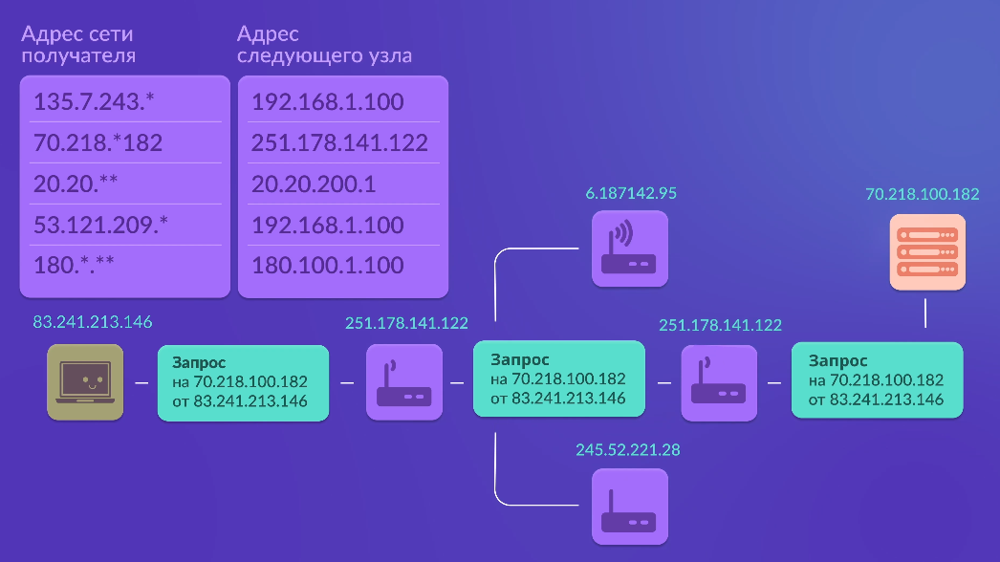
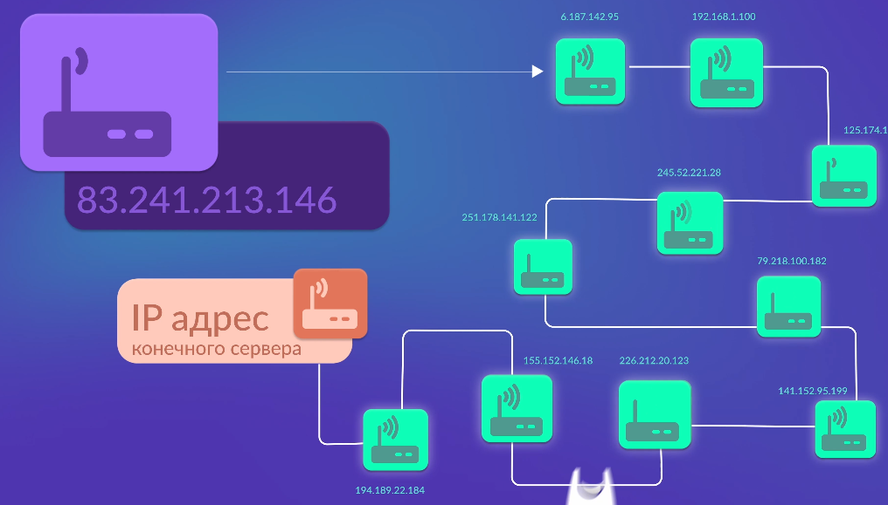
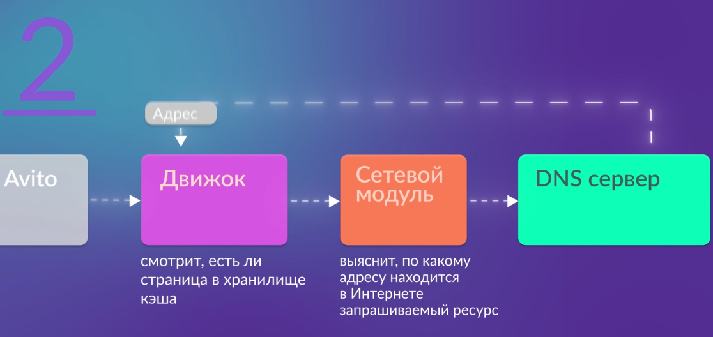
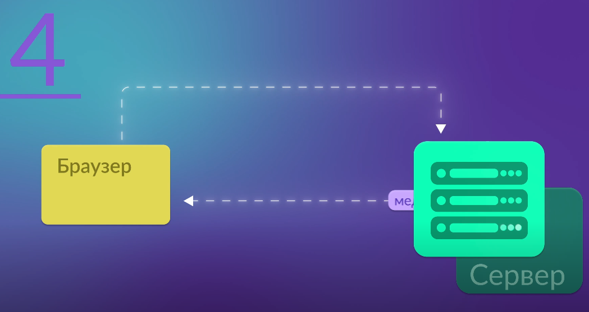
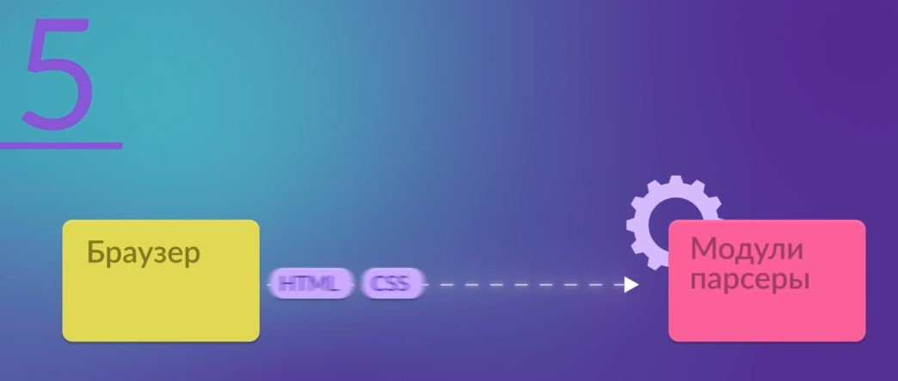
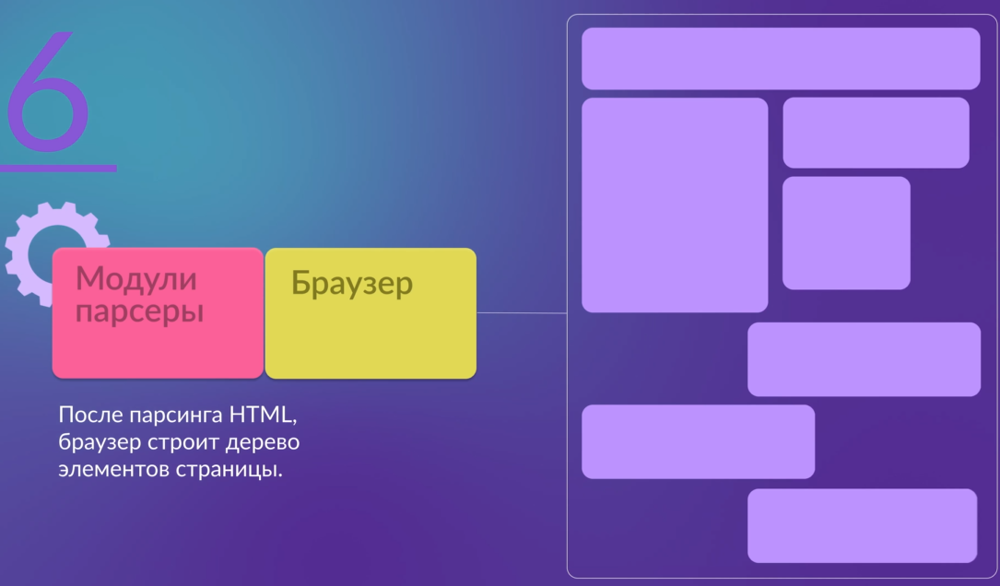

### DNS
DOMAIN NAME SYSTEM - это система, позволяющая определить IP-адрес сервера по домену. Благодаря DNS браузер поймёт, на какой адрес в сети Интернет сделать запрос, чтобы получить ресурсы с сайта (avito.ru)

### Маршрутизатор
Маршрутизатор - компьютер, который соединяется со всеми остальными компьютерами сети и выполняет функцию - слежка за тем, чтобы данные отправителя дошли до получателя (причём до реального получателя). У каждого маршрутизатора есть таблица маршрутизации.

Маршрутизация - процесс передачи пакетов данных между серверамию

Каждый маршрутизатор имеет таблицу маршрутизации, состоящей из нескольких записей - маршрутов. Каждый маршрут содержит адрес сети получателя и адрес следующего узла, которому нужно передавать пакеты.

Маршрутизатор вашей локальной сети не найдёт IP-адрес сервера, на котором хранится сайт (avito.ru), он отправит этот пакет в маршрутизатор вашего дома, а тот - в маршрутизатор района и так далее. Пакет будет гулять до тех пор, пока не найдёт IP-адрес конечного сервера - того, на который был отправлен запрос (на сайт avito.ru).

Когда компьютер или сервер, которй хранит ресурсы сайта (avito.ru) получает запрос, он формирует набор файлов по запросу клиента, меняет в пакете местами адреса получателя и отправителя, и посылает пакет c ресурсами обратно через маршрутизаторы.

### Интерфейс пользователя
Интерфейс пользователя - буфер между пользователем и сердцем браузера - его движком. Он принимает и обрабатывает все пользовательские действия. Интерфейс пользователя обеспечивает стандартный набор функций: ввод информации, печать, визуализация загрузки данных, панели инструментов и настроек.

### Движок браузера
Модуль высокоуровневых действий: начало загрузки страницы, обновление, вперёд/назад, работа с закладками, история, настройки. Эти настройки влиют на работу графического движка (например, отключение стилей, JS, выбор кодировки, масштаб и т.д.). Дополнительная задача движка - информирование пользователя о текущей сессии браузера, код загрузки документа или оповещения об ошибках JS.

### Графический движок
Графический движок - основная часть работы web-браузера, его мотор. Графический движок отображает содержимое ресурса на экране, именно эта часть браузера анализирует полученный HTML, учитывает влияние CSS и JavaScript, а также других объектов на веб-странице (например, изображений). На основе этих данных движок создаёт разметку (макет) страницы - то, что видит пользователь на экране. Ключевые элементы графического движка: HTML- и CSS-парсеры, - это сложные программные комплексы, позволяющие графическому движку разобрать текстовое представление документа и отобразить его на экране пользователя.

### Хранилище данных
Хранилище данных - модель отвечает за сохранение данных пользователя: закладки, настройки, пароли, сохранение полученных данных в кэше браузера. Так можно уменьшить трафик идентичных элементов веб-страниц и просмотра их в offline-режиме.

### Сетевой модуль
Сетевой модуль - модель отвечает за работу с сетью, формирование пакетов, отправку и получение данных; а также JavaScript и XML-парсеры, - они отвечают за прочтение разметки ресурса и выполнение JS-кода. Такая архитектура удобна тем, что можно легко изменить дизайн браузера - отловить возникающие ошибки, улучшить отдельный модуль или переиспользовать его.

## Как браузер работает внутри
1. Пользователь пишет запрос в поисковую строку
2. Строка с запросом попадает в движок, который проверяет наличие страницы в хранилище кэша
3. если в кэше нет страницы, движок сформирует запрос и с помощью сетевого модуля выяснит адрес расположения запрашиваемого ресурса в интернете (браузер сделает это при помощи DNS-сервера).

4. Получив адрес ресурса, браузер формирует запрос и отправляет его на сервер. От ресурса браузер получает HTML, CSS, JS, и медиа-документы.

5. HTML и CSS браузер передаёт в соответствующие модули парсеры

6. После парсинга HTML, браузер строит дерево элементов веб-страницы.

7. После парсинга CSS, браузер получает дерево стилей элементов страницы

8. Браузер совмещает оба дерева и получает дерево спозиционированных и стилизованных элементов страницы, оно сохраняется в кэше и отправляется в интерфейс на отрисовку.

9. В результате мы увидим отрисованную страницу, которую запросили у браузера.

## ВЕБ
ВЕБ - технология, которая даёт доступ к документам на разных компьютерах, связанных при помощи интернета. ВЕБ - обмен документами (веб-страницами или сайтами), работающих на основе 3 базовых инструментов: HTML, CSS, JS. Компьютеры в вебе делятся на клиенты и серверы. Обмен данными между клиентом и сервером происходит не напрямую, а через большое количество узлов (серверов), которые передают запрос по цепочке, пока не доведут его до конечного IP-адреса.

## Браузеры
Для передачи и поиска документов в пользовательском интерфейсе используют браузеры. Браузеры имеют блочную архитектуру, состоят из нескольких модулей, соединённых между собой посредством программных интерфейсов. Блоки браузера - интерфейс пользователя, движок браузера, графический движок, хранилище данных, сетевой блок, JS- и XML-парсеры.

Чтобы выдать пользователю запрашиваемую страницу, браузеру необходимо:
1. Найти адрес в кеше и на внешних серверах
2. Получить и обработать HTML-текст, стили, картинки и скрипты
3. Построить и совместить дерево элементов и дерево стилей
4. Отрисовать страницу и вывести её на экран
